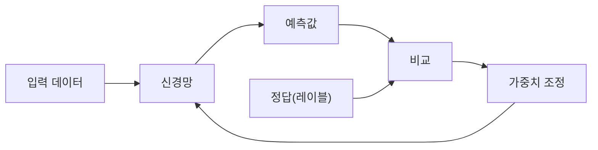
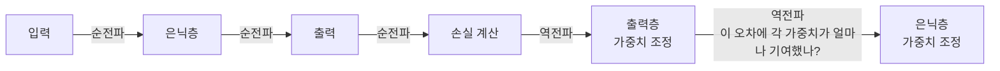
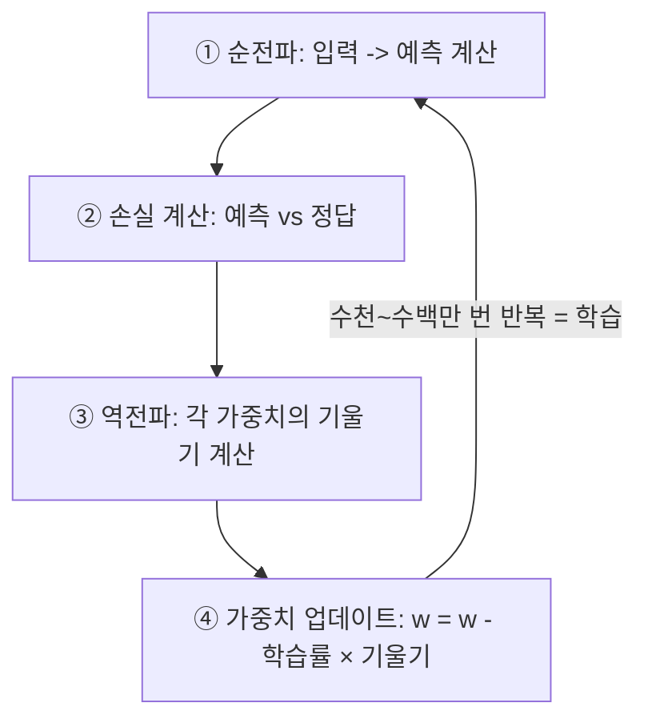

# 1.3 학습의 원리

> **학습 목표**: 손실 함수, 경사하강법, 역전파의 개념을 이해하고, 신경망이 어떻게 "학습"하는지 설명할 수 있다.

## 학습이란 무엇인가?

신경망의 학습은 한 문장으로 요약됩니다:

> **"예측이 틀린 만큼 가중치를 조정하는 과정"**



이 순환을 수천~수백만 번 반복하면, 신경망은 점점 정확한 예측을 하게 됩니다.

### 활쏘기 연습 비유

신경망의 학습 과정은 활쏘기 초보자의 연습과 정확히 같습니다. 처음에는 과녁에서 크게 빗나갑니다(큰 손실). 매번 쏜 후 과녁과의 거리를 측정하고(손실 계산), 자세와 힘 조절을 수정합니다(가중치 조정). 수백 번 반복하면 점점 과녁 중심에 가까워집니다. 핵심은 단순히 "더 잘해야지"가 아니라, 매번 구체적으로 "얼마나" 빗나갔는지를 측정하고 그만큼만 수정한다는 것입니다.

## 1단계: 손실 함수 (Loss Function)

손실 함수는 **"예측이 얼마나 틀렸는지"** 를 숫자로 측정합니다.

### 예시: 집값 예측

```
실제 집값:  5억 원
모델 예측:  4.2억 원
손실(오차): |5 - 4.2| = 0.8억 원
```

대표적인 손실 함수:

| 손실 함수 | 수식 | 용도 |
|----------|------|------|
| **MSE** (평균 제곱 오차) | (예측 - 정답)² 의 평균 | 회귀 (숫자 예측) |
| **Cross-Entropy** | -Σ 정답 × log(예측) | 분류 (카테고리 예측) |

**목표**: 손실 값을 최소화하는 것 = 예측을 정답에 가깝게 만드는 것.

### 성적표 비유

손실 함수는 학생의 성적표와 같습니다. 단순히 "잘했다/못했다"가 아니라, 정확히 몇 점이 부족한지를 알려줍니다. 그 숫자가 있어야 "어디를 얼마나 더 공부해야 하는지"를 파악할 수 있습니다. 손실 값이 0에 가까울수록 모델이 정답에 가까워졌다는 뜻입니다.

### 왜 제곱 오차를 쓰는가?

MSE가 단순한 절댓값 오차 대신 제곱을 사용하는 데는 이유가 있습니다. 첫째, 큰 오차를 더 크게 벌칙을 줍니다(0.1 오차는 0.01, 1.0 오차는 1.0). 둘째, 수학적으로 미분이 가능해서 경사하강법을 적용할 수 있습니다. 셋째, 양수와 음수 오차를 동등하게 다룹니다(예측이 높아도, 낮아도 동일하게 패널티).

## 2단계: 경사하강법 (Gradient Descent)

손실을 줄이려면 가중치를 어떤 방향으로 얼마나 조정해야 할까요? **경사하강법**이 이 문제를 해결합니다.

### 직관적 비유: 안개 낀 산에서 내려오기

눈을 감고 산 위에 서 있다고 상상해보세요. 가장 낮은 곳(골짜기)을 찾아야 합니다:

```
손실값
  ↑
  │   ·  ← 현재 위치
  │  / \
  │ /   \      · ← 다른 시작점
  │/     \    / \
  │       \  /   \
  │        \/     \___
  │         ↑
  │      최저점 (최적의 가중치)
  └──────────────────→ 가중치
```

1. **현재 위치의 기울기(경사)를 측정** — 어느 방향이 내리막인가?
2. **내리막 방향으로 한 걸음 이동** — 가중치를 조금 조정
3. **반복** — 최저점에 도달할 때까지

발 아래 지면이 어느 방향으로 기울어져 있는지 발바닥으로 느끼고, 그 기울기가 아래로 향하는 방향으로 한 발짝 내딛는 것입니다. 눈을 뜰 수 없으니(전체 지형을 볼 수 없으니) 매 순간의 기울기만 믿고 이동해야 합니다.

### 학습률 (Learning Rate)

한 걸음의 크기를 **학습률**이라고 합니다:

```
학습률이 너무 크면:              학습률이 적당하면:
   ·                              ·
  ↙ ↗  (이리저리 튕김)           ↓
 ·   ·                            ·
                                   ↓
  최저점을 지나침                    · ← 최저점 도달
```

학습률이 너무 크면 최저점을 지나치고, 너무 작으면 학습이 매우 느립니다.

::: tip 학습률 선택의 어려움

학습률은 딥러닝에서 가장 중요한 **하이퍼파라미터** 중 하나입니다. 일반적으로 0.001이나 0.0001 같은 작은 값에서 시작하고, 실험을 통해 조정합니다. 현대 딥러닝 프레임워크(PyTorch, TensorFlow)는 학습 도중 학습률을 자동으로 조정하는 **Adam, AdaGrad** 같은 최적화 알고리즘을 제공합니다.
:::

### 지역 최솟값의 함정

안개 낀 산에는 함정이 있습니다. 골짜기처럼 보이는 곳이 실제로는 작은 웅덩이일 수 있습니다. 이를 **지역 최솟값(local minimum)** 이라고 합니다. 진짜 가장 낮은 곳인 **전역 최솟값(global minimum)** 에 도달하지 못하고 작은 웅덩이에 빠질 수 있습니다. 현대 딥러닝에서는 파라미터 수가 너무 많아서 이 문제가 생각보다 심각하지 않다는 것이 알려졌지만, 여전히 중요한 고려 사항입니다.

## 3단계: 역전파 (Backpropagation)

경사하강법은 "기울기를 따라 이동"하라고 하는데, 각 가중치의 기울기는 어떻게 계산할까요? **역전파**가 이를 해결합니다.

### 역전파의 직관

출력에서 발생한 오차를 거꾸로(backward) 전파하며, 각 가중치가 오차에 얼마나 기여했는지 계산합니다:



### 책임 소재 파악 비유

역전파는 프로젝트 실패 후 책임 소재를 파악하는 과정과 비슷합니다. 최종 결과가 나쁘면(큰 손실), "이 결과에 마지막 단계가 얼마나 기여했나? 그 이전 단계는? 그 이전의 이전 단계는?" 하는 방식으로 원인을 거슬러 올라갑니다. 각 단계의 책임 비율을 계산해서, 책임이 큰 단계일수록 더 크게 수정합니다.

### 체인 룰 (Chain Rule)

역전파는 미적분의 **연쇄 법칙(chain rule)** 을 활용합니다:

```
가중치 w가 손실에 미치는 영향:

∂손실     ∂손실     ∂출력     ∂가중합
──── = ──── × ──── × ────
∂w       ∂출력     ∂가중합    ∂w

 전체    출력→손실  가중합→출력  w→가중합
 영향     영향       영향       영향
```

각 단계의 영향을 곱해서 최종 영향을 계산하는 것이 역전파의 핵심입니다.

### 역전파의 역사적 의의

역전파 알고리즘은 1986년 Geoffrey Hinton, David Rumelhart, Ronald Williams가 공동으로 발표했습니다. 사실 이 아이디어는 그 이전에도 여러 연구자가 독립적으로 발견했지만, 이 논문이 딥러닝 커뮤니티에 본격적으로 보급시켰습니다. 역전파가 없었다면 다층 신경망의 학습은 불가능했을 것이고, 오늘날의 딥러닝 혁명도 없었을 것입니다.

## 전체 학습 과정

하나로 연결하면:



### Epoch, Batch, Iteration

| 용어 | 의미 |
|------|------|
| **Epoch** | 전체 데이터를 한 번 다 본 것 |
| **Batch** | 한 번에 처리하는 데이터 묶음 |
| **Iteration** | 한 번의 가중치 업데이트 |

예: 1000개 데이터, 배치 크기 100이면 → 1 Epoch = 10 Iterations

### 왜 배치(Batch)로 나눠서 학습하는가?

1000만 개의 이미지를 한 번에 다 메모리에 올리고 처리하면 GPU 메모리가 부족합니다. 또한 전체 데이터를 한 번 보고 나서야 가중치를 한 번 업데이트하면 학습이 매우 느립니다. 배치로 나누면 더 자주 업데이트할 수 있어서 학습 속도가 빠르고, 잡음(noise)이 섞여 지역 최솟값에 빠지는 것도 어느 정도 방지합니다.

## 과적합과 일반화

학습의 궁극적 목표는 **본 적 없는 새로운 데이터**에서도 잘 작동하는 것(일반화)입니다.

```
학습 데이터에 너무 맞춤 = 과적합(Overfitting)

  좋은 학습:                    과적합:
  ·  ·                         ·  ·
 ·  ──── ·                    · /\/\ ·
·  ──────  ·                 · /    \ ·
 ·         ·                ·/      \·
  부드러운 곡선               데이터 점마다 꼬불꼬불
  (새 데이터에도 잘 작동)       (새 데이터에 취약)
```

### 시험 공부 비유

과적합은 "기출문제를 모두 외워버린" 학생과 같습니다. 작년 기출문제는 100점을 받지만, 새로운 문제가 나오면 속수무책입니다. 반면 개념을 제대로 이해한 학생은 처음 보는 문제도 풀 수 있습니다. 신경망도 마찬가지입니다 — 학습 데이터를 "외워버리는" 것이 아니라 그 안의 패턴을 "이해"해야 새로운 데이터에서도 잘 작동합니다.

### 과소적합 (Underfitting)

과적합과 반대로, 모델이 너무 단순해서 학습 데이터의 패턴조차 제대로 파악하지 못하는 경우를 **과소적합(Underfitting)** 이라고 합니다. 기출문제도 못 푸는 학생에 비유할 수 있습니다.

```
과소적합:     적절한 학습:      과적합:
─────────     ────────        /\/\/\/\
 직선 하나      부드러운 곡선    매우 복잡한 곡선
 (너무 단순)    (패턴 파악)      (외워버림)
```

모델 학습의 핵심은 과소적합과 과적합 사이의 **적절한 균형**을 찾는 것입니다.

과적합을 방지하는 기법들:
- **정규화(Regularization)**: 가중치가 너무 커지지 않게 제한
- **드롭아웃(Dropout)**: 학습 중 일부 뉴런을 무작위로 비활성화
- **더 많은 데이터**: 데이터가 많을수록 일반화 능력 향상

## 역사적 맥락: 딥러닝을 가능하게 한 돌파구

학습 알고리즘의 역사는 단순히 "더 좋아진 것"이 아니라, 구체적인 기술적 돌파구의 연속이었습니다:

- **1986년**: 역전파 알고리즘이 실용화되며 다층 신경망 학습이 가능해짐
- **1998년**: LeCun이 합성곱 신경망(CNN)을 발표하며 이미지 인식에 혁신
- **2006년**: Hinton이 "그리디 레이어 단위 사전 학습"으로 깊은 신경망의 학습 방법을 제시
- **2010년대**: 드롭아웃, 배치 정규화, Adam 옵티마이저 등 실용적 기법들이 등장하며 학습 안정성 향상
- **2017년**: 트랜스포머의 어텐션 메커니즘이 도입되며 대규모 언어 모델의 토대를 마련

## 흔한 오해 바로잡기

::: warning "학습 데이터가 많을수록 무조건 좋다?"

데이터가 많을수록 좋은 것은 맞지만, 데이터의 **품질**과 **다양성**이 양보다 중요할 때가 많습니다.

예를 들어, 얼굴 인식 AI를 만든다고 합시다. 아시아인 얼굴 사진 100만 장으로만 학습시킨다면, 데이터는 많지만 유럽인이나 아프리카인의 얼굴을 잘 인식하지 못할 것입니다. 실제로 여러 상용 얼굴 인식 AI가 특정 인종에 대해 현저히 낮은 성능을 보인다는 연구들이 발표된 바 있습니다.

데이터 편향(data bias)은 현대 AI의 가장 중요한 문제 중 하나입니다. 모델이 학습 데이터의 편향을 그대로 학습하기 때문입니다.
:::

::: warning "학습이 끝나면 AI가 완성된다?"

모델 학습은 AI 개발의 시작일 뿐입니다. 실제 서비스에서는:

- 학습 데이터와 다른 분포의 데이터가 들어올 수 있습니다 (분포 이동, distribution shift)
- 세상이 변하면서 모델의 정확도가 떨어질 수 있습니다 (모델 드리프트)
- 사용자의 피드백을 반영한 지속적인 재학습이 필요합니다

ChatGPT나 Claude 같은 서비스도 출시 후에도 지속적으로 업데이트됩니다.
:::

## 🧪 실습: 경사하강법 직접 느끼기

다음 사고 실험을 해보세요.

**상황**: 두 개의 가중치 w₁, w₂를 가진 아주 단순한 신경망이 있습니다. 현재 손실 함수는 아래와 같습니다:

```
손실(w₁, w₂) = (w₁ - 3)² + (w₂ - 5)²
```

이 함수의 최솟값은 w₁ = 3, w₂ = 5일 때 손실 = 0입니다.

**현재 상태**: w₁ = 0, w₂ = 0 (학습 시작 전 랜덤 초기값)

**질문**:
1. 현재 상태의 손실 값은 얼마인가요?
2. w₁을 0에서 3으로 바꾸면 손실이 어떻게 변하나요?
3. 학습률이 0.1이라면, 한 번의 업데이트 후 w₁은 어떤 값이 될까요? (힌트: 기울기 = 2(w₁ - 3))
4. 학습률이 2.0이라면 어떤 일이 벌어질까요? (힌트: w₁ 업데이트식을 직접 계산해보세요)

이 간단한 문제를 통해 경사하강법의 수렴(학습률이 적절할 때)과 발산(학습률이 너무 클 때)을 직접 경험할 수 있습니다.

## LLM에서의 학습

Claude 같은 LLM의 학습은 기본 원리는 같지만, 규모가 다릅니다:

| | 일반 신경망 | LLM |
|---|---|---|
| 학습 데이터 | 수천~수만 건 | 인터넷 텍스트 수조 토큰 |
| 학습 목표 | 특정 태스크 (분류 등) | "다음 토큰 예측" |
| 학습 시간 | 분~시간 | 수주~수개월 |
| 비용 | 거의 없음 | 수백만~수천만 달러 |
| 추가 학습 | - | RLHF (인간 피드백 강화학습) |

GPT-3 학습에는 약 1만 개의 GPU가 사용되었고, 비용은 약 1,200만 달러로 추정됩니다. 이 규모의 학습을 수행할 수 있는 곳은 전 세계적으로 손에 꼽습니다.

LLM의 학습 과정은 [2.4 LLM의 학습과 추론](/chapters/02-llm-deep-dive/training-inference)에서 자세히 다룹니다.

## 왜 이것이 중요한가?

학습의 원리를 이해하면 AI 시스템을 사용하고 평가하는 관점이 달라집니다.

**AI 실패를 이해하기 위해**: AI가 틀린 예측을 했을 때, 그것이 학습 데이터의 문제인지, 모델 구조의 문제인지, 과적합의 문제인지를 구분할 수 있습니다.

**AI 도구를 평가하기 위해**: "이 AI는 얼마나 많은 데이터로 학습했나?", "학습 데이터의 편향은 없나?", "어떤 데이터 분포에서 잘 작동하나?"를 묻는 것이 올바른 AI 평가 방식입니다.

**프롬프트 작성에 적용하기 위해**: LLM이 "다음 토큰 예측"으로 학습되었다는 것을 알면, 왜 명확하고 구체적인 프롬프트가 더 좋은 결과를 내는지 이해할 수 있습니다. 모델은 학습 데이터에서 본 패턴을 따르기 때문입니다.

## 핵심 정리

- **손실 함수**: 예측이 얼마나 틀렸는지 측정하는 척도
- **경사하강법**: 손실을 줄이는 방향으로 가중치를 조정
- **역전파**: 각 가중치가 오차에 기여한 정도를 역방향으로 계산
- **학습률**: 한 번에 가중치를 얼마나 조정할지 결정
- **과적합**: 학습 데이터에만 맞춰지고 새 데이터에 취약한 상태

::: info 핵심 용어 정리

**손실 함수 (Loss Function)**: 모델의 예측값과 실제 정답 사이의 차이를 수치로 나타내는 함수. 학습의 목표는 이 값을 최소화하는 것입니다.

**MSE (Mean Squared Error, 평균 제곱 오차)**: 예측값과 정답의 차이를 제곱한 값들의 평균. 회귀 문제에 주로 사용합니다.

**크로스 엔트로피 (Cross-Entropy)**: 분류 문제에서 사용하는 손실 함수. 예측한 확률 분포와 실제 분포 사이의 차이를 측정합니다.

**경사하강법 (Gradient Descent)**: 손실 함수의 기울기(경사)를 계산하여 손실을 줄이는 방향으로 가중치를 반복적으로 조정하는 최적화 알고리즘.

**기울기 (Gradient)**: 손실 함수를 각 가중치로 편미분한 값. 경사하강법에서 "어느 방향으로 얼마나 이동해야 하는가"를 알려줍니다.

**학습률 (Learning Rate)**: 경사하강법에서 한 번의 가중치 업데이트 시 이동하는 크기. 너무 크면 발산, 너무 작으면 학습이 느려집니다.

**역전파 (Backpropagation)**: 출력층에서 발생한 오차를 입력층 방향으로 역방향 전파하며, 각 가중치의 기울기를 효율적으로 계산하는 알고리즘.

**연쇄 법칙 (Chain Rule)**: 합성 함수의 미분을 계산하는 미적분 규칙. 역전파의 수학적 기반입니다.

**에포크 (Epoch)**: 전체 학습 데이터를 한 번 완전히 순회하는 학습 단위.

**배치 (Batch)**: 한 번의 가중치 업데이트에 사용하는 학습 데이터의 부분 집합.

**과적합 (Overfitting)**: 모델이 학습 데이터에 지나치게 맞춰져 새로운 데이터에 대한 일반화 성능이 떨어지는 현상.

**일반화 (Generalization)**: 학습 데이터에 없던 새로운 데이터에서도 올바른 예측을 하는 능력.

**드롭아웃 (Dropout)**: 학습 과정에서 뉴런의 일부를 무작위로 비활성화하여 과적합을 방지하는 기법.

**하이퍼파라미터 (Hyperparameter)**: 학습 전에 사람이 직접 설정하는 파라미터. 학습률, 배치 크기, 에포크 수 등이 대표적입니다.
:::

## 더 알아보기

- [3Blue1Brown - Gradient descent, how neural networks learn](https://www.youtube.com/watch?v=IHZwWFHWa-w)
- [3Blue1Brown - Backpropagation](https://www.youtube.com/watch?v=Ilg3gGewQ5U)
- [Stanford CS231n - Optimization](https://cs231n.github.io/optimization-1/)

---

← [1.2 신경망의 기초](/chapters/01-ai-basics/neural-networks) | **다음 챕터**: [2.1 트랜스포머 아키텍처](/chapters/02-llm-deep-dive/) →
