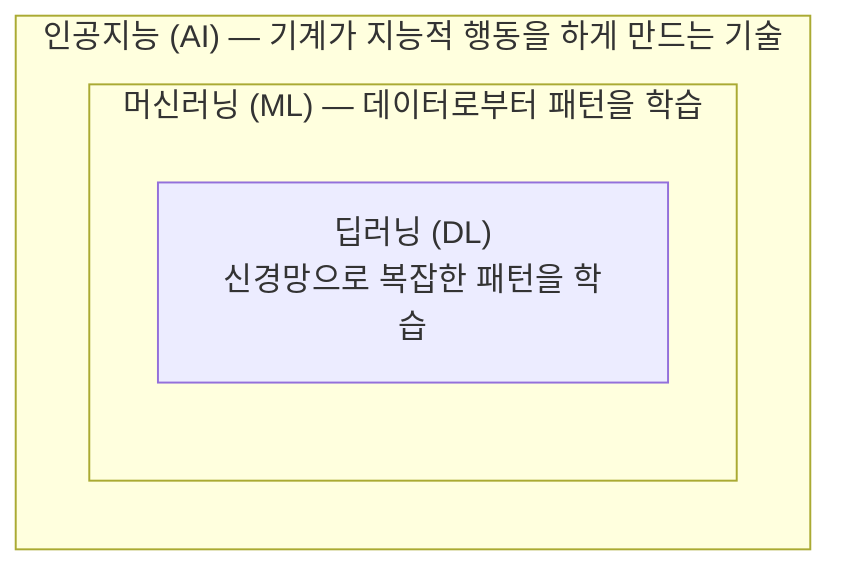
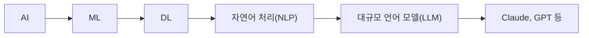

# 1.1 AI, ML, DL이란?

> **학습 목표**: 인공지능(AI), 머신러닝(ML), 딥러닝(DL)의 관계를 이해하고, 각각이 무엇을 의미하는지 명확히 구분할 수 있다.

## AI의 큰 그림

"인공지능"이라는 단어를 들으면 영화 속 로봇을 떠올릴 수 있지만, 현실의 AI는 훨씬 구체적입니다. AI, ML, DL은 서로 포함 관계에 있습니다:



이 관계는 마치 **도구 상자** 안의 도구들과 같습니다. AI라는 큰 상자 안에 ML이라는 도구가 있고, 그 안에 DL이라는 더 특수한 도구가 있는 것입니다. DL은 ML의 일종이고, ML은 AI의 일종이지만, AI의 모든 것이 ML인 것은 아닙니다.

## 인공지능 (Artificial Intelligence)

**정의**: 인간의 지능적 행동을 기계가 모방하도록 만드는 컴퓨터 과학의 한 분야.

AI는 1956년 다트머스 회의에서 처음 학문 분야로 정립되었습니다. 초기 AI는 **규칙 기반(rule-based)** 접근법을 사용했습니다:

```
만약 (이메일에 "무료" AND "당첨"이 포함되면)
  → 스팸으로 분류
```

이 방식의 한계는 명확합니다 — 사람이 모든 규칙을 직접 만들어야 합니다. 스팸 발송자가 "무ㄹㅛ"처럼 표기를 바꾸면 규칙이 무력화됩니다.

### 냉장고 레시피 비유

규칙 기반 AI를 이해하는 좋은 비유가 있습니다. 냉장고 안 재료를 보고 요리를 추천하는 시스템을 만든다고 합시다. 규칙 기반 방식으로는 이렇게 작성합니다:

```
만약 (달걀 AND 베이컨 AND 밀가루가 있으면) → "팬케이크" 추천
만약 (달걀 AND 토마토 AND 치즈가 있으면) → "오믈렛" 추천
만약 (달걀 AND 베이컨 AND 토마토가 있으면) → ???
```

세상에는 재료 조합이 수백만 가지입니다. 모든 경우의 수를 사람이 직접 규칙으로 만드는 것은 불가능합니다. 이 한계가 머신러닝의 등장으로 이어집니다.

## 머신러닝 (Machine Learning)

**정의**: 명시적으로 프로그래밍하지 않고, 데이터로부터 패턴을 학습하는 알고리즘.

규칙을 직접 만드는 대신, **데이터를 보여주고 패턴을 스스로 찾게** 합니다:

```mermaid
graph LR
    subgraph 전통적_프로그래밍["전통적 프로그래밍"]
        R["규칙\n+\n데이터"]
    end
    subgraph 머신러닝["머신러닝"]
        D["데이터\n+\n결과"]
    end
    R -->|결과| Result1["결과"]
    D -->|규칙 (모델)| Result2["규칙 (모델)"]
```

### 아이가 언어를 배우는 방법

머신러닝은 어린아이가 언어를 배우는 방식과 비슷합니다. 부모는 아이에게 "한국어 문법의 규칙을 먼저 외워라"라고 가르치지 않습니다. 아이는 수천 번의 대화를 들으면서 스스로 패턴을 익힙니다. "밥 먹자", "밥 먹었어?", "밥 먹고 싶어"를 반복해서 들으면서, 규칙을 명시적으로 배우지 않고도 자연스럽게 언어를 구사하게 됩니다.

### ML의 주요 유형

| 유형 | 설명 | 예시 |
|------|------|------|
| **지도 학습** (Supervised) | 정답이 있는 데이터로 학습 | 이미지 분류, 스팸 탐지 |
| **비지도 학습** (Unsupervised) | 정답 없이 데이터의 구조를 발견 | 고객 군집화, 이상 탐지 |
| **강화 학습** (Reinforcement) | 보상/벌점을 통해 행동을 학습 | 게임 AI, 로봇 제어 |

### 구체적인 사례: 넷플릭스 추천 시스템

넷플릭스는 머신러닝을 사용해 사용자에게 영화를 추천합니다. 넷플릭스는 2억 명 이상의 사용자 시청 이력, 평점, 시청 완료율 등의 데이터를 학습시킵니다. 모델은 "이런 취향을 가진 사용자는 이런 영화를 좋아한다"는 패턴을 스스로 발견합니다. 넷플릭스에 따르면 이 추천 시스템은 연간 약 10억 달러 이상의 구독 유지 효과를 냅니다.

## 딥러닝 (Deep Learning)

**정의**: 여러 층(layer)으로 구성된 인공 신경망을 사용하여 복잡한 패턴을 학습하는 ML의 하위 분야.

"딥(deep)"은 신경망의 층이 깊다는 의미입니다:

```
입력층        은닉층 1      은닉층 2      출력층
 ○─────────○─────────○─────────○
 ○─────────○─────────○─────────○
 ○─────────○─────────○         │
 ○─────────○─────────○         ○
            ○─────────○
```

### 요리 실력을 키우는 비유

딥러닝을 이해하는 데 요리 비유가 도움이 됩니다. 요리를 전혀 모르는 사람이 있다고 합시다. 처음에는 "칼 잡는 법"처럼 기초적인 것을 배웁니다(첫 번째 층). 그 다음에는 "양파 볶기"처럼 조금 더 복잡한 기술을 배웁니다(두 번째 층). 그 이후에는 "소스 만들기", "플레이팅"처럼 점점 더 복잡한 기술을 쌓아 올립니다. 각 층의 지식이 다음 층의 토대가 되면서, 결국에는 복잡한 요리를 만들 수 있게 됩니다. 딥러닝의 각 층도 이처럼 이전 층이 학습한 단순한 패턴 위에 더 복잡한 패턴을 쌓아 올립니다.

### 왜 딥러닝이 중요한가?

딥러닝이 2010년대 이후 폭발적으로 성장한 3가지 이유:

1. **데이터**: 인터넷의 확산으로 학습 데이터가 급증
2. **컴퓨팅 파워**: GPU의 발전으로 대규모 연산이 가능
3. **알고리즘**: 더 효과적인 학습 기법의 등장

딥러닝의 위력은 2012년 ImageNet 대회에서 처음 극적으로 드러났습니다. AlexNet이라는 딥러닝 모델이 기존 최고 성능 모델보다 오류율을 10%p 이상 낮추면서, 컴퓨터 비전 분야의 패러다임을 완전히 바꿔놓았습니다.

## Claude와 GPT는 어디에 해당하는가?

Claude, GPT 같은 **대규모 언어 모델(LLM)** 은 딥러닝의 한 분야입니다:



LLM은 **트랜스포머**(Transformer)라는 특정 신경망 아키텍처를 기반으로 하며, 방대한 텍스트 데이터로 학습됩니다. 이 내용은 [2장](/chapters/02-llm-deep-dive/)에서 자세히 다룹니다.

## 역사적 맥락

AI의 역사는 흥미롭게도 여러 번의 겨울과 봄을 반복했습니다:

- **1956년**: 다트머스 회의에서 "인공지능"이라는 용어가 처음 등장. 낙관적인 예측과 함께 첫 번째 붐이 시작
- **1970~80년대**: 기대에 미치지 못하는 성과로 "AI 겨울" 도래. 연구비 삭감
- **1997년**: IBM의 딥블루가 세계 체스 챔피언 가리 카스파로프를 꺾으며 AI의 가능성을 다시 증명
- **2012년**: AlexNet이 이미지 인식 대회에서 압도적 성능을 보이며 딥러닝 시대 개막
- **2017년**: 구글이 트랜스포머 아키텍처를 발표하며 LLM의 기초를 닦음
- **2022년**: ChatGPT 출시 5일 만에 사용자 100만 명 돌파. AI가 대중의 일상에 본격적으로 진입

## 흔한 오해 바로잡기

::: warning AI는 인간처럼 "이해"하는가?

많은 사람이 AI가 인간처럼 의미를 이해하고 생각한다고 오해합니다. 하지만 현재의 AI는 **패턴 인식과 통계적 관계**를 학습하는 시스템입니다.

예를 들어, AI가 "슬픈 영화"를 추천한다고 해서 AI가 슬픔이라는 감정을 이해하는 것은 아닙니다. 단지 특정 특성을 가진 영화를 좋아하는 사람들이 또 다른 특정 특성의 영화를 좋아한다는 통계적 패턴을 파악한 것입니다.

이것은 AI를 과소평가하려는 것이 아닙니다. 이 구분을 명확히 이해해야 AI를 올바르게 활용하고, AI의 실패 원인을 정확히 진단할 수 있습니다.
:::

## 🧪 실습: 규칙 기반 vs 머신러닝

다음 문제를 생각해보세요.

**상황**: 병원에서 환자의 당뇨병 여부를 예측하는 시스템을 만들려고 합니다.

사용 가능한 데이터:
- 나이, 체중, 혈당 수치, 혈압, 가족력, 운동량 (주당 시간), 식습관 점수

**질문 1**: 규칙 기반 접근법으로 이 시스템을 만든다면 어떤 규칙들을 작성할 수 있을까요? 최소 3가지 규칙을 생각해보세요.

**질문 2**: 그 규칙들의 한계는 무엇인가요? 어떤 환자를 잘못 분류할 가능성이 있나요?

**질문 3**: 머신러닝으로 접근한다면 어떤 데이터가 더 필요할까요? 어떤 종류의 학습(지도/비지도/강화)이 적합할까요?

이 사고 실험은 왜 현대 의료 AI가 규칙 기반이 아닌 머신러닝을 사용하는지를 직관적으로 이해하는 데 도움이 됩니다.

## 왜 이것이 중요한가?

AI, ML, DL을 구분하는 것은 단순한 용어 정리가 아닙니다. 이 구분은 실용적으로 중요합니다.

**문제에 맞는 도구를 고르기 위해**: 이메일 스팸 필터처럼 규칙이 명확한 문제라면 간단한 ML 모델로도 충분합니다. 반면 사진에서 사람 얼굴을 인식하거나 자연스러운 대화를 생성하는 것처럼 복잡한 문제에는 딥러닝이 필요합니다.

**AI 뉴스를 올바르게 해석하기 위해**: "AI가 암을 진단했다"는 기사를 봤을 때, 이것이 규칙 기반 시스템인지, 일반 ML인지, 딥러닝인지에 따라 신뢰도와 활용 맥락이 달라집니다.

**AI의 한계를 이해하기 위해**: 각 접근법의 특성을 알아야 AI가 왜 특정 상황에서 실패하는지, 그리고 어떻게 개선해야 하는지를 파악할 수 있습니다.

## 핵심 정리

| 개념 | 핵심 아이디어 | 비유 |
|------|-------------|------|
| AI | 기계가 지능적 행동을 함 | 넓은 우산 |
| ML | 데이터에서 패턴을 학습 | 경험으로 배우는 것 |
| DL | 깊은 신경망으로 복잡한 패턴 학습 | 뇌의 뉴런 연결을 모방 |
| LLM | 언어를 이해하고 생성하는 거대 모델 | Claude, GPT |

::: info 핵심 용어 정리

**인공지능 (Artificial Intelligence, AI)**: 기계가 인간의 지능적 행동을 모방하도록 만드는 컴퓨터 과학의 한 분야. 체스, 번역, 이미지 인식 등이 모두 AI의 범주에 속합니다.

**규칙 기반 시스템 (Rule-based System)**: 사람이 직접 "만약 A이면 B를 해라" 형태의 규칙을 작성하는 초기 AI 접근법. 전문가 시스템(Expert System)이라고도 합니다.

**머신러닝 (Machine Learning, ML)**: 명시적 규칙 없이 데이터에서 패턴을 스스로 찾아 학습하는 알고리즘의 총칭.

**지도 학습 (Supervised Learning)**: 입력과 정답(레이블) 쌍으로 이루어진 데이터로 모델을 학습시키는 방법. 가장 보편적인 ML 방식입니다.

**비지도 학습 (Unsupervised Learning)**: 정답 없이 데이터 자체의 구조나 패턴을 발견하는 학습 방법. 고객 세분화, 이상 탐지 등에 활용됩니다.

**강화 학습 (Reinforcement Learning)**: 에이전트가 환경과 상호작용하며 보상을 최대화하는 방향으로 행동을 학습하는 방법. 게임 AI, 로봇 제어에 주로 사용됩니다.

**딥러닝 (Deep Learning, DL)**: 여러 개의 층(layer)으로 구성된 심층 신경망을 사용하는 ML의 하위 분야. 이미지, 음성, 언어 처리 분야에서 혁명적 성과를 냈습니다.

**대규모 언어 모델 (Large Language Model, LLM)**: 방대한 텍스트 데이터로 학습된 대형 딥러닝 모델. Claude, GPT-4 등이 대표적입니다.

**트랜스포머 (Transformer)**: 2017년 구글이 발표한 신경망 아키텍처. 현대 LLM의 기반이 되는 구조입니다.
:::

## 더 알아보기

- [Anthropic Academy - AI Fluency: Framework & Foundations](https://anthropic.skilljar.com/) — AI 기초 개념을 인터랙티브하게 학습
- [Google - Machine Learning Crash Course](https://developers.google.com/machine-learning/crash-course) — ML 기초를 빠르게 학습

---

**다음 챕터**: [1.2 신경망의 기초](/chapters/01-ai-basics/neural-networks) →
