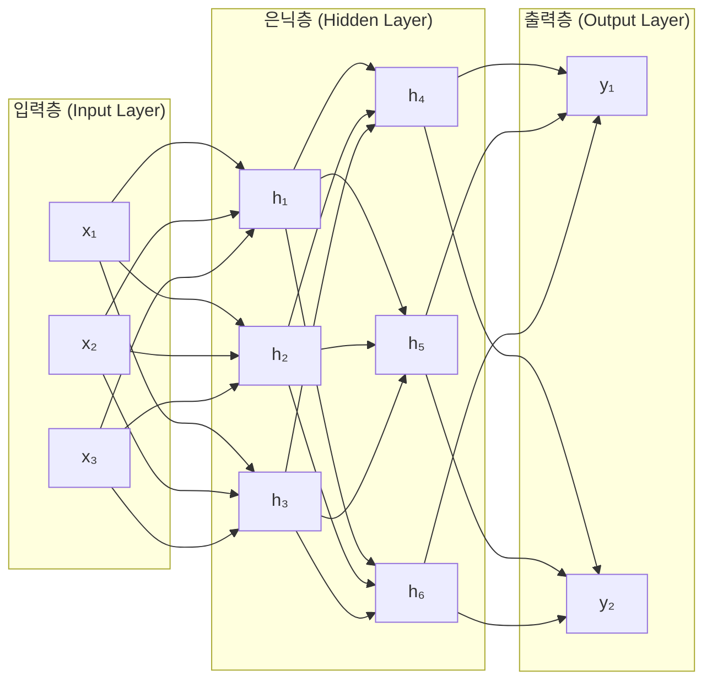
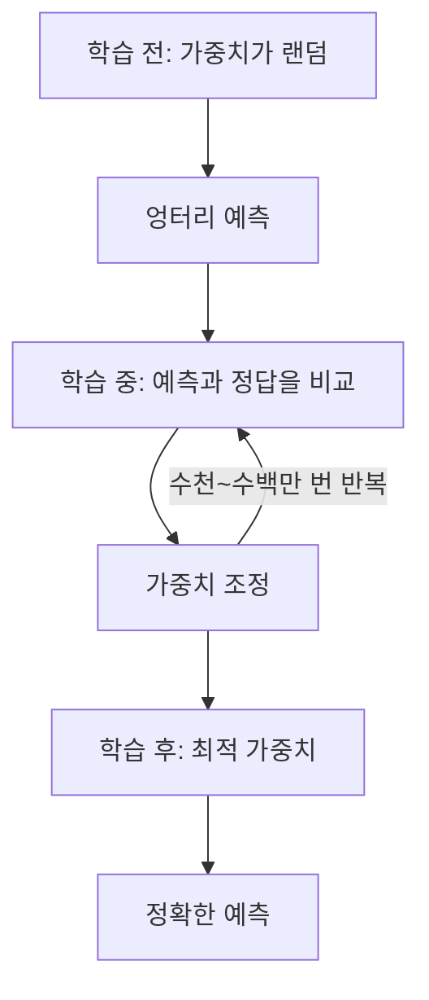

# 1.2 신경망의 기초

> **학습 목표**: 인공 신경망의 기본 구조를 이해하고, 뉴런·층·가중치의 역할을 설명할 수 있다.

## 생물학적 뉴런에서 인공 뉴런으로

인공 신경망은 인간 뇌의 뉴런에서 영감을 받았습니다. 실제 뇌 뉴런과 인공 뉴런을 비교해보면:

```
생물학적 뉴런:                    인공 뉴런:
                                 
수상돌기(입력) ──┐                  x₁ ──(w₁)──┐
수상돌기(입력) ──┤→ 세포체 → 축삭   x₂ ──(w₂)──┤→ Σ → f(z) → 출력
수상돌기(입력) ──┘   (처리)  (출력) x₃ ──(w₃)──┘   합산  활성화
```

인간의 뇌에는 약 860억 개의 뉴런이 있고, 각 뉴런은 최대 1만 개의 다른 뉴런과 연결되어 있습니다. 인공 신경망은 이 구조를 수학적으로 단순화하여 모방합니다. 생물학적 정확성보다는 **계산 가능한 수준의 추상화**가 핵심입니다.

::: tip 영감 vs 모방

인공 신경망이 뇌를 "모방"한다고 하지만, 비행기가 새를 "모방"하는 수준입니다. 새와 비행기 모두 날지만, 작동 원리는 근본적으로 다릅니다. 인공 신경망도 마찬가지입니다 — 뇌에서 영감을 받았지만, 실제 뇌와 같은 방식으로 작동하지는 않습니다.
:::

### 인공 뉴런(퍼셉트론)의 작동 방식

하나의 인공 뉴런은 다음 3단계를 수행합니다:

**1단계: 가중합 계산**
```
z = (x₁ × w₁) + (x₂ × w₂) + (x₃ × w₃) + b
```
- `x`: 입력값 (데이터)
- `w`: 가중치 (각 입력의 중요도)
- `b`: 편향 (기준점 조정)

**2단계: 활성화 함수 적용**
```
출력 = f(z)
```
활성화 함수는 뉴런이 "발화"할지 결정합니다.

**3단계: 출력 전달**

계산된 값이 다음 층의 뉴런으로 전달됩니다.

### 믹서기 비유

인공 뉴런의 작동을 믹서기로 상상할 수 있습니다. 여러 재료(입력 x)를 넣고, 각 재료의 양을 조절하는 다이얼(가중치 w)이 있습니다. 재료들을 섞은 결과가 일정 수준(편향 b)을 넘으면 믹서가 돌아갑니다(활성화). 중요한 것은 다이얼의 조합 — 즉 어떤 재료를 얼마나 중요하게 다루느냐에 따라 최종 음료의 맛(출력)이 달라집니다.

### 구체적인 예시: 스팸 판별

이메일이 스팸인지 판별하는 뉴런을 상상해봅시다:

```
입력                    가중치        가중합
"무료" 포함? (1) ──── × 0.8 ────┐
링크 개수 (5)    ──── × 0.3 ────┤→ z = 0.8 + 1.5 + 0.1 - 0.5
발신자 평판 (0.2) ─── × 0.5 ────┤   z = 1.9
                  편향: -0.5 ────┘
                                    → f(1.9) = 0.87 → "스팸일 확률 87%"
```

여기서 가중치 0.8, 0.3, 0.5는 학습을 통해 자동으로 결정됩니다. 사람이 직접 "무료라는 단어는 0.8만큼 중요하다"고 입력하는 것이 아닙니다.

## 신경망의 구조

뉴런을 여러 **층(layer)** 으로 쌓으면 신경망이 됩니다:



| 층 | 역할 | 비유 |
|----|------|------|
| **입력층** | 원시 데이터를 받음 | 눈, 귀 (감각기관) |
| **은닉층** | 특징을 추출하고 변환 | 뇌 (정보 처리) |
| **출력층** | 최종 결과를 생성 | 입, 손 (행동) |

### 회사 조직도 비유

신경망의 층 구조를 회사 조직도로 이해할 수 있습니다. 입력층은 현장 직원들로, 고객(데이터)으로부터 원시 정보를 받습니다. 은닉층은 중간 관리자들로, 현장 보고를 취합하고 분석합니다. 출력층은 최고 경영진으로, 최종 결정을 내립니다. 단계가 많을수록 더 복잡한 판단을 내릴 수 있지만, 그만큼 각 단계 간의 소통과 조율이 중요해집니다.

### 은닉층이 하는 일

은닉층이 많을수록 더 복잡한 패턴을 학습할 수 있습니다. 이미지 인식을 예로 들면:


각 은닉층이 점점 더 추상적인 특징을 학습합니다. 이것이 **딥러닝의 "딥"** 이 의미하는 것 — 깊은 층을 통해 단순한 패턴에서 복잡한 개념으로 나아갑니다.

실제로 2014년 구글이 발표한 Inception 모델은 22개의 층을 가지고 있었고, 이미지넷 대회에서 사람 수준에 근접한 성능을 보였습니다. 2015년 마이크로소프트의 ResNet은 152개의 층으로 사람을 뛰어넘는 정확도를 달성했습니다.

## 활성화 함수

활성화 함수는 뉴런의 출력을 결정합니다. 대표적인 함수들:

### Sigmoid
```
출력 범위: 0 ~ 1 (확률 해석에 유용)

     1 |          ────────
       |        /
   0.5 |------/----------
       |    /
     0 |───
       └──────────────────
```

### ReLU (Rectified Linear Unit)
```
출력 범위: 0 ~ ∞ (현대 신경망에서 가장 널리 사용)

       |        /
       |      /
       |    /
       |  /
     0 |──────────────
       └──────────────────
         음수는 0, 양수는 그대로
```

### 왜 활성화 함수가 필요한가?

활성화 함수가 없으면 아무리 많은 층을 쌓아도 결국 하나의 선형 변환과 같습니다. 활성화 함수가 **비선형성**을 추가해서 복잡한 패턴을 학습할 수 있게 합니다.

직관적 예시: 활성화 함수 없는 10층 신경망은 사실상 1층 신경망과 계산 결과가 동일합니다. 이는 두 개의 직선 y=ax와 y=bx를 합성하면 y=abx라는 또 다른 직선이 되는 것과 같은 원리입니다. 진짜 복잡한 패턴을 표현하려면 직선의 합성이 아니라 곡선이 필요합니다 — 이것이 ReLU나 Sigmoid 같은 활성화 함수의 역할입니다.

### 전등 스위치 비유

초기의 활성화 함수(계단 함수)는 전등 스위치와 같았습니다 — 켜거나 끄거나 둘 중 하나였습니다. 그런데 전등의 밝기를 0%부터 100%까지 자유롭게 조절할 수 있는 디머(dimmer) 스위치가 등장하면서 훨씬 미세한 제어가 가능해졌습니다. Sigmoid와 ReLU가 바로 이 "디머" 역할을 합니다. 특히 ReLU는 "음수 입력은 무조건 꺼라, 양수는 그 세기 그대로 전달하라"는 단순하지만 강력한 규칙으로 현대 딥러닝을 이끌고 있습니다.

## 가중치(Weight)와 편향(Bias)

신경망의 학습이란 결국 **최적의 가중치와 편향을 찾는 것**입니다.



### 라디오 주파수 비유

가중치를 조정하는 과정은 라디오 주파수를 맞추는 것과 비슷합니다. 처음에는 잡음만 들립니다(랜덤 가중치). 다이얼을 조금씩 돌리면서(가중치 조정) 점점 선명한 소리가 들리기 시작합니다. 완벽한 주파수를 찾으면(최적 가중치) 선명한 방송을 들을 수 있습니다. 다만 다이얼이 하나가 아니라 수억 개라면 — 이것이 현대 딥러닝 모델이 학습을 통해 다루는 가중치의 규모입니다.

### 파라미터 수의 규모

가중치와 편향을 통틀어 **파라미터**라고 부릅니다. 모델의 복잡도는 파라미터 수로 나타냅니다:

| 모델 | 파라미터 수 | 용도 |
|------|------------|------|
| 손글씨 인식 (LeNet) | 약 6만 | 숫자 인식 |
| 이미지 분류 (ResNet-50) | 약 2,500만 | 사진 분류 |
| GPT-3 | 약 1,750억 | 언어 생성 |
| GPT-4 (추정) | 1조 이상 | 복잡한 언어 이해 |

파라미터 수가 많을수록 더 복잡한 패턴을 표현할 수 있지만, 학습에 더 많은 데이터와 컴퓨팅 자원이 필요합니다.

가중치 조정이 어떻게 이루어지는지는 다음 챕터에서 자세히 다룹니다.

## 역사적 맥락: 신경망의 부침

신경망의 역사는 파란만장합니다:

- **1943년**: Warren McCulloch와 Walter Pitts가 최초의 인공 뉴런 모델을 수학적으로 기술
- **1958년**: Frank Rosenblatt이 퍼셉트론(Perceptron)을 개발. "기계가 스스로 학습할 수 있다"는 기대가 폭발
- **1969년**: Minsky와 Papert가 "퍼셉트론은 XOR 문제를 풀 수 없다"고 증명하며 첫 번째 겨울 도래
- **1986년**: 역전파 알고리즘이 재발견되며 다층 신경망이 가능해짐
- **1990년대~2000년대**: SVM, 랜덤 포레스트 등 다른 ML 기법에 밀려 비주류로
- **2006년**: Geoffrey Hinton이 깊은 신경망의 효율적인 학습법을 제시하며 딥러닝 시대 개막
- **2012년**: AlexNet이 이미지 인식 대회를 압도적으로 석권하며 딥러닝이 주류가 됨

## 흔한 오해 바로잡기

::: warning "신경망은 뇌처럼 작동한다?"

"인공 신경망"이라는 이름 때문에 많은 사람이 신경망이 실제 뇌와 비슷하게 작동한다고 생각합니다. 하지만 현대 인공 신경망은 뇌에서 영감을 받았을 뿐, 뇌의 실제 작동 방식과는 크게 다릅니다.

몇 가지 차이점:
- 뇌의 뉴런은 스파이크(전기 신호의 타이밍)로 정보를 처리하지만, 인공 뉴런은 단순한 숫자를 사용합니다.
- 뇌는 전기와 화학 신호를 동시에 사용하지만, 인공 신경망은 순수한 수학 연산만 사용합니다.
- 뇌는 수면 중에도 학습하고 재구성되지만, 신경망은 명시적인 학습 단계와 추론 단계가 분리되어 있습니다.

이 차이를 이해하면 AI의 능력과 한계를 더 정확하게 파악할 수 있습니다.
:::

## 🧪 실습: 신경망을 직접 설계해보기

다음 문제를 읽고 신경망 구조를 설계해보세요.

**문제**: 병원에서 X-ray 이미지를 보고 폐렴 여부를 판단하는 신경망을 만들려고 합니다.

- 이미지 크기: 224 × 224 픽셀 (흑백)
- 출력: "정상" 또는 "폐렴"

**생각해볼 것**:

1. 입력층의 뉴런 수는 몇 개여야 할까요? (힌트: 224 × 224 = ?)
2. 출력층의 뉴런 수는 몇 개여야 할까요?
3. 은닉층이 전혀 없다면(입력층 → 출력층 직결) 어떤 한계가 있을까요?
4. 이 모델이 학습할 수 있는 "특징"에는 어떤 것들이 있을까요? (폐 안의 하얀 음영, 폐의 윤곽선 등)

실제로 Stanford 대학팀은 이와 유사한 방식으로 2017년에 방사선과 전문의와 동등한 수준의 폐렴 진단 AI를 발표했습니다. 이 모델은 10만 장 이상의 X-ray 이미지로 학습되었습니다.

## LLM과의 연결

Claude 같은 LLM도 결국 거대한 신경망입니다. 차이는 **규모**와 **구조**입니다:

| | 간단한 신경망 | LLM (Claude 등) |
|---|---|---|
| 파라미터 수 | 수천~수백만 | 수십억~수조 |
| 입력 | 숫자 벡터 | 텍스트 (토큰화) |
| 구조 | 단순 층 쌓기 | 트랜스포머 |
| 학습 데이터 | 특정 데이터셋 | 인터넷 텍스트 전체 |

## 왜 이것이 중요한가?

신경망의 내부 구조를 이해하면, AI 시스템의 행동을 더 잘 예측하고 해석할 수 있습니다.

**활용 측면**: 신경망의 입력층과 출력층 설계는 문제 정의와 직결됩니다. 어떤 데이터를 입력으로 주고 어떤 출력을 원하는지를 명확히 정의하는 것이 AI 프로젝트의 첫 번째 핵심 작업입니다.

**해석 측면**: 은닉층이 학습하는 "특징"을 이해하는 것이 AI 해석 가능성(Explainable AI) 연구의 핵심입니다. 의료, 금융, 법률처럼 판단의 근거가 중요한 분야에서 신경망 내부를 이해하는 것은 단순한 학문적 관심이 아니라 실용적 요구사항입니다.

## 핵심 정리

- **인공 뉴런**: 입력에 가중치를 곱하고, 합산하고, 활성화 함수를 적용
- **층**: 뉴런의 집합. 입력층 → 은닉층(들) → 출력층
- **가중치**: 각 연결의 중요도. 학습 = 최적의 가중치 찾기
- **활성화 함수**: 비선형성을 추가하여 복잡한 패턴 학습 가능
- **깊은 네트워크**: 층이 많을수록 더 추상적인 특징을 학습

::: info 핵심 용어 정리

**퍼셉트론 (Perceptron)**: 1958년 Frank Rosenblatt이 개발한 최초의 인공 뉴런 모델. 현대 신경망의 기본 단위입니다.

**가중치 (Weight)**: 두 뉴런 사이의 연결 강도. 학습 과정에서 조정되며, 모델의 "지식"이 담기는 곳입니다.

**편향 (Bias)**: 활성화 함수를 적용하기 전에 더해지는 상수. 뉴런의 발화 기준점을 조정합니다.

**파라미터 (Parameter)**: 가중치와 편향을 합친 총칭. 모델의 복잡도를 나타내는 지표로 사용됩니다.

**활성화 함수 (Activation Function)**: 뉴런의 출력을 비선형으로 변환하는 함수. Sigmoid, ReLU, Tanh 등이 있습니다.

**ReLU (Rectified Linear Unit)**: f(x) = max(0, x)로 정의되는 활성화 함수. 음수 입력은 0, 양수 입력은 그대로 출력합니다. 현대 딥러닝에서 가장 널리 사용됩니다.

**은닉층 (Hidden Layer)**: 입력층과 출력층 사이의 층. 층이 많을수록 더 복잡한 특징을 학습할 수 있습니다.

**완전 연결층 (Fully Connected Layer)**: 한 층의 모든 뉴런이 다음 층의 모든 뉴런과 연결된 구조. Dense Layer라고도 합니다.

**비선형성 (Non-linearity)**: 직선으로 표현할 수 없는 복잡한 관계. 활성화 함수가 신경망에 비선형성을 부여합니다.
:::

## 더 알아보기

- [3Blue1Brown - But what is a neural network?](https://www.youtube.com/watch?v=aircAruvnKk) — 신경망을 시각적으로 설명하는 최고의 영상
- [TensorFlow Playground](https://playground.tensorflow.org/) — 브라우저에서 신경망을 직접 실험

---

← [1.1 AI, ML, DL이란?](/chapters/01-ai-basics/) | **다음 챕터**: [1.3 학습의 원리](/chapters/01-ai-basics/how-learning-works) →
