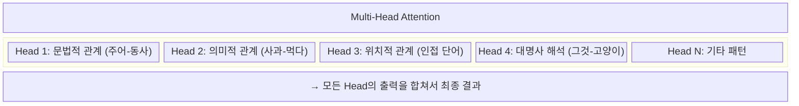
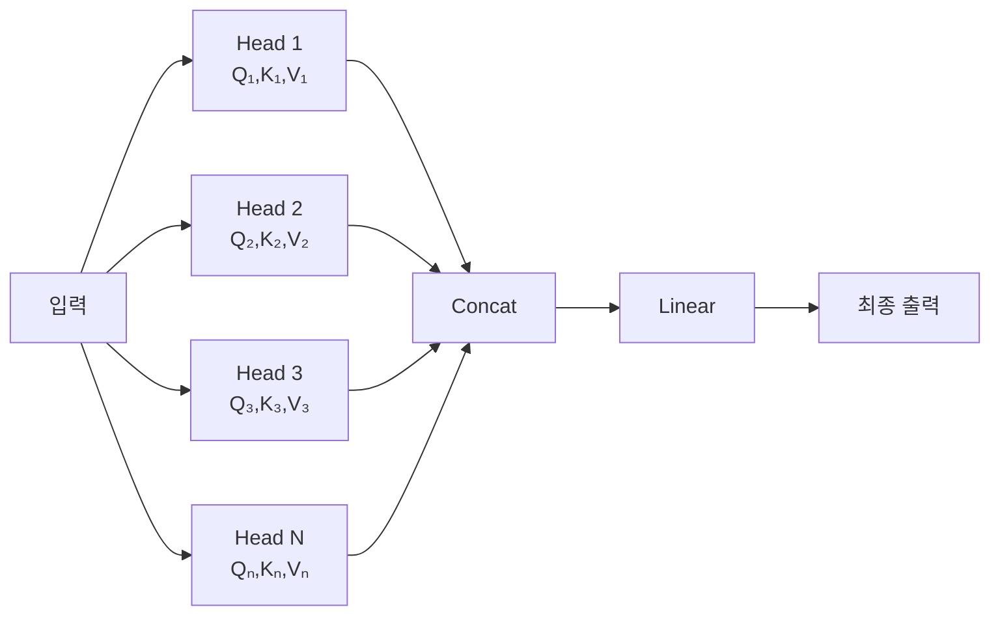

# 2.3 어텐션 메커니즘

> **학습 목표**: Self-Attention과 Multi-Head Attention의 작동 원리를 이해하고, 이것이 LLM의 핵심인 이유를 설명할 수 있다.

## 어텐션이란?

한 문장을 읽을 때 우리 뇌는 모든 단어에 동일한 주의를 기울이지 않습니다:

```
"그 고양이가 매트 위에 앉았다. 그것은 매우 편안해 보였다."

"그것"은 무엇을 가리킬까?
 → "그것" ──(높은 주의)──→ "고양이"
 → "그것" ──(낮은 주의)──→ "매트"
```

**어텐션 메커니즘**은 이와 같은 "관련성 파악"을 수학적으로 구현한 것입니다.

### 비유: 검색 엔진

어텐션을 이해하는 가장 직관적인 비유는 **검색 엔진**입니다.

- 검색창에 입력하는 키워드 = **Query (질문)**
- 데이터베이스의 각 문서가 가진 메타데이터/태그 = **Key (색인)**
- 문서의 실제 내용 = **Value (내용)**

검색 엔진은 Query와 모든 Key의 유사도를 계산하고, 유사도가 높은 문서의 Value를 더 많이 반영하여 결과를 보여줍니다. 어텐션도 정확히 이 방식으로 작동합니다. 단, 검색 엔진이 완전 일치를 찾는 것과 달리, 어텐션은 **의미적 유사도**를 기준으로 소프트하게(부드럽게) 가중치를 줍니다.

## Self-Attention의 직관

"Self"가 붙는 이유: 같은 시퀀스 내에서 각 토큰이 **자기 자신을 포함한 모든 토큰**을 참조합니다.

```
"나는 맛있는 사과를 먹었다"

"먹었다"의 입장에서 다른 토큰들의 중요도:

나는    맛있는   사과를   먹었다
 ██      ██     ████    ██████
 낮음    보통    높음     자기자신
 (0.1)  (0.2)  (0.5)   (0.2)

→ "먹었다"는 "사과를"에 가장 많은 주의를 기울임
```

이 과정을 통해 "먹었다"라는 단어는 "무엇을 먹었는가(사과를)"라는 정보를 자신의 벡터에 흡수합니다. 이것이 트랜스포머가 문맥을 이해하는 핵심 원리입니다.

## Query, Key, Value

Self-Attention은 **Q(Query), K(Key), V(Value)** 세 가지 벡터를 사용합니다.

### 도서관 비유

```
Query (질문):  "나는 무엇을 찾고 있는가?"
Key (색인):    "이 책은 어떤 내용인가?"  
Value (내용):  "이 책의 실제 정보"

1. 내 Query로 모든 책의 Key를 비교
2. 관련성이 높은 책에 높은 가중치
3. 가중치에 따라 Value를 합산 → 최종 답
```

### 수학적 과정

각 토큰의 임베딩 벡터에서 Q, K, V를 생성합니다:

```
토큰 임베딩 x → Q = x × Wq
              → K = x × Wk  (학습되는 가중치 행렬)
              → V = x × Wv
```

**Attention 계산**:

```
                    Q × Kᵀ
Attention(Q,K,V) = softmax(────────) × V
                     √dk

1. Q × Kᵀ  → 모든 토큰 쌍의 유사도 점수 (행렬)
2. ÷ √dk   → 스케일링 (값이 너무 커지는 것 방지)
3. softmax  → 확률로 변환 (합 = 1)
4. × V     → 가중 평균으로 최종 출력
```

### 단계별 예시

```
문장: "고양이가 앉았다"

Step 1: 유사도 계산 (Q × Kᵀ)
            고양이가  앉았다
고양이가  [  0.8      0.3  ]
앉았다    [  0.6      0.7  ]

Step 2: Softmax (확률 변환)
            고양이가  앉았다
고양이가  [  0.62     0.38 ]   ← 합 = 1
앉았다    [  0.47     0.53 ]   ← 합 = 1

Step 3: 가중 평균 (× V)
고양이가의 출력 = 0.62 × V_고양이가 + 0.38 × V_앉았다
앉았다의 출력   = 0.47 × V_고양이가 + 0.53 × V_앉았다
```

## 완전한 수치 예시: Attention 계산 따라하기

실제 숫자로 어텐션 계산 전체를 한 번 따라가 봅시다. 이해를 위해 2차원으로 단순화합니다.

**문장**: "사과 먹다" (2개 토큰)

**설정**:
- 임베딩 차원: 2 (실제로는 수천 차원이지만, 개념 이해를 위해)
- 각 토큰의 임베딩: 사과 = [1, 0], 먹다 = [0, 1]

**가중치 행렬** (학습으로 얻어진 것으로 가정):

```
Wq = [[1, 0],   Wk = [[1, 0],   Wv = [[0, 1],
      [0, 1]]         [0, 1]]         [1, 0]]
```

**1단계: Q, K, V 계산**

```
"사과":
  Q_사과 = [1, 0] × Wq = [1, 0]
  K_사과 = [1, 0] × Wk = [1, 0]
  V_사과 = [1, 0] × Wv = [0, 1]

"먹다":
  Q_먹다 = [0, 1] × Wq = [0, 1]
  K_먹다 = [0, 1] × Wk = [0, 1]
  V_먹다 = [0, 1] × Wv = [1, 0]
```

**2단계: 유사도 점수 계산 (Q × Kᵀ)**

```
"사과"의 Query로 모든 Key와 내적(dot product):
  Score(사과→사과) = Q_사과 · K_사과 = [1,0]·[1,0] = 1×1 + 0×0 = 1.0
  Score(사과→먹다) = Q_사과 · K_먹다 = [1,0]·[0,1] = 1×0 + 0×1 = 0.0

"먹다"의 Query로 모든 Key와 내적:
  Score(먹다→사과) = Q_먹다 · K_사과 = [0,1]·[1,0] = 0×1 + 1×0 = 0.0
  Score(먹다→먹다) = Q_먹다 · K_먹다 = [0,1]·[0,1] = 0×0 + 1×1 = 1.0

유사도 행렬:
         사과   먹다
사과  [ 1.0    0.0 ]
먹다  [ 0.0    1.0 ]
```

**3단계: 스케일링 (÷ √dk, dk=2)**

```
√dk = √2 ≈ 1.414

스케일된 유사도:
         사과   먹다
사과  [ 0.71   0.0  ]
먹다  [ 0.0    0.71 ]
```

**4단계: Softmax 적용**

```
softmax([0.71, 0.0]) = [e^0.71 / (e^0.71 + e^0), e^0 / (e^0.71 + e^0)]
                     = [2.034 / (2.034 + 1), 1 / (2.034 + 1)]
                     = [2.034 / 3.034, 1 / 3.034]
                     ≈ [0.67, 0.33]

어텐션 가중치:
         사과   먹다
사과  [ 0.67   0.33 ]   ← "사과"는 자신(0.67)에 더 주목
먹다  [ 0.33   0.67 ]   ← "먹다"는 자신(0.67)에 더 주목
```

**5단계: Value 가중합으로 출력 계산**

```
"사과"의 최종 출력:
  = 0.67 × V_사과 + 0.33 × V_먹다
  = 0.67 × [0, 1] + 0.33 × [1, 0]
  = [0, 0.67] + [0.33, 0]
  = [0.33, 0.67]

"먹다"의 최종 출력:
  = 0.33 × V_사과 + 0.67 × V_먹다
  = 0.33 × [0, 1] + 0.67 × [1, 0]
  = [0, 0.33] + [0.67, 0]
  = [0.67, 0.33]
```

**해석**:

```
입력:
  사과 = [1, 0]  →  출력 = [0.33, 0.67]
  먹다 = [0, 1]  →  출력 = [0.67, 0.33]

→ "사과"의 출력 벡터가 "먹다"의 Value 정보(0.33)를 흡수
→ "먹다"의 출력 벡터가 "사과"의 Value 정보(0.33)를 흡수
→ 각 토큰이 서로의 정보를 교환하며 문맥화(contextualize)됨
```

::: tip 이 예시에서 배울 점
실제 모델에서는 이 계산이 수천 차원에서 수십억 개의 파라미터로 이루어집니다. 하지만 핵심 원리는 동일합니다: Q×Kᵀ로 유사도를 계산하고, softmax로 가중치를 만들고, V의 가중합으로 출력을 냅니다. 학습을 통해 Wq, Wk, Wv가 의미 있는 관계를 포착하는 방향으로 조정됩니다.
:::

## Multi-Head Attention

하나의 어텐션만으로는 다양한 관계를 동시에 포착하기 어렵습니다. **Multi-Head**는 여러 개의 어텐션을 병렬로 실행합니다:





현대 LLM에서의 Head 수:
- GPT-3: 96 Heads
- Claude: 수십~수백 Heads (비공개)

### 비유: 음악 앙상블

Multi-Head Attention을 이해하는 직관적인 비유는 **오케스트라**입니다. 바이올린, 첼로, 플루트, 트럼펫이 각자 다른 음역과 음색을 담당하지만 동시에 연주하여 하나의 풍부한 음악을 만들어냅니다.

각 Head는 텍스트의 다른 "차원"을 담당합니다:
- Head 1: "나는"이 "먹었다"의 주어임을 파악 (문법적 관계)
- Head 2: "사과"와 "먹다"가 의미적으로 연결됨 (의미 관계)
- Head 3: 인접한 단어들의 순서 패턴 파악 (위치 관계)
- Head 4: 문장 전반의 감정적 톤 파악 (고수준 의미)

이 모든 관점이 합쳐져 훨씬 풍부한 문맥 이해가 가능합니다.

### 각 Head가 실제로 무엇을 학습하나?

Anthropic과 다른 연구 기관들의 해석 가능성 연구에 따르면, 어텐션 헤드들은 다음과 같은 실제 언어 패턴을 학습합니다:

| 어텐션 헤드 역할 (실제 연구 사례) | 설명 |
|----------------------------------|------|
| 대명사 해소 헤드 | "그가 말했다" → "그"가 앞의 특정 인물을 가리킴 |
| 동사-목적어 헤드 | 동사와 그 목적어의 관계 파악 |
| 괄호 매칭 헤드 | 여는 괄호와 닫는 괄호를 연결 |
| 다음 토큰 예측 헤드 | 문장 끝에서 다음에 올 내용 예측 |
| 복사 헤드 | 앞서 나온 중요한 단어를 뒤에서 다시 참조 |

## Masked Attention (인과적 어텐션)

Claude 같은 디코더 모델에서는 미래의 토큰을 볼 수 없습니다. **마스킹**으로 미래를 가립니다:

```
"나는 오늘 공부를 한다"

어텐션 마스크:
         나는  오늘  공부를  한다
나는   [  ✓     ✗     ✗     ✗  ]
오늘   [  ✓     ✓     ✗     ✗  ]
공부를 [  ✓     ✓     ✓     ✗  ]
한다   [  ✓     ✓     ✓     ✓  ]

✓ = 볼 수 있음, ✗ = 마스킹 (볼 수 없음)

→ 각 토큰은 자신과 이전 토큰만 참조 가능
```

이것이 LLM이 텍스트를 **왼쪽에서 오른쪽으로** 생성하는 이유입니다.

### 왜 마스킹이 필요한가?

생성 시에는 미래 토큰이 아직 존재하지 않습니다. 모델이 "한다"를 생성할 때 아직 "한다" 이후의 단어는 없습니다. 하지만 학습 시에는 전체 문장을 한 번에 처리하여 효율성을 높입니다. 마스킹은 학습 중에도 "이 토큰이 생성될 당시에는 이 미래 단어들을 볼 수 없었다"는 상황을 모방하는 장치입니다.

BERT 같은 인코더 모델은 마스킹을 사용하지 않습니다. 전체 문장을 한 번에 볼 수 있어서 이해 능력은 뛰어나지만, 텍스트를 순서대로 생성하는 용도로는 쓸 수 없습니다.

## 어텐션의 계산 비용

어텐션의 가장 큰 단점은 **이차 복잡도(O(n²))** 입니다:

```
토큰 수 n이 늘면, 모든 쌍을 비교해야 하므로:

n = 100    →    10,000 연산
n = 1,000  →  1,000,000 연산
n = 10,000 → 100,000,000 연산

→ 컨텍스트 윈도우를 늘리기 어려운 이유
```

### 이 문제가 얼마나 심각한가?

100토큰 문장의 어텐션 계산량을 1이라고 하면:
- 1,000토큰 → 100배 더 많은 연산
- 10,000토큰 → 10,000배 더 많은 연산
- 200,000토큰 (Claude 한도) → 4,000,000배 더 많은 연산

이것이 긴 컨텍스트 처리가 비용이 많이 드는 이유입니다. Anthropic이 Claude의 200K 토큰 컨텍스트를 달성하기 위해 상당한 엔지니어링 최적화가 필요했습니다.

이를 해결하기 위한 연구들:
- **Flash Attention**: 메모리 효율적 어텐션 구현
- **Sparse Attention**: 모든 쌍이 아닌 일부만 계산
- **Linear Attention**: O(n) 복잡도의 근사 방법

## 어텐션 시각화: 실제 모델에서 관찰되는 패턴

연구자들이 학습된 모델의 어텐션 가중치를 시각화하면 흥미로운 패턴을 발견합니다:

```
문장: "The animal didn't cross the street because it was too tired"

"it"의 어텐션 가중치:
  The       0.02
  animal    0.68   ← 높은 어텐션 (대명사 해소)
  didn't    0.01
  cross     0.01
  the       0.01
  street    0.12   ← 보통 어텐션 (다른 해석 가능성)
  because   0.03
  it        0.05
  was       0.04
  too       0.01
  tired     0.02
```

"it"이 "animal"을 가리킨다는 것을 모델이 어텐션을 통해 파악했습니다. 이것이 어텐션이 대명사 해소, 관계절 처리 등 복잡한 언어 이해를 가능하게 하는 방식입니다.

## 단계별 워크스루: "고양이가 생선을 먹었다"의 어텐션

```
문장: "고양이가 생선을 먹었다" (3 토큰으로 단순화)

1단계 — 각 토큰에서 Q, K, V 생성:
  "고양이가" → Q₁, K₁, V₁
  "생선을"   → Q₂, K₂, V₂
  "먹었다"   → Q₃, K₃, V₃

2단계 — "먹었다"(Q₃)의 어텐션 계산:
  유사도: Q₃·K₁ = 0.3 (고양이와 먹다의 관계)
          Q₃·K₂ = 0.8 (생선과 먹다의 관계 → 높음!)
          Q₃·K₃ = 0.5 (자기 자신)

3단계 — Softmax:
  [0.3, 0.8, 0.5] → [0.19, 0.52, 0.29]
   고양이  생선  먹었다

4단계 — Value 가중합:
  "먹었다" 출력 = 0.19×V₁ + 0.52×V₂ + 0.29×V₃
  → "먹었다"는 "생선을"의 정보를 52% 흡수
  → 이제 "먹었다" 벡터는 "생선을 먹는 행위"를 나타냄

결과:
  "먹었다" 토큰이 "무엇을 먹었는가(생선을)"를 알게 됨
  → 다음 토큰 예측 시 "고양이가 생선을 먹었다" 전체를 이해하고 응답 가능
```

## 🧪 실습: 어텐션 직접 계산해보기

다음 문장에서 각 토큰이 어떤 토큰에 높은 어텐션을 줄지 예상해보세요.

**문장**: "그녀는 빨간 사과를 샀다"

각 토큰에 대해 질문:
1. "그녀는" — 어떤 토큰과 가장 강하게 연결될까요? (동작 주체)
2. "빨간" — 어떤 토큰을 수식하므로 어떤 토큰에 높은 어텐션을 줄까요?
3. "샀다" — 목적어인 어떤 토큰에 높은 어텐션을 줄까요?

그 다음, 실제 어텐션 시각화 도구인 [BertViz](https://github.com/jessevig/bertviz)나 [Transformer Explainability](https://github.com/hila-chefer/Transformer-Explainability)를 사용해보세요.

**추가 사고 실험**: "나는 강가에서 낚시로 배를 잡았다"라는 문장에서 "배"(pear/stomach/ship 중 어느 의미?)를 모델은 어떻게 어텐션을 통해 해석할까요? 어떤 단어들이 "배"의 의미를 결정하는 데 도움을 줄까요?

## 왜 이것이 중요한가?

어텐션 메커니즘을 이해하면 LLM의 동작 방식에 대한 핵심 통찰을 얻습니다:

- **긴 문서 이해**: 문서 처음에 언급된 개념을 끝부분에서 정확히 참조할 수 있는 이유
- **문맥 의존적 해석**: 같은 단어도 전후 문맥에 따라 다르게 해석되는 이유
- **컨텍스트 비용**: 긴 컨텍스트가 더 비싼 이유 (O(n²) 계산)
- **다국어 능력**: 하나의 어텐션 메커니즘이 언어 구분 없이 관계를 파악하는 이유

::: warning 어텐션이 "이해"와 같은 것은 아닙니다
어텐션 가중치가 높다는 것이 모델이 그 관계를 "이해"한다는 의미는 아닙니다. 어텐션은 수학적 유사도 계산일 뿐이고, 실제 이해는 훨씬 복잡한 과정입니다. 어텐션 가중치를 보고 모델이 "왜" 특정 결정을 내렸는지 완전히 설명하는 것은 아직 열린 연구 문제입니다.
:::

## 핵심 정리

- **Self-Attention**: 시퀀스 내 모든 토큰이 서로를 참조하여 관련성을 파악
- **Q, K, V**: Query(질문), Key(색인), Value(내용)로 유사도를 계산
- **Multi-Head**: 여러 어텐션을 병렬 실행하여 다양한 관계를 동시에 포착
- **Masked Attention**: 디코더에서 미래 토큰을 가려서 자기회귀적 생성
- **O(n²)**: 어텐션의 계산 비용은 토큰 수의 제곱에 비례

## 더 알아보기

- [The Illustrated Transformer (Jay Alammar)](https://jalammar.github.io/illustrated-transformer/) — 어텐션을 단계별로 시각화
- [3Blue1Brown - Attention in Transformers](https://www.youtube.com/watch?v=eMlx5fFNoYc)
- [Anthropic Research - Scaling Monosemanticity](https://www.anthropic.com/research) — 어텐션이 실제로 학습하는 것

::: info 핵심 용어 정리
| 용어 | 설명 |
|------|------|
| **어텐션 (Attention)** | 토큰 간 관련성을 계산하여 중요한 토큰에 더 많은 가중치를 부여하는 메커니즘 |
| **Self-Attention** | 같은 시퀀스 내의 토큰들끼리 서로 참조하는 어텐션. 트랜스포머의 핵심 |
| **Query (Q)** | "무엇을 찾고 있는가"에 해당하는 벡터. 현재 토큰의 검색 키 |
| **Key (K)** | "나는 어떤 내용인가"에 해당하는 벡터. 각 토큰의 색인 |
| **Value (V)** | "나의 실제 정보"에 해당하는 벡터. 어텐션 가중합에 사용됨 |
| **Softmax** | 점수 벡터를 0~1 사이의 확률 분포로 변환하는 함수. 합이 1이 됨 |
| **Multi-Head Attention** | 여러 개의 어텐션을 병렬로 실행하여 다양한 관계 패턴을 동시에 학습 |
| **Masked Attention** | 디코더에서 미래 토큰을 볼 수 없도록 가리는 인과적 어텐션 |
| **어텐션 가중치** | Softmax 이후의 값. 각 토큰이 다른 토큰에 기울이는 주의의 비율 |
| **O(n²) 복잡도** | n개 토큰의 어텐션 계산량이 n²에 비례. 긴 컨텍스트 처리의 병목 |
:::

---

← [2.2 토큰화와 임베딩](/chapters/02-llm-deep-dive/tokenization) | **다음 챕터**: [2.4 LLM의 학습과 추론](/chapters/02-llm-deep-dive/training-inference) →
