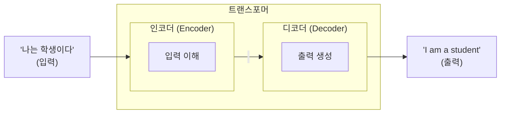
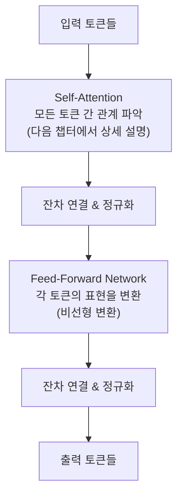

# 2.1 트랜스포머 아키텍처

> **학습 목표**: 트랜스포머의 전체 구조를 이해하고, 왜 이 아키텍처가 현대 AI의 기반이 되었는지 설명할 수 있다.

## 트랜스포머 이전의 세계

트랜스포머(2017) 이전에는 **RNN(순환 신경망)** 과 **LSTM**이 텍스트 처리의 주류였습니다:

```
RNN의 처리 방식 (순차적):
"나는" → [처리] → "오늘" → [처리] → "공부를" → [처리] → "한다"
   t=1              t=2               t=3              t=4

문제: 단어를 하나씩 순서대로 처리 → 느리고, 긴 문장에서 앞부분을 잊어버림
```

## "Attention Is All You Need"

2017년 Google 연구팀이 발표한 논문 **"Attention Is All You Need"** 가 모든 것을 바꿨습니다. 핵심 아이디어: 순차 처리를 버리고, **모든 단어를 동시에** 보면서 관계를 파악하자.

```
트랜스포머의 처리 방식 (병렬):
"나는"  ←──→  "오늘"  ←──→  "공부를"  ←──→  "한다"
   ↕            ↕            ↕            ↕
 모든 단어가 서로를 동시에 참조 (Attention)
```

## 트랜스포머의 전체 구조

원본 트랜스포머는 **인코더-디코더** 구조입니다:



### 현대 LLM은 어떤 부분을 사용하나?

| 모델 | 사용 구조 | 용도 |
|------|----------|------|
| BERT | **인코더만** | 텍스트 이해, 분류 |
| GPT, Claude | **디코더만** | 텍스트 생성 |
| T5, 원본 트랜스포머 | **인코더 + 디코더** | 번역, 요약 |

Claude와 GPT는 **디코더 전용(decoder-only)** 구조입니다. 입력을 이해하면서 동시에 다음 토큰을 생성합니다.

## 트랜스포머 블록의 내부

하나의 트랜스포머 블록은 이렇게 생겼습니다:



이 블록을 **수십~수백 개** 쌓은 것이 LLM입니다.

### 잔차 연결 (Residual Connection)

```
입력 ──────────────────────────┐
  │                            │
  ▼                            │ (더하기)
[Self-Attention] ──→ 출력 ───+─▼──→ 다음 층으로
```

입력을 출력에 직접 더해줍니다. 이를 통해:
- 깊은 네트워크에서도 학습이 잘 되고
- 이전 정보가 손실되지 않습니다

## 위치 인코딩 (Positional Encoding)

트랜스포머는 모든 토큰을 동시에 처리하기 때문에, 순서 정보가 없습니다. **위치 인코딩**이 순서를 알려줍니다:

```
"나는 밥을 먹는다"

토큰 임베딩:      위치 인코딩:       최종 입력:
[나는] = [0.2, ...]  + [pos 1] = [...]  → [0.5, ...]
[밥을] = [0.7, ...]  + [pos 2] = [...]  → [0.9, ...]
[먹는다] = [0.3, ...] + [pos 3] = [...]  → [0.6, ...]
```

## 왜 트랜스포머가 혁명적인가?

| 특성 | RNN/LSTM | 트랜스포머 |
|------|----------|-----------|
| 처리 방식 | 순차적 | **병렬** |
| 긴 문장 | 앞부분을 잊음 | 전체를 동시에 참조 |
| 학습 속도 | 느림 | **빠름** (GPU 활용) |
| 확장성 | 한계 있음 | **수조 파라미터까지 확장** |

병렬 처리가 가능하다는 것은 GPU를 최대한 활용할 수 있다는 뜻이고, 이것이 모델을 거대하게 키울 수 있는 기반이 되었습니다.

## 규모의 변화

| 모델 | 연도 | 파라미터 수 | 트랜스포머 블록 수 |
|------|------|-----------|-----------------|
| 원본 트랜스포머 | 2017 | 6,500만 | 6 |
| GPT-2 | 2019 | 15억 | 48 |
| GPT-3 | 2020 | 1,750억 | 96 |
| 현대 LLM | 2024~ | 수천억~수조 | 100+ |

## 핵심 정리

- **트랜스포머**: 2017년 등장, 병렬 처리로 AI의 판도를 바꿈
- **Self-Attention**: 모든 토큰이 서로를 동시에 참조하는 메커니즘
- **인코더-디코더**: 원본 구조. Claude/GPT는 디코더만 사용
- **트랜스포머 블록**: Self-Attention + Feed-Forward + 잔차 연결
- **위치 인코딩**: 병렬 처리에서 순서 정보를 보존
- **확장성**: 병렬 처리 덕분에 수천억 파라미터까지 확장 가능

## 더 알아보기

- [Attention Is All You Need (원문)](https://arxiv.org/abs/1706.03762)
- [The Illustrated Transformer (Jay Alammar)](https://jalammar.github.io/illustrated-transformer/) — 트랜스포머를 시각적으로 이해하는 최고의 글
- [3Blue1Brown - Transformers](https://www.youtube.com/watch?v=wjZofJX0v4M)

---

**다음 챕터**: [2.2 토큰화와 임베딩](/chapters/02-llm-deep-dive/tokenization) →
