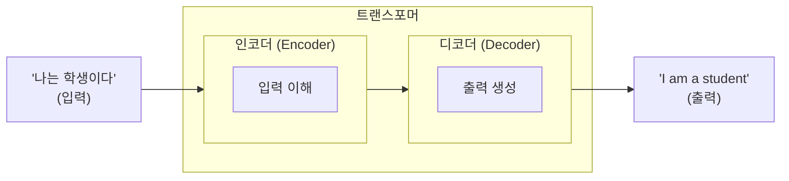
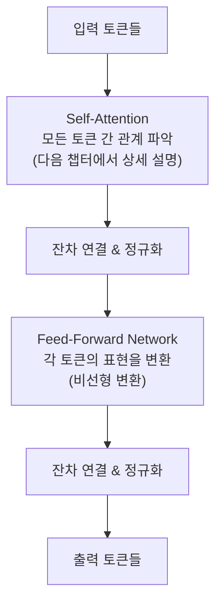

# 2.1 트랜스포머 아키텍처

> **학습 목표**: 트랜스포머의 전체 구조를 이해하고, 왜 이 아키텍처가 현대 AI의 기반이 되었는지 설명할 수 있다.

## 트랜스포머 이전의 세계

트랜스포머(2017) 이전에는 **RNN(순환 신경망)** 과 **LSTM**이 텍스트 처리의 주류였습니다:

```
RNN의 처리 방식 (순차적):
"나는" → [처리] → "오늘" → [처리] → "공부를" → [처리] → "한다"
   t=1              t=2               t=3              t=4

문제: 단어를 하나씩 순서대로 처리 → 느리고, 긴 문장에서 앞부분을 잊어버림
```

### 비유: 전화 전달 게임의 한계

RNN을 이해하는 가장 쉬운 비유는 **전화 전달 게임**입니다. 10명이 한 줄로 서서 메시지를 귓속말로 전달한다고 상상해보세요. 첫 번째 사람이 "나는 오늘 도서관에서 공부를 했는데 정말 재미있었다"라고 말하면, 마지막 사람에게는 원래 메시지가 흐릿하게 전달되거나 중간 내용이 빠집니다. RNN도 마찬가지입니다. 문장이 길어질수록 앞부분의 정보가 점점 희미해지는 **장기 의존성 문제(Long-term Dependency Problem)** 가 발생합니다.

LSTM은 이 문제를 어느 정도 개선했지만, 근본적인 한계인 **순차 처리의 굴레**를 벗어나지 못했습니다. 단어를 하나씩 처리해야 하니 GPU 수천 개를 가져다 놔도 병렬로 쓸 수가 없었습니다.

## "Attention Is All You Need"

2017년 Google 연구팀이 발표한 논문 **"Attention Is All You Need"** 가 모든 것을 바꿨습니다. 핵심 아이디어: 순차 처리를 버리고, **모든 단어를 동시에** 보면서 관계를 파악하자.

```
트랜스포머의 처리 방식 (병렬):
"나는"  ←──→  "오늘"  ←──→  "공부를"  ←──→  "한다"
   ↕            ↕            ↕            ↕
 모든 단어가 서로를 동시에 참조 (Attention)
```

### 비유: 회의실과 전화 전달 게임

트랜스포머의 방식은 **회의실**에 비유할 수 있습니다. 전화 전달 게임은 정보가 한 방향으로만 순서대로 흐르지만, 회의실에서는 참석자 모두가 동시에 서로를 보고 대화할 수 있습니다. "나는"이라는 단어가 "한다"라는 동사와 직접 연결될 수 있고, "공부를"이 "오늘"과 바로 대화할 수 있습니다. 중간에 다른 단어를 거칠 필요가 없습니다.

이 단순한 아이디어의 전환이 AI 역사에서 가장 큰 도약 중 하나가 되었습니다.

## 트랜스포머의 전체 구조

원본 트랜스포머는 **인코더-디코더** 구조입니다:



### 현대 LLM은 어떤 부분을 사용하나?

| 모델 | 사용 구조 | 용도 |
|------|----------|------|
| BERT | **인코더만** | 텍스트 이해, 분류 |
| GPT, Claude | **디코더만** | 텍스트 생성 |
| T5, 원본 트랜스포머 | **인코더 + 디코더** | 번역, 요약 |

Claude와 GPT는 **디코더 전용(decoder-only)** 구조입니다. 입력을 이해하면서 동시에 다음 토큰을 생성합니다.

::: tip 왜 생성 모델은 디코더만 쓸까?
인코더는 문장 전체를 한 번에 보고 이해하는 데 특화되어 있습니다. 반면 디코더는 앞에 이미 생성된 내용을 보면서 다음을 생성하는 구조입니다. 텍스트를 순서대로 생성해야 하는 LLM에게는 디코더 구조가 더 자연스럽습니다. 인코더 없이도 디코더 혼자서 입력 이해와 출력 생성을 모두 할 수 있습니다.
:::

## 트랜스포머 블록의 내부

하나의 트랜스포머 블록은 이렇게 생겼습니다:



이 블록을 **수십~수백 개** 쌓은 것이 LLM입니다.

### 잔차 연결 (Residual Connection)

```
입력 ──────────────────────────┐
  │                            │
  ▼                            │ (더하기)
[Self-Attention] ──→ 출력 ───+─▼──→ 다음 층으로
```

입력을 출력에 직접 더해줍니다. 이를 통해:
- 깊은 네트워크에서도 학습이 잘 되고
- 이전 정보가 손실되지 않습니다

### 비유: 레시피에 재료를 하나씩 추가하기

잔차 연결은 요리에 비유하면 이렇습니다. 재료(입력)를 완전히 갈아없애는 것이 아니라, 원래 재료에 새로운 맛(Self-Attention의 출력)을 **더하는** 방식입니다. 매 단계에서 원래 재료가 보존되기 때문에, 100층짜리 깊은 네트워크에서도 처음 입력의 정보가 끝까지 살아남을 수 있습니다. 이 기법이 없으면 수십 층 이상의 네트워크는 학습 자체가 잘 안 됩니다.

### Feed-Forward Network의 역할

Self-Attention이 "어떤 토큰들이 서로 관련 있는가"를 파악한다면, Feed-Forward Network(FFN)는 "그 관련 정보를 바탕으로 이 토큰의 의미를 어떻게 변환할 것인가"를 담당합니다.

FFN의 크기는 모델 성능에 중요한 영향을 미칩니다. GPT-3의 경우 각 FFN은 약 49,152차원의 중간 표현을 갖습니다(임베딩 차원 12,288의 4배). 이 안에 모델이 학습한 사실적 지식의 상당 부분이 저장되어 있다는 연구 결과도 있습니다.

## 위치 인코딩 (Positional Encoding)

트랜스포머는 모든 토큰을 동시에 처리하기 때문에, 순서 정보가 없습니다. **위치 인코딩**이 순서를 알려줍니다:

```
"나는 밥을 먹는다"

토큰 임베딩:      위치 인코딩:       최종 입력:
[나는] = [0.2, ...]  + [pos 1] = [...]  → [0.5, ...]
[밥을] = [0.7, ...]  + [pos 2] = [...]  → [0.9, ...]
[먹는다] = [0.3, ...] + [pos 3] = [...]  → [0.6, ...]
```

### 비유: 줄 번호가 없는 책

위치 인코딩이 왜 필요한지 이해하는 쉬운 방법: 책의 모든 페이지를 섞어서 한꺼번에 읽는다고 상상해보세요. 내용은 알 수 있지만 순서를 모릅니다. 위치 인코딩은 각 페이지에 "나는 1번째 페이지다", "나는 2번째 페이지다"라는 도장을 찍어주는 것입니다.

원본 트랜스포머는 사인파(sin/cos) 함수로 위치 인코딩을 만들었습니다. 현대 LLM들은 **RoPE(Rotary Position Embedding)** 같은 더 발전된 방식을 사용해서 긴 컨텍스트를 더 잘 처리합니다. Claude 3의 200K 토큰 컨텍스트 윈도우도 이런 발전된 위치 인코딩 덕분에 가능합니다.

## 왜 트랜스포머가 혁명적인가?

| 특성 | RNN/LSTM | 트랜스포머 |
|------|----------|-----------|
| 처리 방식 | 순차적 | **병렬** |
| 긴 문장 | 앞부분을 잊음 | 전체를 동시에 참조 |
| 학습 속도 | 느림 | **빠름** (GPU 활용) |
| 확장성 | 한계 있음 | **수조 파라미터까지 확장** |

병렬 처리가 가능하다는 것은 GPU를 최대한 활용할 수 있다는 뜻이고, 이것이 모델을 거대하게 키울 수 있는 기반이 되었습니다.

## 규모의 변화

| 모델 | 연도 | 파라미터 수 | 트랜스포머 블록 수 |
|------|------|-----------|-----------------|
| 원본 트랜스포머 | 2017 | 6,500만 | 6 |
| GPT-2 | 2019 | 15억 | 48 |
| GPT-3 | 2020 | 1,750억 | 96 |
| 현대 LLM | 2024~ | 수천억~수조 | 100+ |

### 파라미터 수가 직관적으로 얼마나 큰가?

GPT-3의 1,750억 파라미터를 A4 용지에 숫자로 출력한다면, 그 높이가 에베레스트 산의 수백 배에 달합니다. 각 파라미터를 32비트 부동소수점으로 저장하면 약 700GB의 저장 공간이 필요합니다. 이걸 일반 PC 메모리(16GB)에 올리는 것은 불가능합니다.

현대 LLM이 작동하려면 고사양 GPU 여러 장이 필요한 이유가 여기 있습니다.

## 단계별 워크스루: "나는 학생이다"가 트랜스포머를 통과하는 과정

실제로 문장 하나가 트랜스포머를 통과하는 과정을 따라가 봅시다.

**입력 문장**: "나는 학생이다"

```
1단계 — 토큰화:
"나는 학생이다" → ["나는", "학생", "이다"]
                    토큰0   토큰1   토큰2

2단계 — 임베딩 + 위치 인코딩:
"나는"  → [0.21, 0.54, -0.13, ...] + [위치0] = [최종 벡터 0]
"학생"  → [0.87, -0.32, 0.66, ...] + [위치1] = [최종 벡터 1]
"이다"  → [-0.12, 0.91, 0.44, ...] + [위치2] = [최종 벡터 2]
(실제로는 수천 차원의 벡터)

3단계 — 트랜스포머 블록 (총 N번 반복):
  3a. Self-Attention:
      "나는" ←→ "학생" (관련성 높음: 주어-목적어)
      "나는" ←→ "이다" (관련성 보통)
      "학생" ←→ "이다" (관련성 높음: 명사-서술어)
      → 각 토큰의 벡터가 문맥 정보를 반영하여 업데이트

  3b. Feed-Forward:
      각 토큰 벡터에 비선형 변환 적용
      → 더 풍부한 표현으로 변환

  3c. 잔차 연결:
      이전 벡터 + 변환된 벡터 → 정보 보존

4단계 — 최종 출력 벡터:
각 토큰이 문맥을 완전히 반영한 벡터로 변환됨
→ 다음 토큰 예측에 사용
```

::: info 트랜스포머 블록은 몇 개를 쌓을까?
GPT-3은 96개의 블록을 쌓습니다. 즉 "나는 학생이다"라는 문장은 이 과정을 96번 반복하며 점점 더 깊은 표현으로 변환됩니다. 초기 블록에서는 문법 구조를, 후기 블록에서는 의미와 추론을 처리한다는 연구 결과들이 있습니다.
:::

## 🧪 실습: 트랜스포머 구조 생각해보기

다음 질문에 대해 스스로 생각해보세요:

1. "나는 어제 도서관에서 친구를 만났다. 그는 매우 반가워했다." 에서 "그는"이 "친구"를 가리킨다는 것을 RNN과 트랜스포머는 각각 어떻게 파악할까요? 어떤 방식이 더 유리할까요?

2. 트랜스포머 블록을 1개만 쌓으면 어떻게 될까요? 96개를 쌓으면 어떤 이점이 생길까요?

3. 위치 인코딩 없이 "나는 밥을 먹었다"와 "밥을 나는 먹었다"를 처리하면 트랜스포머는 두 문장을 어떻게 구별할까요?

## 왜 이것이 중요한가?

트랜스포머 아키텍처를 이해하면, 다음 질문들에 대한 직관적인 답을 얻을 수 있습니다:

- **왜 Claude는 긴 문서를 잘 처리할 수 있나?** — 어텐션 덕분에 문서의 어느 부분이든 직접 참조 가능
- **왜 모델이 클수록 더 잘할까?** — 더 많은 블록, 더 넓은 임베딩 차원 → 더 풍부한 표현 학습 가능
- **왜 API 비용이 토큰 수에 비례할까?** — 각 토큰이 모든 다른 토큰과 어텐션 계산을 해야 하기 때문
- **왜 ChatGPT나 Claude에 긴 역할극 설정을 주면 효과적일까?** — 컨텍스트 윈도우 전체가 어텐션의 참조 범위

## 핵심 정리

- **트랜스포머**: 2017년 등장, 병렬 처리로 AI의 판도를 바꿈
- **Self-Attention**: 모든 토큰이 서로를 동시에 참조하는 메커니즘
- **인코더-디코더**: 원본 구조. Claude/GPT는 디코더만 사용
- **트랜스포머 블록**: Self-Attention + Feed-Forward + 잔차 연결
- **위치 인코딩**: 병렬 처리에서 순서 정보를 보존
- **확장성**: 병렬 처리 덕분에 수천억 파라미터까지 확장 가능

## 더 알아보기

- [Attention Is All You Need (원문)](https://arxiv.org/abs/1706.03762)
- [The Illustrated Transformer (Jay Alammar)](https://jalammar.github.io/illustrated-transformer/) — 트랜스포머를 시각적으로 이해하는 최고의 글
- [3Blue1Brown - Transformers](https://www.youtube.com/watch?v=wjZofJX0v4M)

::: info 핵심 용어 정리
| 용어 | 설명 |
|------|------|
| **트랜스포머 (Transformer)** | 2017년 Google이 제안한 신경망 아키텍처. 어텐션 메커니즘으로 모든 토큰을 병렬 처리 |
| **Self-Attention** | 시퀀스 내 토큰들이 서로의 관련성을 계산하는 메커니즘 |
| **인코더 (Encoder)** | 입력 시퀀스를 이해하는 역할. BERT가 대표적 |
| **디코더 (Decoder)** | 출력을 순서대로 생성하는 역할. GPT, Claude가 대표적 |
| **트랜스포머 블록** | Self-Attention + Feed-Forward + 잔차 연결로 구성된 기본 단위. 수십~수백 개 쌓음 |
| **잔차 연결 (Residual Connection)** | 입력을 출력에 더하여 정보 손실을 방지하는 기법 |
| **위치 인코딩 (Positional Encoding)** | 병렬 처리에서 순서 정보를 각 토큰 벡터에 주입하는 방법 |
| **Feed-Forward Network (FFN)** | 각 토큰의 표현을 비선형 변환하는 층. 모델의 사실 지식 저장소 역할도 함 |
| **파라미터 (Parameter)** | 학습을 통해 최적화되는 가중치 값들. 모델의 "지식"을 담고 있음 |
:::

---

**다음 챕터**: [2.2 토큰화와 임베딩](/chapters/02-llm-deep-dive/tokenization) →
