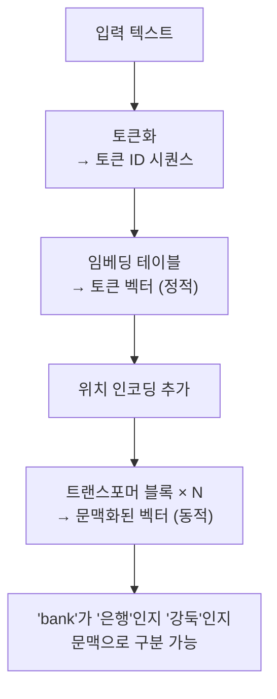

# 2.2 토큰화와 임베딩

> **학습 목표**: AI가 텍스트를 숫자로 변환하는 과정(토큰화, 임베딩)을 이해하고, 이것이 LLM의 성능에 미치는 영향을 설명할 수 있다.

## 왜 토큰화가 필요한가?

컴퓨터는 텍스트를 직접 이해할 수 없습니다. 신경망에 입력하려면 **텍스트 → 숫자**로 변환해야 합니다. 이 과정이 **토큰화(Tokenization)** 입니다.

```
"Claude는 도움이 됩니다"
        │ 토큰화
        ▼
["Claude", "는", " 도움", "이", " 됩니다"]
        │ 토큰 ID 변환
        ▼
[15234, 890, 34521, 234, 78432]
        │ 임베딩
        ▼
[[0.12, -0.34, ...], [0.56, 0.78, ...], ...]
```

### 비유: 악보와 음표

악기를 연주하려면 음악을 악보로 변환해야 합니다. 악보 없이는 연주자(AI)가 음악을 이해하거나 재현할 수 없습니다. 토큰화는 텍스트를 AI가 읽을 수 있는 "악보"로 변환하는 과정입니다. 악보에서 음표 하나하나가 가장 작은 단위이듯, 토큰이 AI가 처리하는 가장 작은 단위입니다.

중요한 점은, 악보의 단위를 어떻게 정하느냐에 따라 악보의 길이와 복잡도가 달라집니다. 음표 하나를 "도"로 표현할 수도 있고, "미파솔"을 하나의 단위로 묶을 수도 있습니다. 토큰화 방식도 마찬가지입니다.

## 토큰화 방식의 진화

### 1. 단어 단위 (Word-level)
```
"인공지능은 재미있다" → ["인공지능은", "재미있다"]

문제: 어휘 사전이 너무 커지고, 처음 보는 단어를 처리할 수 없음
```

단어 단위 방식의 가장 큰 문제는 **어휘 외 단어(OOV, Out-Of-Vocabulary)** 입니다. 사전에 없는 단어를 만나면 모델이 처리할 방법이 없습니다. 한국어처럼 어미 변화가 많은 언어에서는 "먹다", "먹어", "먹었다", "먹겠다"를 모두 별개의 단어로 취급해야 해서 어휘 사전이 기하급수적으로 커집니다.

### 2. 글자 단위 (Character-level)
```
"AI는 좋다" → ["A", "I", "는", " ", "좋", "다"]

문제: 시퀀스가 너무 길어지고, 의미 파악이 어려움
```

글자 단위는 OOV 문제가 없지만, "대한민국"이라는 단어를 처리하려면 ["대", "한", "민", "국"] 4개의 토큰이 필요합니다. 긴 문서는 시퀀스가 엄청나게 길어지고, 모델이 의미 있는 단위(단어, 구절)를 학습하기 어렵습니다.

### 3. 서브워드 단위 (Subword) — 현재 주류

단어와 글자의 중간 지점. 자주 쓰는 조합은 한 토큰으로, 드문 단어는 쪼개서 처리합니다.

```
"unhappiness" → ["un", "happiness"]
"인공지능"     → ["인공", "지능"]
"Anthropic"   → ["Anthrop", "ic"]
```

대표적인 서브워드 알고리즘:

| 알고리즘 | 사용 모델 | 특징 |
|----------|----------|------|
| **BPE** (Byte Pair Encoding) | GPT, Claude | 빈도 기반 병합 |
| **WordPiece** | BERT | BPE 변형 |
| **SentencePiece** | T5, LLaMA | 언어 독립적 |

### BPE 작동 방식

```
초기: ["l", "o", "w", "e", "r"]

1단계: 가장 빈번한 쌍 "l"+"o" 병합 → ["lo", "w", "e", "r"]
2단계: 가장 빈번한 쌍 "e"+"r" 병합 → ["lo", "w", "er"]
3단계: 가장 빈번한 쌍 "lo"+"w" 병합 → ["low", "er"]
4단계: "low"+"er" 병합 → ["lower"]

→ 이 과정을 전체 학습 데이터에 대해 수만 번 반복
```

### BPE 단계별 워크스루: 실제 어휘 구축 과정

작은 데이터셋으로 BPE가 어휘를 구축하는 과정을 따라가 봅시다.

**학습 데이터**: "low lower newest widest"가 각각 5, 2, 6, 3회 등장

```
초기 어휘:
l(10회), o(10회), w(10회), e(14회), r(7회), n(6회), s(9회), t(9회), i(3회), d(3회)
→ 공백으로 구분된 문자 시퀀스로 시작

가장 빈번한 쌍 찾기:
("e", "r") → 7+2 = 9회  ← 가장 많음
("e", "s") → 6+3 = 9회  ← 동률

"er" 병합 후 어휘에 추가:
low → l o w
lower → l o w er
newest → n e w er s t     ← 'er'이 하나의 단위가 됨
widest → w i d e s t

다음 반복: ("n","e"), ("ew","er") 등 다시 계산...
```

이 과정을 수만~수십만 번 반복하면, 어휘 크기가 목표치(보통 3만~10만)에 도달할 때까지 병합이 계속됩니다. GPT-4는 약 10만 개의 어휘를 사용합니다.

## 언어별 토큰화의 차이

토큰화 방식은 언어에 따라 크게 달라집니다. 이 차이가 AI 모델의 성능과 비용에 직접적인 영향을 미칩니다.

### 영어 vs 한국어 vs 코드

동일한 의미를 표현할 때 언어에 따라 토큰 수가 어떻게 달라지는지 비교해봅시다.

**의미**: "인공지능은 매우 유용합니다"

```
영어: "Artificial intelligence is very useful"
토큰: ["Artificial", " intelligence", " is", " very", " useful"]
토큰 수: 5개

한국어: "인공지능은 매우 유용합니다"
토큰: ["인공", "지능", "은", " 매우", " 유용", "합니다"]
토큰 수: 6개 (영어와 비슷)

일본어: "人工知能はとても役に立ちます"
토큰: ["人工", "知能", "は", "とても", "役に", "立ち", "ます"]
토큰 수: 7개
```

GPT 계열 토크나이저의 경우 한국어는 영어보다 토큰 효율이 약간 낮습니다. 하지만 초기 LLM(GPT-2 시절)은 한국어 한 글자가 3~5개의 토큰으로 분리되는 경우도 있었습니다. 현대 모델들은 한국어 데이터로도 충분히 학습하여 토큰 효율이 크게 개선되었습니다.

### 코드 토큰화의 특성

프로그래밍 언어는 자연어와 다르게 토큰화됩니다:

```python
# Python 코드
def calculate(x, y):
    return x + y

토큰 (GPT-4 기준):
["def", " calculate", "(", "x", ",", " y", "):", "\n", "    ", "return", " x", " +", " y"]
토큰 수: 13개
```

코드에서는 들여쓰기(스페이스 4개), 괄호, 연산자 등이 별개의 토큰이 됩니다. 이 때문에 긴 코드 파일을 처리할 때 토큰이 빠르게 소모됩니다.

### 왜 언어별 토큰 효율 차이가 생기나?

| 언어 특성 | 영향 |
|----------|------|
| 알파벳 기반 (영어) | BPE가 자주 쓰는 단어 조합을 효율적으로 병합 |
| 음절 기반 (한국어) | 음절 단위 분리가 많아 토큰 수 증가 경향 |
| 표의문자 (한자, 일본어 한자) | 글자 하나가 독립된 의미를 가져 1토큰이 되기도 함 |
| 학습 데이터 비율 | 학습 데이터에 많을수록 토큰 효율 향상 |

::: warning 한국어 AI 사용 시 주의
영어 기반으로 학습된 모델에 한국어 입력을 줄 경우, 영어 대비 1.5~2배 더 많은 토큰을 소비할 수 있습니다. 특히 토큰 기반 과금 API를 사용할 때는 이 점을 고려해야 합니다. Claude는 한국어 학습 데이터가 풍부해서 이 격차가 상대적으로 적은 편입니다.
:::

## 토큰의 실제 모습

Claude에서 실제로 토큰이 어떻게 나뉘는지 예시:

```
입력: "안녕하세요, Claude Code를 사용하고 있습니다."

토큰: ["안녕", "하세요", ",", " Claude", " Code", "를", " 사용", "하고", " 있습니다", "."]

토큰 수: 10개
```

::: tip 토큰 수가 중요한 이유
- LLM의 **컨텍스트 윈도우**(한 번에 처리할 수 있는 토큰 수)가 제한됨
- Claude: 최대 200K 토큰 (약 15만 단어 분량)
- 요금도 토큰 수 기반으로 과금
:::

### 예상 밖의 토큰 분리 사례

토큰화는 항상 우리 직관과 일치하지는 않습니다:

```
"ChatGPT"   → ["Chat", "G", "PT"]           (3토큰)
"2024년"    → ["2024", "년"]                 (2토큰)
"https://"  → ["https", "://"]              (2토큰)
"Hello!!!"  → ["Hello", "!!!" ]             (2토큰)
"   "       → ["   "]                       (공백 3개가 1토큰)
```

숫자는 특히 흥미롭습니다. "1234567890"은 경우에 따라 한 토큰이 되기도 하고 여러 토큰으로 나뉘기도 합니다. 이것이 LLM이 큰 수의 덧셈을 어려워하는 이유 중 하나입니다.

## 임베딩 (Embedding)

토큰 ID는 그냥 번호표일 뿐, 의미 정보가 없습니다. **임베딩**은 각 토큰을 **의미를 담은 고차원 벡터**로 변환합니다.

```
토큰 ID → 임베딩 벡터 (수백~수천 차원)

"왕"  → [0.21, -0.53, 0.87, 0.12, ...]
"여왕" → [0.23, -0.51, 0.85, 0.45, ...]  ← "왕"과 비슷!
"사과" → [0.91, 0.32, -0.12, 0.67, ...]  ← 완전 다름
```

### 비유: 지도 위의 좌표

임베딩을 이해하는 가장 좋은 비유는 **지도 위의 좌표**입니다. 서울(37.5°N, 127.0°E)과 인천(37.4°N, 126.6°E)의 좌표는 서로 비슷합니다. 실제로 두 도시는 가깝기 때문입니다. 반면 서울과 뉴욕(40.7°N, 74.0°W)의 좌표는 완전히 다릅니다.

임베딩도 마찬가지입니다. "왕"과 "여왕"은 비슷한 의미를 가지므로 고차원 공간에서 서로 가까운 위치에 있습니다. "사과"는 전혀 다른 의미이므로 먼 곳에 있습니다. 이 거리가 단어 간의 의미적 유사성을 나타냅니다.

### 임베딩의 마법: 의미 연산

잘 학습된 임베딩은 단어 간 관계를 벡터 연산으로 표현합니다:

```
왕 - 남자 + 여자 ≈ 여왕

벡터로:
[0.21, -0.53, 0.87, ...]   (왕)
- [0.15, -0.21, 0.34, ...]   (남자)
+ [0.17, -0.19, 0.32, ...]   (여자)
= [0.23, -0.51, 0.85, ...]   ≈ 여왕!
```

이 결과는 2013년 Word2Vec 논문에서 처음 발견되어 AI 연구자들을 놀라게 했습니다. 단어의 의미가 수학적으로 연산 가능한 구조를 갖는다는 것을 보여주었습니다.

비슷한 패턴들:
```
파리 - 프랑스 + 일본 ≈ 도쿄  (수도 관계)
달리기 - 달리다 + 먹다 ≈ 먹기  (동사 형태 변화)
개 - 강아지 + 고양이 ≈ 아기고양이  (새끼 관계)
```

### 임베딩 공간 시각화

고차원 벡터를 2D로 압축해서 보면:

```
         ↑
    여왕 ·   · 왕
         
    공주 ·   · 왕자
         
───────────────────→
    
    사과 ·   · 바나나
    
    자동차 · · 비행기
```

의미가 비슷한 단어들이 가까이 모여 있습니다.

### 실제 임베딩 차원 수

| 모델 | 임베딩 차원 |
|------|-----------|
| Word2Vec (2013) | 300 |
| BERT-base | 768 |
| GPT-3 | 12,288 |
| 추정 Claude 3 | 8,192~16,384 |

GPT-3의 임베딩 차원이 12,288이라는 것은, 각 토큰이 12,288개의 숫자로 표현된다는 뜻입니다. 이 12,288차원 공간 안에 단어의 모든 의미적 속성이 인코딩되어 있습니다.

## LLM에서의 임베딩

LLM의 임베딩은 단순 단어 임베딩보다 훨씬 풍부합니다:



**정적 임베딩**: 같은 단어는 항상 같은 벡터 (Word2Vec 등)
**문맥 임베딩**: 문맥에 따라 같은 단어도 다른 벡터 (트랜스포머)

### 문맥 임베딩의 힘: 동음이의어 구분

```
"나는 은행에서 돈을 뺐다" 에서의 "은행"
→ 트랜스포머를 통과한 후 벡터: [금융, 돈, 예금 방향에 가까운 벡터]

"은행나무 아래에서 쉬었다" 에서의 "은행"
→ 트랜스포머를 통과한 후 벡터: [나무, 식물, 자연 방향에 가까운 벡터]
```

같은 토큰 "은행"이 문맥에 따라 완전히 다른 벡터가 됩니다. 이것이 LLM이 동음이의어를 구분하고 문맥에 맞는 답변을 생성할 수 있는 이유입니다.

## 단계별 워크스루: "나는 학생이다"의 토큰화와 임베딩

```
입력: "나는 학생이다"

1단계 — 토큰화 (BPE):
"나는 학생이다"
→ ["나는", " 학생", "이다"]
→ 토큰 ID: [32891, 45123, 8901]

2단계 — 임베딩 테이블 조회:
토큰 ID 32891 ("나는") → [0.21, 0.54, -0.13, 0.88, ...] (12,288차원)
토큰 ID 45123 ("학생") → [0.87, -0.32, 0.66, 0.22, ...] (12,288차원)
토큰 ID 8901  ("이다") → [-0.12, 0.91, 0.44, 0.67, ...] (12,288차원)

3단계 — 위치 인코딩 추가:
"나는"  벡터 + 위치 0 인코딩 → 최종 입력 벡터 0
"학생"  벡터 + 위치 1 인코딩 → 최종 입력 벡터 1
"이다"  벡터 + 위치 2 인코딩 → 최종 입력 벡터 2

4단계 — 트랜스포머 처리:
→ 각 벡터가 문맥을 반영하여 업데이트
→ "학생" 벡터는 "나는"(주어)과 "이다"(서술어)의 정보를 흡수
→ 최종적으로 문장 전체의 의미를 담은 벡터들이 완성
```

## 🧪 실습: 토큰화 직접 해보기

**실험 1**: 다음 문장들을 각각 토큰화하면 몇 개의 토큰이 될까요? (직접 세어보고 [OpenAI Tokenizer](https://platform.openai.com/tokenizer)로 확인해보세요)

- "Hello, World!"
- "안녕하세요, 세계!"
- "def hello_world(): print('Hello')"

**실험 2**: 같은 의미를 영어와 한국어로 표현할 때 토큰 수 차이를 비교해보세요. 어떤 언어가 더 효율적인가요?

**실험 3**: 다음 단어들이 임베딩 공간에서 어떻게 배치될지 상상해보세요. 서로 가깝다고 생각되는 단어들끼리 묶어보세요:
- 의사, 간호사, 병원, 환자, 수술
- 자동차, 버스, 기차, 비행기, 배
- 슬픔, 기쁨, 분노, 공포, 놀라움

## 왜 이것이 중요한가?

토큰화와 임베딩을 이해하면 실용적인 통찰을 얻을 수 있습니다:

- **API 비용 최적화**: 같은 내용이라도 표현 방식에 따라 토큰 수(비용)가 달라집니다
- **컨텍스트 한계 이해**: 200K 토큰이 꽉 찬다는 것이 실제로 어느 정도 분량인지 파악 가능
- **다국어 성능 차이 이해**: 왜 AI가 특정 언어에서 더 잘 작동하는지
- **LLM의 약점 이해**: 숫자 계산이나 철자 단위 조작을 왜 어려워하는지 (토큰 단위로 처리하기 때문)

::: tip 실용적 팁: 토큰을 절약하는 방법
같은 정보라도 간결하게 표현하면 토큰을 절약할 수 있습니다. 예를 들어 "제발 정말로 도와주세요, 굉장히 중요한 일입니다" 대신 "도움 요청: 중요한 사항"으로 표현하면 토큰이 절반으로 줄 수 있습니다. 장문의 시스템 프롬프트를 최적화할 때 이 원칙이 중요합니다.
:::

## 핵심 정리

- **토큰화**: 텍스트를 처리 가능한 단위(토큰)로 쪼개는 과정
- **서브워드**: 현대 LLM의 주류 방식. BPE가 대표적
- **컨텍스트 윈도우**: LLM이 한 번에 처리할 수 있는 토큰 수 제한
- **임베딩**: 토큰을 의미를 담은 고차원 벡터로 변환
- **문맥 임베딩**: 트랜스포머를 거치면 문맥에 따라 벡터가 달라짐

## 더 알아보기

- [OpenAI Tokenizer](https://platform.openai.com/tokenizer) — 토큰화를 직접 실험
- [The Illustrated Word2Vec (Jay Alammar)](https://jalammar.github.io/illustrated-word2vec/) — 임베딩을 시각적으로 이해

::: info 핵심 용어 정리
| 용어 | 설명 |
|------|------|
| **토큰 (Token)** | LLM이 처리하는 텍스트의 최소 단위. 단어, 서브워드, 또는 글자가 될 수 있음 |
| **토큰화 (Tokenization)** | 텍스트를 토큰 시퀀스로 변환하는 과정 |
| **BPE (Byte Pair Encoding)** | 빈도 기반으로 글자 쌍을 반복 병합하여 서브워드 어휘를 구축하는 알고리즘 |
| **서브워드 (Subword)** | 단어보다 작고 글자보다 큰 단위. 현대 LLM이 주로 사용 |
| **어휘 사전 (Vocabulary)** | 모델이 알고 있는 토큰의 전체 목록. GPT-4는 약 10만 개 |
| **임베딩 (Embedding)** | 토큰을 의미 정보를 담은 고차원 벡터로 변환한 것 |
| **정적 임베딩** | 문맥에 상관없이 같은 단어는 항상 같은 벡터. Word2Vec이 대표적 |
| **문맥 임베딩 (Contextual Embedding)** | 트랜스포머를 거쳐 문맥에 따라 달라지는 벡터. 동음이의어 구분 가능 |
| **컨텍스트 윈도우 (Context Window)** | 모델이 한 번에 처리할 수 있는 최대 토큰 수. Claude 3: 200K |
| **OOV (Out-Of-Vocabulary)** | 어휘 사전에 없는 단어. 서브워드 방식은 이 문제를 크게 줄임 |
:::

---

← [2.1 트랜스포머 아키텍처](/chapters/02-llm-deep-dive/) | **다음 챕터**: [2.3 어텐션 메커니즘](/chapters/02-llm-deep-dive/attention) →
