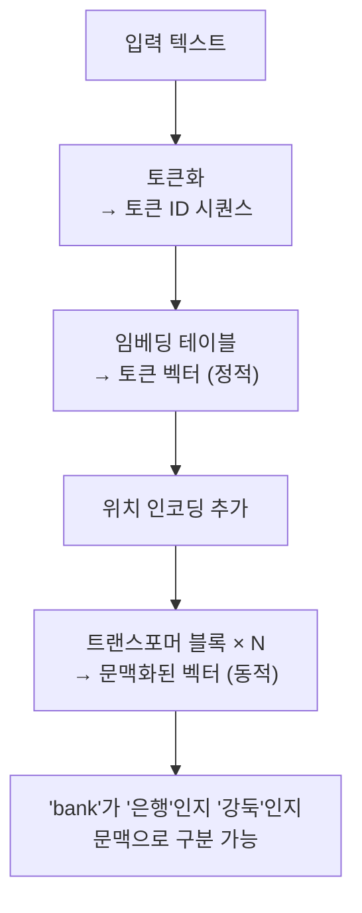

# 2.2 토큰화와 임베딩

> **학습 목표**: AI가 텍스트를 숫자로 변환하는 과정(토큰화, 임베딩)을 이해하고, 이것이 LLM의 성능에 미치는 영향을 설명할 수 있다.

## 왜 토큰화가 필요한가?

컴퓨터는 텍스트를 직접 이해할 수 없습니다. 신경망에 입력하려면 **텍스트 → 숫자**로 변환해야 합니다. 이 과정이 **토큰화(Tokenization)** 입니다.

```
"Claude는 도움이 됩니다"
        │ 토큰화
        ▼
["Claude", "는", " 도움", "이", " 됩니다"]
        │ 토큰 ID 변환
        ▼
[15234, 890, 34521, 234, 78432]
        │ 임베딩
        ▼
[[0.12, -0.34, ...], [0.56, 0.78, ...], ...]
```

## 토큰화 방식의 진화

### 1. 단어 단위 (Word-level)
```
"인공지능은 재미있다" → ["인공지능은", "재미있다"]

문제: 어휘 사전이 너무 커지고, 처음 보는 단어를 처리할 수 없음
```

### 2. 글자 단위 (Character-level)
```
"AI는 좋다" → ["A", "I", "는", " ", "좋", "다"]

문제: 시퀀스가 너무 길어지고, 의미 파악이 어려움
```

### 3. 서브워드 단위 (Subword) — 현재 주류

단어와 글자의 중간 지점. 자주 쓰는 조합은 한 토큰으로, 드문 단어는 쪼개서 처리합니다.

```
"unhappiness" → ["un", "happiness"]
"인공지능"     → ["인공", "지능"]
"Anthropic"   → ["Anthrop", "ic"]
```

대표적인 서브워드 알고리즘:

| 알고리즘 | 사용 모델 | 특징 |
|----------|----------|------|
| **BPE** (Byte Pair Encoding) | GPT, Claude | 빈도 기반 병합 |
| **WordPiece** | BERT | BPE 변형 |
| **SentencePiece** | T5, LLaMA | 언어 독립적 |

### BPE 작동 방식

```
초기: ["l", "o", "w", "e", "r"]

1단계: 가장 빈번한 쌍 "l"+"o" 병합 → ["lo", "w", "e", "r"]
2단계: 가장 빈번한 쌍 "e"+"r" 병합 → ["lo", "w", "er"]
3단계: 가장 빈번한 쌍 "lo"+"w" 병합 → ["low", "er"]
4단계: "low"+"er" 병합 → ["lower"]

→ 이 과정을 전체 학습 데이터에 대해 수만 번 반복
```

## 토큰의 실제 모습

Claude에서 실제로 토큰이 어떻게 나뉘는지 예시:

```
입력: "안녕하세요, Claude Code를 사용하고 있습니다."

토큰: ["안녕", "하세요", ",", " Claude", " Code", "를", " 사용", "하고", " 있습니다", "."]

토큰 수: 10개
```

::: tip 토큰 수가 중요한 이유
- LLM의 **컨텍스트 윈도우**(한 번에 처리할 수 있는 토큰 수)가 제한됨
- Claude: 최대 200K 토큰 (약 15만 단어 분량)
- 요금도 토큰 수 기반으로 과금
:::

## 임베딩 (Embedding)

토큰 ID는 그냥 번호표일 뿐, 의미 정보가 없습니다. **임베딩**은 각 토큰을 **의미를 담은 고차원 벡터**로 변환합니다.

```
토큰 ID → 임베딩 벡터 (수백~수천 차원)

"왕"  → [0.21, -0.53, 0.87, 0.12, ...]
"여왕" → [0.23, -0.51, 0.85, 0.45, ...]  ← "왕"과 비슷!
"사과" → [0.91, 0.32, -0.12, 0.67, ...]  ← 완전 다름
```

### 임베딩의 마법: 의미 연산

잘 학습된 임베딩은 단어 간 관계를 벡터 연산으로 표현합니다:

```
왕 - 남자 + 여자 ≈ 여왕

벡터로:
[0.21, -0.53, 0.87, ...]   (왕)
- [0.15, -0.21, 0.34, ...]   (남자)
+ [0.17, -0.19, 0.32, ...]   (여자)
= [0.23, -0.51, 0.85, ...]   ≈ 여왕!
```

### 임베딩 공간 시각화

고차원 벡터를 2D로 압축해서 보면:

```
         ↑
    여왕 ·   · 왕
         
    공주 ·   · 왕자
         
───────────────────→
    
    사과 ·   · 바나나
    
    자동차 · · 비행기
```

의미가 비슷한 단어들이 가까이 모여 있습니다.

## LLM에서의 임베딩

LLM의 임베딩은 단순 단어 임베딩보다 훨씬 풍부합니다:



**정적 임베딩**: 같은 단어는 항상 같은 벡터 (Word2Vec 등)
**문맥 임베딩**: 문맥에 따라 같은 단어도 다른 벡터 (트랜스포머)

## 핵심 정리

- **토큰화**: 텍스트를 처리 가능한 단위(토큰)로 쪼개는 과정
- **서브워드**: 현대 LLM의 주류 방식. BPE가 대표적
- **컨텍스트 윈도우**: LLM이 한 번에 처리할 수 있는 토큰 수 제한
- **임베딩**: 토큰을 의미를 담은 고차원 벡터로 변환
- **문맥 임베딩**: 트랜스포머를 거치면 문맥에 따라 벡터가 달라짐

## 더 알아보기

- [OpenAI Tokenizer](https://platform.openai.com/tokenizer) — 토큰화를 직접 실험
- [The Illustrated Word2Vec (Jay Alammar)](https://jalammar.github.io/illustrated-word2vec/) — 임베딩을 시각적으로 이해

---

← [2.1 트랜스포머 아키텍처](/chapters/02-llm-deep-dive/) | **다음 챕터**: [2.3 어텐션 메커니즘](/chapters/02-llm-deep-dive/attention) →
