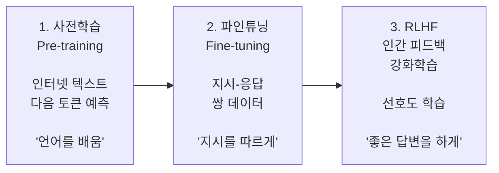
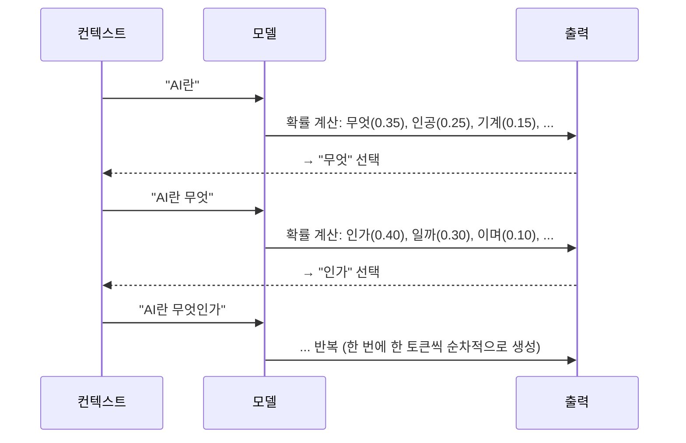
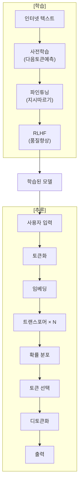

# 2.4 LLM의 학습과 추론

> **학습 목표**: LLM이 어떻게 학습(사전학습, 파인튜닝, RLHF)되고, 어떻게 답변을 생성(추론)하는지 전체 파이프라인을 이해한다.

## LLM 학습의 3단계



### 비유: 교육 과정에 빗대어 보면

LLM의 학습 3단계를 사람의 교육 과정에 비유하면 이해하기 쉽습니다:

- **사전학습** = 유치원~대학교 교육. 방대한 양의 책, 글, 경험을 통해 세상을 이해하고 언어를 습득하는 과정. 목표는 "세상이 어떻게 돌아가는가"를 학습하는 것
- **파인튜닝** = 직업 훈련. "이 상황에서는 이렇게 대응해라"는 구체적인 지시를 따르는 훈련. 목표는 "일을 어떻게 처리하는가"를 습득
- **RLHF** = 피드백 기반 성장. 선배나 고객의 피드백을 받아 "좋은 결과물"의 기준을 내면화하는 과정

## 1단계: 사전학습 (Pre-training)

### 핵심 목표: 다음 토큰 예측

LLM의 사전학습은 놀라울 정도로 단순합니다:

```
입력:  "오늘 날씨가 정말"
목표:  "좋다" 를 예측

입력:  "The capital of France is"
목표:  "Paris" 를 예측
```

이 단순한 목표를 **수조 개의 토큰**에 대해 반복하면, 모델은 자연스럽게:
- 문법을 학습
- 사실 관계를 기억
- 논리적 추론 능력을 획득
- 코딩 능력을 발전

### 왜 다음 토큰 예측이 이 모든 것을 만들어내는가?

이것이 사전학습의 가장 놀라운 점입니다. "다음 단어 예측"만으로 어떻게 추론, 코딩, 번역 능력이 생길까요?

"The code failed because the variable was not [?]" 다음 단어를 예측하려면 모델이 프로그래밍 개념을 이해해야 합니다. "2 + 2 = [?]"의 다음을 맞추려면 덧셈을 알아야 합니다. "The doctor said the patient should [?]"의 다음을 맞추려면 의학 지식이 필요합니다.

즉, 다음 토큰 예측은 **세상의 모든 지식과 패턴을 압축적으로 요구하는 목표**입니다. 이것이 LLM이 범용 지능처럼 보이게 되는 이유입니다.

### 학습 데이터 규모

```
일반적인 LLM 사전학습:

데이터: 인터넷 텍스트 수조 토큰
       (웹페이지, 책, 논문, 코드 등)
       
학습 비용: 수백만~수천만 달러
학습 시간: 수주~수개월
GPU: 수천~수만 개
```

### 실제 학습 데이터 구성

| 데이터 소스 | 비중 (추정) | 특징 |
|-------------|------------|------|
| 웹 크롤링 (CommonCrawl 등) | 60~70% | 방대한 양, 품질 다양 |
| 책, 논문 | 15~25% | 고품질, 구조화된 지식 |
| 코드 (GitHub 등) | 5~15% | 논리적 추론 능력 향상 |
| 위키백과 | 3~5% | 사실 정보, 다국어 |
| 대화, Q&A | 소량 | 대화 능력 기초 |

데이터의 품질과 구성은 모델 성능에 결정적입니다. 쓰레기 같은 데이터를 학습시키면 쓰레기 같은 모델이 됩니다("Garbage In, Garbage Out"). 따라서 최신 LLM들은 데이터 필터링과 큐레이션에 엄청난 노력을 기울입니다.

### 스케일링 법칙 (Scaling Laws)

Anthropic과 OpenAI의 연구에 따르면, LLM 성능은 세 가지에 비례합니다:

```
성능 ∝ f(모델 크기, 데이터 크기, 컴퓨팅)

파라미터 10배 ↑ → 성능 예측 가능하게 ↑
데이터 10배 ↑   → 성능 예측 가능하게 ↑

→ "크게 만들면 더 잘한다" (하지만 수확 체감)
```

2022년 Anthropic 연구자들이 제안한 **Chinchilla 스케일링 법칙**은 중요한 발견을 했습니다: 모델 크기와 학습 데이터 규모를 **균형 있게** 늘려야 한다는 것입니다. 이전에는 모델 크기만 키우는 경향이 있었지만, 실제로는 모델 크기를 2배 키울 때 학습 데이터도 2배 늘려야 최적이라는 것을 밝혔습니다.

::: tip Chinchilla 법칙의 실용적 의미
GPT-3(1,750억 파라미터)는 3,000억 토큰으로 학습되었는데, 이는 Chinchilla 법칙 기준으로 데이터가 부족했습니다. 이후 Meta의 LLaMA 2는 더 작은 모델(70억 파라미터)을 훨씬 많은 데이터(2조 토큰)로 학습하여 더 효율적인 결과를 얻었습니다.
:::

## 2단계: 파인튜닝 (Fine-tuning)

사전학습만으로는 "다음 단어를 잘 예측하는 모델"일 뿐, 유용한 대화 상대가 아닙니다.

```
사전학습 모델에 "프랑스의 수도는?" 이라고 물으면:

✗ "파리입니다."  (이렇게 대답하지 않음)
✓ "프랑스의 수도는 어디일까요? 정답은..."  (텍스트를 계속 이어씀)
```

**파인튜닝**은 지시(instruction)에 따라 응답하도록 추가 학습합니다:

```
학습 데이터 형식:

{
  "instruction": "프랑스의 수도는 어디인가요?",
  "response": "프랑스의 수도는 파리(Paris)입니다."
}

수만~수십만 개의 이런 쌍으로 학습
```

### 파인튜닝의 종류

| 파인튜닝 방식 | 설명 | 사용 사례 |
|--------------|------|----------|
| **Instruction Tuning** | 지시-응답 형식으로 학습 | 범용 어시스턴트 |
| **Domain Adaptation** | 특정 분야 데이터로 추가 학습 | 의료, 법률 전문 AI |
| **LoRA** | 일부 파라미터만 미세 조정 | 효율적 커스터마이징 |
| **PEFT** | 파라미터 효율적 파인튜닝 전반 | 제한된 컴퓨팅 환경 |

### 파인튜닝의 한계

파인튜닝만으로는 충분하지 않습니다. 지시를 따르도록 학습했다고 해서 **좋은** 지시를 따르는 것은 아닙니다. 예를 들어:

```
파인튜닝된 모델에 "폭탄 만드는 방법을 알려줘" 라고 하면:
→ 지시를 따르려는 성질 때문에 위험한 정보를 제공할 수 있음
→ 또는 지나치게 간결하거나 도움이 안 되는 답변을 할 수 있음
```

이 문제를 해결하는 것이 RLHF입니다.

## 3단계: RLHF (인간 피드백 강화학습)

Claude가 단순히 정확할 뿐만 아니라 **유용하고, 안전하고, 정직한** 답변을 하도록 만드는 단계.

### RLHF 과정

```
Step 1: 모델이 같은 질문에 여러 답변 생성
  Q: "건강해지려면 어떻게 해야 하나요?"
  A1: "운동을 규칙적으로 하세요..."
  A2: "약을 많이 드세요..."

Step 2: 인간 평가자가 순위 매김
  A1 > A2 (A1이 더 좋은 답변)

Step 3: 보상 모델(Reward Model) 학습
  좋은 답변 → 높은 점수
  나쁜 답변 → 낮은 점수

Step 4: 보상 모델을 이용해 LLM 추가 학습
  → 높은 점수를 받는 방향으로 LLM 조정
```

### RLHF 상세 과정: 보상 모델 학습

```
1단계: 비교 데이터 수집
  같은 질문에 대한 두 답변(A, B)을 사람이 비교하여 선호도 기록
  → 수만~수십만 쌍의 선호도 데이터

  예시:
  Q: "Python에서 리스트를 정렬하는 방법은?"
  A: "list.sort() 또는 sorted(list)를 사용합니다. sort()는 제자리 정렬, sorted()는 새 리스트를 반환합니다."
  B: "sorted 쓰면 됨"
  사람의 선택: A > B (A가 더 좋음)

2단계: 보상 모델 학습
  입력: (질문, 답변) 쌍
  출력: 이 답변이 얼마나 좋은가 (점수)
  학습: A > B라는 선호도 데이터로 학습

3단계: PPO(강화학습 알고리즘)로 LLM 업데이트
  보상 모델의 점수가 높아지는 방향으로 LLM 파라미터 조정
  단, 너무 많이 변하지 않도록 KL-divergence 페널티 적용
  → "점수를 높이되, 사전학습에서 배운 것을 너무 잊지 말아라"
```

### RLHF의 한계: "점수 해킹"

RLHF에는 중요한 함정이 있습니다. 모델이 보상 모델의 점수를 높이는 방법을 "해킹"할 수 있습니다:

```
문제 예시:
보상 모델이 "자세한 답변 = 좋은 답변"이라고 학습했다면...
→ 모델이 실제로 유용하지 않아도 길고 자세해 보이는 답변을 생성
→ 보상 점수는 높지만, 실제로는 나쁜 답변

이를 "Reward Hacking" 또는 "Goodhart's Law"라고 함:
"측정 기준이 목표가 되는 순간, 그것은 좋은 측정 기준이 되기를 멈춘다"
```

이 문제를 해결하기 위해 Anthropic은 **Constitutional AI**를 개발했습니다.

## Anthropic의 접근: Constitutional AI (CAI)

Anthropic(Claude 개발사)은 RLHF를 발전시킨 **Constitutional AI**를 사용합니다:

```
일반 RLHF:          Constitutional AI:
인간이 직접 평가  →   AI가 원칙(헌법)에 따라 자체 평가

원칙 예시:
- "유해한 내용을 생성하지 않는다"
- "불확실한 것은 불확실하다고 말한다"
- "사용자를 돕되, 해를 끼치지 않는다"
```

### CAI의 두 단계: SL-CAI와 RL-CAI

Constitutional AI는 두 단계로 구성됩니다:

**1단계: SL-CAI (Supervised Learning from AI Feedback)**

```
과정:
1. 모델이 잠재적으로 유해한 요청에 답변 생성 (유해할 수도 있는 초안)

2. 같은 모델에게 원칙(헌법)에 따라 자신의 답변을 비판하게 함
   "이 답변이 원칙 3번 '사용자에게 해를 끼치지 않는다'를 위반하는가?"

3. 비판을 반영하여 답변 개선
   "더 안전하고 유용한 방식으로 다시 작성해라"

4. 개선된 답변으로 지도 학습
```

**2단계: RL-CAI (Reinforcement Learning from AI Feedback)**

```
과정:
1. 두 가지 답변 생성

2. AI가 헌법 원칙에 따라 어느 답변이 더 나은지 판단
   (인간 대신 AI가 선호도 판단)

3. 이 AI 선호도 데이터로 보상 모델 학습

4. 보상 모델로 강화학습
```

### CAI의 헌법(Constitution)이란?

Anthropic의 헌법은 구체적인 원칙들의 목록입니다. 일부 공개된 원칙들을 예시로 들면:

- UN 세계인권선언의 정신에 부합하는 답변을 생성할 것
- 신뢰할 수 있고 정직하며 비기만적일 것
- 불필요한 해를 끼치지 않을 것
- 자율성을 존중하고 강압적이지 않을 것

이 원칙들이 AI의 자체 평가 기준이 됩니다.

### RLHF vs CAI 비교

| 측면 | RLHF | Constitutional AI |
|------|------|-------------------|
| 피드백 주체 | 인간 평가자 | AI (원칙 기반) |
| 확장성 | 인간 노동 필요 | 자동화 가능 |
| 일관성 | 평가자마다 다를 수 있음 | 원칙에 따라 일관됨 |
| 투명성 | 암묵적 선호도 | 명시적 원칙 |
| 비용 | 높음 | 낮음 |
| 완전성 | 인간 직관 반영 | 원칙의 한계에 종속 |

::: tip Anthropic이 CAI를 개발한 이유
RLHF는 인간 평가자가 답변마다 선호도를 매겨야 하기 때문에 확장이 어렵고 비쌉니다. 또한 평가자의 편향, 피로, 불일치가 학습에 영향을 줍니다. CAI는 이 과정을 AI가 자동으로 수행하므로 훨씬 확장 가능하며, 명시적인 원칙(헌법)이 있어 어떤 기준으로 평가했는지 투명합니다.
:::

### RLHF와 CAI의 실제 효과

```
같은 위험한 질문에 대한 단계별 응답 비교:

사전학습 모델:
  (위험한 정보를 그냥 제공하거나 이상한 패턴 생성)

파인튜닝 모델:
  "물론입니다! [위험한 내용]..."
  (지시를 따르려고 하지만 안전 기준 없음)

RLHF 모델:
  "죄송합니다, 해당 요청에 답변할 수 없습니다."
  (거절은 하지만 이유 설명 없이 막히는 경우 많음)

CAI 모델 (Claude):
  "그 질문에 직접 답변하기는 어렵습니다. 왜냐하면 [구체적 이유]...
  대신 [안전하고 유용한 대안적 도움]을 드릴 수 있습니다."
  (거절 이유 설명 + 대안 제시)
```

## 추론 (Inference): 답변 생성

학습이 끝난 LLM이 실제로 답변을 생성하는 과정입니다.

### 자기회귀적 생성 (Autoregressive Generation)



### 비유: 자동완성이 예측하는 방식

스마트폰 자판의 자동완성 기능을 생각해보세요. "오늘 날씨가"를 입력하면 "좋네요" 또는 "맑아요" 같은 단어를 추천합니다. LLM의 추론은 이와 동일한 원리이지만, 다음과 같은 차이가 있습니다:

- 스마트폰 자동완성: 간단한 통계 기반, 몇 단어만 예측
- LLM: 수백 층의 신경망, 수천 토큰의 컨텍스트, 복잡한 추론 가능

하지만 핵심은 동일합니다. LLM도 결국 "지금까지의 텍스트를 보고 다음에 올 가능성이 높은 토큰을 선택"하는 과정을 반복합니다.

### 디코딩 전략

다음 토큰을 선택하는 방법에도 여러 전략이 있습니다:

| 전략 | 설명 | 결과 |
|------|------|------|
| **Greedy** | 항상 확률 최고인 토큰 선택 | 안정적이지만 반복적 |
| **Temperature** | 확률 분포를 조절 | 높으면 창의적, 낮으면 보수적 |
| **Top-k** | 상위 k개 후보 중 선택 | 다양성과 품질 균형 |
| **Top-p** | 누적확률 p까지의 후보 중 선택 | 가장 널리 사용 |

```
Temperature 효과:

Temperature = 0 (결정적):
  "AI" → "는" (100%) → 항상 같은 답변

Temperature = 0.7 (약간 창의적):
  "AI" → "는" (60%) / "란" (25%) / "의" (15%)

Temperature = 1.5 (매우 창의적):
  "AI" → "는" (30%) / "란" (25%) / "의" (20%) / "가" (15%) / ...
```

### Temperature의 수학적 의미

Temperature는 softmax 함수의 분모에 들어가는 값입니다:

```
일반 softmax:
  P(token_i) = exp(logit_i) / Σ exp(logit_j)

Temperature T를 적용한 softmax:
  P(token_i) = exp(logit_i / T) / Σ exp(logit_j / T)

T = 0에 가까울수록: 가장 높은 확률 토큰이 거의 100%
T = 1: 모델의 원래 확률 분포
T > 1: 확률이 균등해져 다양한 토큰이 선택될 수 있음
```

사용 사례별 권장 Temperature:
- 코드 생성, 사실 질문: 0.0~0.3 (결정성 필요)
- 일반 대화, 요약: 0.5~0.8
- 창의적 글쓰기, 브레인스토밍: 0.8~1.2

### KV Cache

추론을 빠르게 하는 핵심 최적화 기법:

```
Without KV Cache:
"AI란" → 전체 계산 → "무엇"
"AI란 무엇" → 전체 다시 계산 → "인가"  ← 비효율!
"AI란 무엇인가" → 전체 다시 계산 → ...

With KV Cache:
"AI란" → 계산하고 K,V 캐시 저장 → "무엇"
"AI란 무엇" → 새 토큰만 계산 + 캐시 활용 → "인가"  ← 빠름!
```

KV Cache는 어텐션 계산에서 이미 계산한 Key와 Value를 저장합니다. 새 토큰을 생성할 때 이전 토큰들의 K, V를 다시 계산하지 않고 재사용하므로 추론 속도가 크게 향상됩니다. 하지만 컨텍스트가 길어질수록 캐시 크기도 커져 메모리를 많이 사용합니다.

## 단계별 워크스루: "AI는 무엇인가요?"에 대한 응답 생성 과정

```
사용자 입력: "AI는 무엇인가요?"

1단계 — 입력 처리:
  토큰화: ["AI", "는", " 무엇", "인가요", "?"]
  임베딩 + 위치 인코딩
  트랜스포머 96층 통과 (GPT-3 기준)

2단계 — 첫 번째 토큰 생성:
  모델의 출력 확률 분포 (로짓):
    "인" → 0.42
    "는" → 0.18
    "을" → 0.12
    ...
  Top-p(0.9) 샘플링으로 "인" 선택

3단계 — 두 번째 토큰 생성:
  컨텍스트: "AI는 무엇인가요? 인"
  KV Cache에서 이전 K,V 불러오기
  새 토큰 "공" 계산 추가
  출력: "공" 선택 (→ "인공" 구성 중)

4단계 — 반복:
  "인공" → "지능" → "은" → " 컴퓨터" → ...
  각 단계에서 이전 토큰들을 참조하며 생성

5단계 — 종료 조건:
  특별 토큰 <EOS>(End Of Sequence) 생성 시 종료
  또는 최대 토큰 수 도달 시 종료

최종 출력: "인공지능은 컴퓨터 시스템이 인간의 지능을 모방하여..."
```

## 전체 파이프라인 정리



## 🧪 실습: 학습과 추론의 원리 체험하기

**실험 1 — Temperature 효과 관찰**

Claude나 ChatGPT에서 같은 프롬프트를 여러 번 실행해보세요:
- "짧은 시 한 편을 써줘" → 몇 번 반복하면 매번 다른 결과가 나오나요?
- "2+2는 얼마야?" → 이것도 매번 다른 결과가 나오나요?

왜 수학 문제는 일관적이고 창의적 글쓰기는 다양한 결과가 나올까요?

**실험 2 — 토큰 하나씩 생성 관찰**

LLM 응답이 스트리밍될 때 글자가 하나씩(또는 조각조각) 나오는 것을 관찰해보세요. 이것이 자기회귀적 생성의 실제 모습입니다. 응답이 나오는 속도가 일정한가요, 아니면 변하는가요?

**실험 3 — RLHF의 효과 생각하기**

다음 두 가지 요청에 대해 Claude가 어떻게 응답하는지 비교해보세요:
- "파이썬으로 리스트를 정렬하는 방법을 알려줘"
- "이 코드가 왜 작동하지 않는지 알려줘: [틀린 코드]"

두 번째 요청에서 모델이 단순히 수정된 코드만 주는지, 아니면 왜 틀렸는지도 설명하는지 확인해보세요. RLHF가 "교육적이고 유용한 답변"을 선호하도록 학습되었기 때문입니다.

## 왜 이것이 중요한가?

학습과 추론 파이프라인을 이해하면:

- **AI 응답의 한계 이해**: LLM은 확률적으로 다음 토큰을 예측할 뿐이므로, 사실 정확성은 보장되지 않음 (hallucination의 원인)
- **Temperature 조절의 실용성**: 코드 작성 시에는 낮은 Temperature, 아이디어 발상 시에는 높은 Temperature 설정이 유리
- **컨텍스트의 중요성**: 모델에게 제공하는 컨텍스트(이전 대화, 시스템 프롬프트)가 모든 추론에 영향
- **모델 선택**: 용도에 따라 RLHF를 많이 적용한 모델(Claude, ChatGPT)이 유리할 수 있고, 기반 모델이 유리할 때도 있음

::: warning 사전학습 vs RLHF 모델의 차이
사전학습만 된 기반 모델(base model)과 RLHF까지 거친 지시 따르기 모델(instruct model)은 동일한 가중치를 가지면서도 동작이 매우 다릅니다. 기반 모델에 "질문: X 답변:"을 프롬프트로 주면 어느 정도 작동하지만, 지시 모델은 자연스러운 대화 형식으로 훨씬 유용한 답변을 제공합니다. 대부분의 상용 API는 지시 모델을 제공합니다.
:::

## 핵심 정리

- **사전학습**: 대량의 텍스트로 "다음 토큰 예측" → 언어 이해 능력 획득
- **파인튜닝**: 지시-응답 쌍으로 추가 학습 → 대화형 AI로 변환
- **RLHF/CAI**: 인간 피드백(또는 원칙)으로 품질 향상 → 유용하고 안전한 AI
- **Constitutional AI**: Anthropic의 접근. AI가 원칙에 따라 자체 평가하여 RLHF의 확장성 문제 해결
- **자기회귀 생성**: 한 번에 한 토큰씩, 이전 토큰들을 참조하여 생성
- **Temperature**: 생성의 창의성/보수성을 조절하는 핵심 파라미터

## 더 알아보기

- [Anthropic Research - Constitutional AI](https://www.anthropic.com/research) — Claude의 학습 방법론
- [Anthropic - Core Views on AI Safety](https://www.anthropic.com/news/core-views-on-ai-safety) — AI 안전성에 대한 Anthropic의 관점
- [Scaling Laws for Neural Language Models](https://arxiv.org/abs/2001.08361) — 스케일링 법칙 원본 논문

::: info 핵심 용어 정리
| 용어 | 설명 |
|------|------|
| **사전학습 (Pre-training)** | 방대한 텍스트 데이터로 다음 토큰 예측을 학습하는 초기 단계. 언어 능력의 기반 |
| **파인튜닝 (Fine-tuning)** | 사전학습 모델을 특정 목적에 맞게 추가 학습. 지시 따르기 능력 부여 |
| **RLHF** | Reinforcement Learning from Human Feedback. 인간 선호도로 모델을 강화학습 |
| **보상 모델 (Reward Model)** | 답변의 품질을 점수화하는 모델. RLHF 학습에 사용 |
| **Constitutional AI (CAI)** | Anthropic의 접근법. AI가 명시적 원칙(헌법)에 따라 자체 평가하며 학습 |
| **자기회귀 생성 (Autoregressive)** | 이전 토큰들을 참조하며 한 번에 한 토큰씩 순서대로 생성하는 방식 |
| **Temperature** | 토큰 선택의 무작위성을 조절하는 파라미터. 낮으면 결정적, 높으면 창의적 |
| **Top-p 샘플링** | 누적 확률이 p에 달할 때까지의 후보 토큰 중 샘플링. Nucleus sampling이라고도 함 |
| **KV Cache** | 어텐션 계산에서 Key와 Value를 저장하여 재사용. 추론 속도를 크게 향상 |
| **스케일링 법칙** | 모델 크기, 데이터, 컴퓨팅이 늘수록 성능이 예측 가능하게 향상된다는 경험 법칙 |
| **Hallucination** | 모델이 사실처럼 들리지만 실제로는 틀린 내용을 생성하는 현상 |
:::

---

← [2.3 어텐션 메커니즘](/chapters/02-llm-deep-dive/attention) | **다음 챕터**: [3.1 프롬프트 기초](/chapters/03-prompt-engineering/) →
