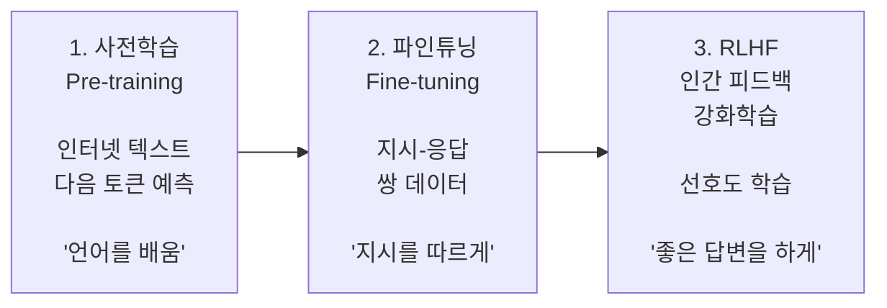
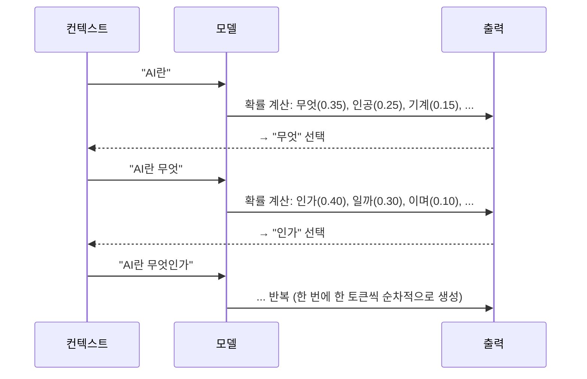
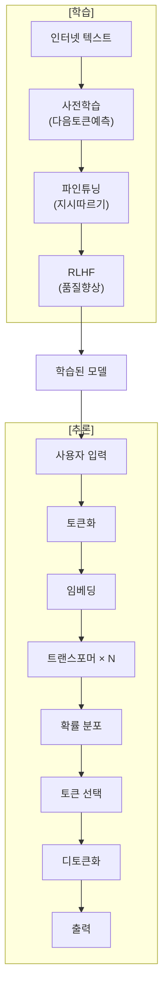

# 2.4 LLM의 학습과 추론

> **학습 목표**: LLM이 어떻게 학습(사전학습, 파인튜닝, RLHF)되고, 어떻게 답변을 생성(추론)하는지 전체 파이프라인을 이해한다.

## LLM 학습의 3단계



## 1단계: 사전학습 (Pre-training)

### 핵심 목표: 다음 토큰 예측

LLM의 사전학습은 놀라울 정도로 단순합니다:

```
입력:  "오늘 날씨가 정말"
목표:  "좋다" 를 예측

입력:  "The capital of France is"
목표:  "Paris" 를 예측
```

이 단순한 목표를 **수조 개의 토큰**에 대해 반복하면, 모델은 자연스럽게:
- 문법을 학습
- 사실 관계를 기억
- 논리적 추론 능력을 획득
- 코딩 능력을 발전

### 학습 데이터 규모

```
일반적인 LLM 사전학습:

데이터: 인터넷 텍스트 수조 토큰
       (웹페이지, 책, 논문, 코드 등)
       
학습 비용: 수백만~수천만 달러
학습 시간: 수주~수개월
GPU: 수천~수만 개
```

### 스케일링 법칙 (Scaling Laws)

Anthropic과 OpenAI의 연구에 따르면, LLM 성능은 세 가지에 비례합니다:

```
성능 ∝ f(모델 크기, 데이터 크기, 컴퓨팅)

파라미터 10배 ↑ → 성능 예측 가능하게 ↑
데이터 10배 ↑   → 성능 예측 가능하게 ↑

→ "크게 만들면 더 잘한다" (하지만 수확 체감)
```

## 2단계: 파인튜닝 (Fine-tuning)

사전학습만으로는 "다음 단어를 잘 예측하는 모델"일 뿐, 유용한 대화 상대가 아닙니다.

```
사전학습 모델에 "프랑스의 수도는?" 이라고 물으면:

✗ "파리입니다."  (이렇게 대답하지 않음)
✓ "프랑스의 수도는 어디일까요? 정답은..."  (텍스트를 계속 이어씀)
```

**파인튜닝**은 지시(instruction)에 따라 응답하도록 추가 학습합니다:

```
학습 데이터 형식:

{
  "instruction": "프랑스의 수도는 어디인가요?",
  "response": "프랑스의 수도는 파리(Paris)입니다."
}

수만~수십만 개의 이런 쌍으로 학습
```

## 3단계: RLHF (인간 피드백 강화학습)

Claude가 단순히 정확할 뿐만 아니라 **유용하고, 안전하고, 정직한** 답변을 하도록 만드는 단계.

### RLHF 과정

```
Step 1: 모델이 같은 질문에 여러 답변 생성
  Q: "건강해지려면 어떻게 해야 하나요?"
  A1: "운동을 규칙적으로 하세요..."
  A2: "약을 많이 드세요..."

Step 2: 인간 평가자가 순위 매김
  A1 > A2 (A1이 더 좋은 답변)

Step 3: 보상 모델(Reward Model) 학습
  좋은 답변 → 높은 점수
  나쁜 답변 → 낮은 점수

Step 4: 보상 모델을 이용해 LLM 추가 학습
  → 높은 점수를 받는 방향으로 LLM 조정
```

### Anthropic의 접근: Constitutional AI (CAI)

Anthropic(Claude 개발사)은 RLHF를 발전시킨 **Constitutional AI**를 사용합니다:

```
일반 RLHF:          Constitutional AI:
인간이 직접 평가  →   AI가 원칙(헌법)에 따라 자체 평가

원칙 예시:
- "유해한 내용을 생성하지 않는다"
- "불확실한 것은 불확실하다고 말한다"
- "사용자를 돕되, 해를 끼치지 않는다"
```

## 추론 (Inference): 답변 생성

학습이 끝난 LLM이 실제로 답변을 생성하는 과정입니다.

### 자기회귀적 생성 (Autoregressive Generation)



### 디코딩 전략

다음 토큰을 선택하는 방법에도 여러 전략이 있습니다:

| 전략 | 설명 | 결과 |
|------|------|------|
| **Greedy** | 항상 확률 최고인 토큰 선택 | 안정적이지만 반복적 |
| **Temperature** | 확률 분포를 조절 | 높으면 창의적, 낮으면 보수적 |
| **Top-k** | 상위 k개 후보 중 선택 | 다양성과 품질 균형 |
| **Top-p** | 누적확률 p까지의 후보 중 선택 | 가장 널리 사용 |

```
Temperature 효과:

Temperature = 0 (결정적):
  "AI" → "는" (100%) → 항상 같은 답변

Temperature = 0.7 (약간 창의적):
  "AI" → "는" (60%) / "란" (25%) / "의" (15%)

Temperature = 1.5 (매우 창의적):
  "AI" → "는" (30%) / "란" (25%) / "의" (20%) / "가" (15%) / ...
```

### KV Cache

추론을 빠르게 하는 핵심 최적화 기법:

```
Without KV Cache:
"AI란" → 전체 계산 → "무엇"
"AI란 무엇" → 전체 다시 계산 → "인가"  ← 비효율!
"AI란 무엇인가" → 전체 다시 계산 → ...

With KV Cache:
"AI란" → 계산하고 K,V 캐시 저장 → "무엇"
"AI란 무엇" → 새 토큰만 계산 + 캐시 활용 → "인가"  ← 빠름!
```

## 전체 파이프라인 정리



## 핵심 정리

- **사전학습**: 대량의 텍스트로 "다음 토큰 예측" → 언어 이해 능력 획득
- **파인튜닝**: 지시-응답 쌍으로 추가 학습 → 대화형 AI로 변환
- **RLHF/CAI**: 인간 피드백(또는 원칙)으로 품질 향상 → 유용하고 안전한 AI
- **자기회귀 생성**: 한 번에 한 토큰씩, 이전 토큰들을 참조하여 생성
- **Temperature**: 생성의 창의성/보수성을 조절하는 핵심 파라미터

## 더 알아보기

- [Anthropic Research - Constitutional AI](https://www.anthropic.com/research) — Claude의 학습 방법론
- [Anthropic - Core Views on AI Safety](https://www.anthropic.com/news/core-views-on-ai-safety) — AI 안전성에 대한 Anthropic의 관점
- [Scaling Laws for Neural Language Models](https://arxiv.org/abs/2001.08361) — 스케일링 법칙 원본 논문

---

← [2.3 어텐션 메커니즘](/chapters/02-llm-deep-dive/attention) | **다음 챕터**: [3.1 프롬프트 기초](/chapters/03-prompt-engineering/) →
