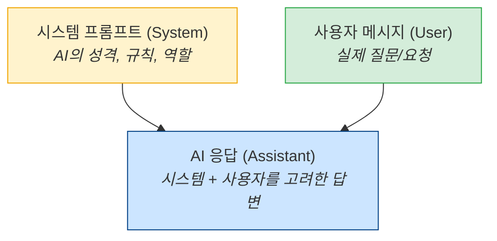

# 3.2 고급 프롬프트 기법

> **학습 목표**: Chain-of-Thought, Few-shot, 시스템 프롬프트 등 고급 프롬프트 기법을 이해하고 활용할 수 있다.

## Zero-shot vs Few-shot

### Zero-shot: 예시 없이 지시만

```
"다음 문장의 감정을 분류하세요: '오늘 정말 최악의 하루였어'"
→ 부정적
```

### Few-shot: 예시를 함께 제공

```
"다음 문장들의 감정을 분류하세요:

문장: '이 영화 정말 재밌다!'
감정: 긍정적

문장: '서비스가 너무 별로예요'
감정: 부정적

문장: '보통이에요 그저 그래요'
감정: 중립

문장: '오늘 정말 최악의 하루였어'
감정: "
→ 부정적
```

Few-shot이 효과적인 이유: AI가 **패턴**을 파악하고, 기대하는 형식과 기준을 이해합니다.

## Chain-of-Thought (CoT)

AI에게 **단계별로 사고하도록** 요청하는 기법입니다.

### Without CoT

```
Q: "가게에 사과 23개가 있었습니다. 8개를 팔고 12개를 더 들여왔습니다.
    그 중 5개는 상해서 버렸습니다. 남은 사과는?"
A: "22개"  ← 바로 답만 제시 (틀릴 가능성 높음)
```

### With CoT

```
Q: "가게에 사과 23개가 있었습니다. 8개를 팔고 12개를 더 들여왔습니다.
    그 중 5개는 상해서 버렸습니다. 남은 사과는?
    단계별로 생각해주세요."

A: "단계별로 풀어보겠습니다:
    1. 처음: 23개
    2. 8개 판매: 23 - 8 = 15개
    3. 12개 입고: 15 + 12 = 27개
    4. 5개 폐기: 27 - 5 = 22개
    답: 22개"
```

### CoT의 변형

| 기법 | 설명 | 사용법 |
|------|------|--------|
| **Zero-shot CoT** | "단계별로 생각해주세요" 한 줄 추가 | 간단한 추론 문제 |
| **Manual CoT** | 사고 과정 예시를 직접 제공 | 복잡한 전문 영역 |
| **Self-Consistency** | CoT를 여러 번 실행, 다수결 | 높은 정확도 필요 시 |

## Extended Thinking

Claude에서 제공하는 기능으로, 모델이 답변 전에 **내부적으로 깊이 사고**하는 과정을 거칩니다:

```
일반 모드:
  입력 → [바로 답변 생성] → 출력

Extended Thinking:
  입력 → [심층 사고 과정] → [사고 기반 답변 생성] → 출력
         └─ 문제 분해
         └─ 여러 접근법 비교
         └─ 반례 검토
         └─ 최적 방안 선택
```

특히 복잡한 코딩, 수학, 분석 문제에서 효과적입니다.

## 시스템 프롬프트 (System Prompt)

시스템 프롬프트는 AI의 **전체 행동 방식**을 설정합니다:



### 좋은 시스템 프롬프트 예시

```
당신은 Python 코드 리뷰 전문가입니다.

규칙:
1. 보안 취약점을 최우선으로 검토합니다
2. PEP 8 스타일 가이드를 따릅니다
3. 개선 제안 시 반드시 코드 예시를 포함합니다
4. 심각도를 🔴 높음 / 🟡 보통 / 🟢 낮음으로 표시합니다

출력 형식:
각 이슈를 다음 형식으로 보고합니다:
[심각도] 줄 번호 - 이슈 설명
→ 수정 제안
```

## XML 태그 활용

Claude는 XML 태그로 구조화된 프롬프트를 잘 이해합니다:

```xml
<context>
React 18 프로젝트에서 성능 최적화 작업 중입니다.
</context>

<task>
다음 컴포넌트에서 불필요한 리렌더링을 찾아 최적화해주세요.
</task>

<code>
{컴포넌트 코드}
</code>

<requirements>
- React.memo, useMemo, useCallback 활용
- 변경 전후 설명 포함
- 성능 개선 예상 효과 설명
</requirements>
```

## 프롬프트 체이닝 (Chaining)

복잡한 작업을 여러 단계의 프롬프트로 나누는 기법:

```
프롬프트 1: "이 코드의 문제점을 목록으로 나열해주세요"
    ↓ (결과를 다음 프롬프트의 입력으로)
프롬프트 2: "위 문제점 중 가장 심각한 3개를 선택하고 수정 방안을 제시해주세요"
    ↓
프롬프트 3: "위 수정 방안을 적용한 전체 코드를 작성해주세요"
```

하나의 거대한 프롬프트보다 단계별로 나누는 것이 더 정확한 결과를 줍니다.

## 일반적인 실수와 해결

| 실수 | 문제 | 해결 |
|------|------|------|
| 너무 모호함 | "좋은 코드 짜줘" | 구체적 요구사항 명시 |
| 너무 복잡함 | 하나의 프롬프트에 모든 것 | 프롬프트 체이닝으로 분할 |
| 형식 미지정 | 원하는 형식과 다른 출력 | 출력 형식 예시 제공 |
| 컨텍스트 부족 | AI가 배경을 모름 | 관련 정보 사전 제공 |
| 부정문 사용 | "~하지 마세요" | "~해주세요"로 긍정형 |

## 핵심 정리

- **Few-shot**: 예시를 제공하여 패턴을 알려줌
- **Chain-of-Thought**: 단계별 사고를 유도하여 추론 정확도 향상
- **Extended Thinking**: Claude의 심층 사고 기능
- **시스템 프롬프트**: AI의 전체 행동 방식을 설정
- **XML 태그**: 구조화된 입력으로 명확한 구분
- **프롬프트 체이닝**: 복잡한 작업을 단계별로 분할

## 더 알아보기

- [Anthropic - Prompt Engineering Guide](https://docs.anthropic.com/en/docs/build-with-claude/prompt-engineering/overview)
- [Anthropic - Extended Thinking](https://docs.anthropic.com/en/docs/build-with-claude/extended-thinking)
- [Chain-of-Thought Prompting (원본 논문)](https://arxiv.org/abs/2201.11903)

---

← [3.1 프롬프트 기초](/chapters/03-prompt-engineering/) | **다음 챕터**: [3.3 실전 프롬프트 설계](/chapters/03-prompt-engineering/real-world) →
