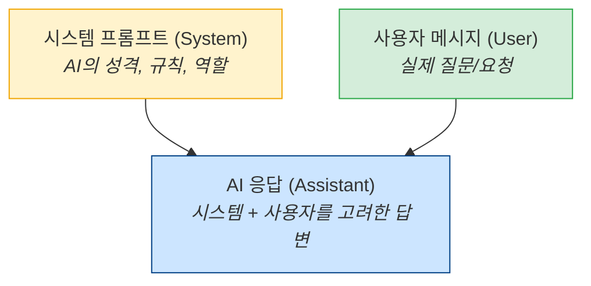
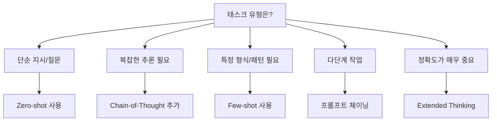

# 3.2 고급 프롬프트 기법

> **학습 목표**: Chain-of-Thought, Few-shot, 시스템 프롬프트 등 고급 프롬프트 기법을 이해하고 활용할 수 있다.

## Zero-shot vs Few-shot

### Zero-shot: 예시 없이 지시만

```
"다음 문장의 감정을 분류하세요: '오늘 정말 최악의 하루였어'"
→ 부정적
```

### Few-shot: 예시를 함께 제공

```
"다음 문장들의 감정을 분류하세요:

문장: '이 영화 정말 재밌다!'
감정: 긍정적

문장: '서비스가 너무 별로예요'
감정: 부정적

문장: '보통이에요 그저 그래요'
감정: 중립

문장: '오늘 정말 최악의 하루였어'
감정: "
→ 부정적
```

Few-shot이 효과적인 이유: AI가 **패턴**을 파악하고, 기대하는 형식과 기준을 이해합니다.

---

## Few-shot 실전 활용

Few-shot은 형식뿐 아니라 **판단 기준**을 학습시키는 데도 유용합니다.

::: details 예시: 코드 품질 평가 Few-shot

```
다음 코드를 품질 기준에 따라 평가해주세요.

예시 1:
코드:
def f(x):
    return x*2

평가:
- 점수: 3/10
- 이유: 함수명과 변수명이 의미 없음, 타입 힌트 없음, 독스트링 없음

예시 2:
코드:
def double_value(number: int) -> int:
    """주어진 정수를 2배로 반환합니다."""
    return number * 2

평가:
- 점수: 9/10
- 이유: 명확한 이름, 타입 힌트, 독스트링 포함. 단, 음수 처리 언급이 없음

평가할 코드:
def calc(a, b, op):
    if op == '+': return a+b
    if op == '-': return a-b
    if op == '*': return a*b

평가:
```

이 패턴으로 Few-shot을 사용하면, AI가 여러분 팀의 코드 품질 기준을 그대로 따릅니다.
:::

::: tip Few-shot 예시 선택 기준
- 다양한 케이스를 커버하는 3~5개가 적당
- 예시끼리 서로 다른 유형이어야 효과적
- 예시의 형식이 일관되어야 함
- 실제로 원하는 수준의 답변이 예시에 담겨야 함
:::

---

## Chain-of-Thought (CoT)

AI에게 **단계별로 사고하도록** 요청하는 기법입니다.

### Without CoT

```
Q: "가게에 사과 23개가 있었습니다. 8개를 팔고 12개를 더 들여왔습니다.
    그 중 5개는 상해서 버렸습니다. 남은 사과는?"
A: "22개"  ← 바로 답만 제시 (틀릴 가능성 높음)
```

### With CoT

```
Q: "가게에 사과 23개가 있었습니다. 8개를 팔고 12개를 더 들여왔습니다.
    그 중 5개는 상해서 버렸습니다. 남은 사과는?
    단계별로 생각해주세요."

A: "단계별로 풀어보겠습니다:
    1. 처음: 23개
    2. 8개 판매: 23 - 8 = 15개
    3. 12개 입고: 15 + 12 = 27개
    4. 5개 폐기: 27 - 5 = 22개
    답: 22개"
```

### CoT의 변형

| 기법 | 설명 | 사용법 |
|------|------|--------|
| **Zero-shot CoT** | "단계별로 생각해주세요" 한 줄 추가 | 간단한 추론 문제 |
| **Manual CoT** | 사고 과정 예시를 직접 제공 | 복잡한 전문 영역 |
| **Self-Consistency** | CoT를 여러 번 실행, 다수결 | 높은 정확도 필요 시 |

---

## CoT 실전 적용: 복잡한 버그 분석

단순 "버그 고쳐줘"가 아닌, 사고 과정을 요구하면 정확도가 올라갑니다.

::: details CoT를 활용한 버그 분석 프롬프트

```
다음 코드에서 발생하는 버그를 분석해주세요.
단계별로 사고 과정을 보여주세요:

1단계: 코드 흐름 추적 (어떤 경로로 실행되는가)
2단계: 예상되는 버그 후보 나열
3단계: 각 후보의 가능성 평가
4단계: 가장 유력한 원인 결론
5단계: 수정 방법 및 테스트 케이스

코드:
```python
def process_orders(orders):
    total = 0
    for order in orders:
        if order['status'] == 'completed':
            total += order['amount']
    return total / len(orders)
```

에러: ZeroDivisionError (특정 상황에서만 발생)
```

**CoT 없이 요청했을 때**: "빈 리스트일 때 발생합니다. `if orders:` 조건을 추가하세요." — 피상적

**CoT와 함께 요청했을 때**: 빈 리스트 케이스뿐 아니라, completed 상태가 하나도 없는 경우도 진단하고, 두 케이스 모두 테스트하는 코드까지 제공.
:::

---

## Extended Thinking

Claude에서 제공하는 기능으로, 모델이 답변 전에 **내부적으로 깊이 사고**하는 과정을 거칩니다:

```
일반 모드:
  입력 → [바로 답변 생성] → 출력

Extended Thinking:
  입력 → [심층 사고 과정] → [사고 기반 답변 생성] → 출력
         └─ 문제 분해
         └─ 여러 접근법 비교
         └─ 반례 검토
         └─ 최적 방안 선택
```

특히 복잡한 코딩, 수학, 분석 문제에서 효과적입니다.

### Extended Thinking API 사용

```python
import anthropic

client = anthropic.Anthropic()

response = client.messages.create(
    model="claude-opus-4-5",
    max_tokens=16000,
    thinking={
        "type": "enabled",
        "budget_tokens": 10000  # 사고에 할당할 최대 토큰 수
    },
    messages=[{
        "role": "user",
        "content": """다음 알고리즘의 시간복잡도를 분석하고,
        O(n log n)으로 개선 가능한지 검토해주세요.
        
        def find_duplicates(arr):
            result = []
            for i in range(len(arr)):
                for j in range(i+1, len(arr)):
                    if arr[i] == arr[j] and arr[i] not in result:
                        result.append(arr[i])
            return result
        """
    }]
)

# 사고 과정과 최종 답변이 분리되어 반환됨
for block in response.content:
    if block.type == "thinking":
        print("사고 과정:", block.thinking)
    elif block.type == "text":
        print("최종 답변:", block.text)
```

::: tip Extended Thinking을 써야 할 때
- 수학적 증명이나 알고리즘 최적화
- 여러 트레이드오프가 있는 아키텍처 결정
- 복잡한 비즈니스 로직 검증
- 다단계 추론이 필요한 데이터 분석
:::

---

## 시스템 프롬프트 (System Prompt)

시스템 프롬프트는 AI의 **전체 행동 방식**을 설정합니다:



### 좋은 시스템 프롬프트 예시

```
당신은 Python 코드 리뷰 전문가입니다.

규칙:
1. 보안 취약점을 최우선으로 검토합니다
2. PEP 8 스타일 가이드를 따릅니다
3. 개선 제안 시 반드시 코드 예시를 포함합니다
4. 심각도를 🔴 높음 / 🟡 보통 / 🟢 낮음으로 표시합니다

출력 형식:
각 이슈를 다음 형식으로 보고합니다:
[심각도] 줄 번호 - 이슈 설명
→ 수정 제안
```

### 시스템 프롬프트 vs 사용자 프롬프트 — 언제 무엇을?

| 내용 | 위치 |
|------|------|
| AI의 역할, 성격, 전문성 | 시스템 프롬프트 |
| 항상 지켜야 할 규칙 | 시스템 프롬프트 |
| 출력 형식 (항상 동일) | 시스템 프롬프트 |
| 이번 요청의 구체적 내용 | 사용자 프롬프트 |
| 이번 요청에만 필요한 데이터 | 사용자 프롬프트 |

---

## XML 태그 활용

Claude는 XML 태그로 구조화된 프롬프트를 잘 이해합니다:

```xml
<context>
React 18 프로젝트에서 성능 최적화 작업 중입니다.
</context>

<task>
다음 컴포넌트에서 불필요한 리렌더링을 찾아 최적화해주세요.
</task>

<code>
{컴포넌트 코드}
</code>

<requirements>
- React.memo, useMemo, useCallback 활용
- 변경 전후 설명 포함
- 성능 개선 예상 효과 설명
</requirements>
```

::: tip XML 태그를 사용하는 이유
일반 텍스트로 쓰면 "코드와 설명을 구분"하기 어렵지만, XML 태그는 각 부분의 역할을 명확히 합니다. 특히 긴 프롬프트에서 효과적입니다.
:::

### XML 태그 실전 패턴

```xml
<!-- 다중 문서 처리 -->
<documents>
  <document index="1">
    <title>Q3 재무 보고서</title>
    <content>...</content>
  </document>
  <document index="2">
    <title>Q4 목표</title>
    <content>...</content>
  </document>
</documents>

<task>
두 문서를 비교하여 Q3 실적이 Q4 목표 달성에 충분한지 분석해주세요.
</task>
```

---

## 프롬프트 체이닝 (Chaining)

복잡한 작업을 여러 단계의 프롬프트로 나누는 기법:

```
프롬프트 1: "이 코드의 문제점을 목록으로 나열해주세요"
    ↓ (결과를 다음 프롬프트의 입력으로)
프롬프트 2: "위 문제점 중 가장 심각한 3개를 선택하고 수정 방안을 제시해주세요"
    ↓
프롬프트 3: "위 수정 방안을 적용한 전체 코드를 작성해주세요"
```

하나의 거대한 프롬프트보다 단계별로 나누는 것이 더 정확한 결과를 줍니다.

### 프롬프트 체이닝 Python 구현

```python
import anthropic

client = anthropic.Anthropic()

def chain_prompts(code: str) -> str:
    """3단계 프롬프트 체이닝으로 코드를 개선합니다."""
    
    # 1단계: 문제점 분석
    step1 = client.messages.create(
        model="claude-opus-4-5",
        max_tokens=1024,
        messages=[{
            "role": "user",
            "content": f"다음 코드의 문제점을 번호 목록으로 나열하세요:\n\n```python\n{code}\n```"
        }]
    )
    issues = step1.content[0].text
    
    # 2단계: 우선순위 결정
    step2 = client.messages.create(
        model="claude-opus-4-5",
        max_tokens=1024,
        messages=[{
            "role": "user",
            "content": f"""다음 문제점들 중 가장 심각한 3개를 선택하고
            각각 수정 방법을 간략히 설명하세요:
            
            {issues}"""
        }]
    )
    priorities = step2.content[0].text
    
    # 3단계: 개선 코드 생성
    step3 = client.messages.create(
        model="claude-opus-4-5",
        max_tokens=2048,
        messages=[{
            "role": "user",
            "content": f"""다음 수정 방안을 적용한 전체 코드를 작성하세요:
            
            원본 코드:
            ```python
            {code}
            ```
            
            수정 방안:
            {priorities}"""
        }]
    )
    
    return step3.content[0].text

# 사용
improved_code = chain_prompts("""
def get_users(db, filter):
    query = "SELECT * FROM users WHERE " + filter
    return db.execute(query)
""")
```

---

## 일반적인 실수와 해결

| 실수 | 문제 | 해결 |
|------|------|------|
| 너무 모호함 | "좋은 코드 짜줘" | 구체적 요구사항 명시 |
| 너무 복잡함 | 하나의 프롬프트에 모든 것 | 프롬프트 체이닝으로 분할 |
| 형식 미지정 | 원하는 형식과 다른 출력 | 출력 형식 예시 제공 |
| 컨텍스트 부족 | AI가 배경을 모름 | 관련 정보 사전 제공 |
| 부정문 사용 | "~하지 마세요" | "~해주세요"로 긍정형 |

---

## 기법 선택 가이드



---

## 🧪 실습

**실습 1: Few-shot 설계**

다음 태스크를 위한 few-shot 프롬프트를 3개의 예시를 포함하여 작성해보세요.

태스크: "GitHub 커밋 메시지를 보고 변경 유형(feat/fix/refactor/docs)을 자동 분류"

::: details 힌트
```
"커밋 메시지를 분류해주세요.

커밋: 'Add user authentication endpoint'
분류: feat

커밋: 'Fix null pointer in payment service'
분류: fix

커밋: '????'
분류: ????"
```
예시 3개를 채워보세요.
:::

**실습 2: CoT 추가하기**

다음 Zero-shot 프롬프트에 CoT를 추가하여 정확도를 높이세요:

```
"이 SQL 쿼리의 성능 문제를 찾아주세요:
SELECT * FROM orders o 
JOIN users u ON o.user_id = u.id
WHERE u.country = 'KR'
ORDER BY o.created_at DESC"
```

---

## 핵심 정리

- **Few-shot**: 예시를 제공하여 패턴을 알려줌
- **Chain-of-Thought**: 단계별 사고를 유도하여 추론 정확도 향상
- **Extended Thinking**: Claude의 심층 사고 기능
- **시스템 프롬프트**: AI의 전체 행동 방식을 설정
- **XML 태그**: 구조화된 입력으로 명확한 구분
- **프롬프트 체이닝**: 복잡한 작업을 단계별로 분할

---

::: info 핵심 용어 정리

**Zero-shot**: 예시 없이 지시만으로 태스크를 수행하는 방식. 일반적인 태스크에 적합.

**Few-shot**: 2~5개의 입출력 예시를 함께 제공하여 AI가 패턴을 학습하도록 하는 방식. 특정 형식이나 판단 기준이 필요할 때 유효.

**Chain-of-Thought (CoT)**: AI가 최종 답변 전에 중간 사고 과정을 단계별로 서술하도록 유도하는 기법. 수학 추론, 논리 분석에서 정확도를 크게 높임.

**Extended Thinking**: Claude가 응답 생성 전에 내부적으로 깊이 사고하는 별도 단계. API를 통해 활성화 가능하며, 사고 과정과 최종 답변이 분리되어 반환됨.

**프롬프트 체이닝 (Prompt Chaining)**: 하나의 복잡한 태스크를 여러 프롬프트로 분해하여 각 단계의 출력을 다음 단계의 입력으로 연결하는 기법.

**Self-Consistency**: 동일한 CoT 프롬프트를 여러 번 실행하고 가장 많이 나온 답변을 최종 결과로 선택하는 앙상블 기법.
:::

## 더 알아보기

- [Anthropic - Prompt Engineering Guide](https://docs.anthropic.com/en/docs/build-with-claude/prompt-engineering/overview)
- [Anthropic - Extended Thinking](https://docs.anthropic.com/en/docs/build-with-claude/extended-thinking)
- [Chain-of-Thought Prompting (원본 논문)](https://arxiv.org/abs/2201.11903)

---

← [3.1 프롬프트 기초](/chapters/03-prompt-engineering/) | **다음 챕터**: [3.3 실전 프롬프트 설계](/chapters/03-prompt-engineering/real-world) →
