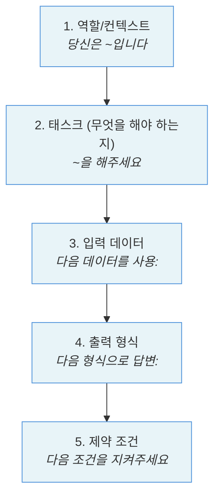

# 3.1 프롬프트 기초

> **학습 목표**: 프롬프트 엔지니어링의 기본 원칙을 이해하고, 효과적인 프롬프트를 작성할 수 있다.
>
> **참고**: [Anthropic Prompt Engineering Guide](https://docs.anthropic.com/en/docs/build-with-claude/prompt-engineering/overview) 기반

## 프롬프트란?

프롬프트는 AI에게 주는 **지시문**입니다. 같은 AI라도 프롬프트에 따라 결과가 크게 달라집니다.

```
나쁜 프롬프트:                    좋은 프롬프트:
"코드 짜줘"                      "Python으로 CSV 파일을 읽어서
                                  각 열의 평균값을 계산하는
                                  함수를 작성해줘.
                                  pandas를 사용하고,
                                  빈 값은 무시해줘."

→ 무엇을? 어떤 언어로?           → 명확한 목표, 조건, 제약
```

## 좋은 프롬프트의 원칙

### 1. 명확하고 구체적으로

```
✗ "이 코드 고쳐줘"
✓ "이 Python 코드에서 리스트가 비어있을 때 IndexError가 발생합니다.
   빈 리스트일 경우 빈 딕셔너리를 반환하도록 수정해주세요."
```

### 2. 역할 부여 (System Prompt)

```
"당신은 10년 경력의 시니어 백엔드 개발자입니다.
 코드 리뷰를 할 때 보안과 성능에 특히 주의를 기울입니다."
```

역할을 부여하면 AI의 답변 스타일과 관점이 달라집니다.

### 3. 출력 형식 지정

```
"다음 형식으로 답변해주세요:

## 요약
(한 줄 요약)

## 원인
(버그의 원인)

## 수정 코드
(수정된 코드)

## 설명
(수정 내용 설명)"
```

### 4. 컨텍스트 제공

AI는 여러분의 상황을 모릅니다. 필요한 배경 정보를 충분히 제공하세요:

```
"우리 팀은 React + TypeScript로 프론트엔드를 개발하고 있습니다.
 현재 사용자 인증 시스템을 구현 중이며,
 JWT 토큰을 사용합니다.
 
 다음 코드에서 토큰 갱신 로직에 문제가 있습니다:
 [코드]"
```

### 5. 제약 조건 명시

```
"다음 조건을 지켜주세요:
- 외부 라이브러리 사용 금지
- Python 3.9 이상 문법 사용
- 함수 하나당 20줄 이내
- 타입 힌트 포함"
```

## 프롬프트의 구조

효과적인 프롬프트의 일반적인 구조:



## 실습: 프롬프트 개선하기

### Before

```
"이메일 분류해줘"
```

### After

```
"고객 지원 이메일을 다음 카테고리 중 하나로 분류해주세요:
- 결제 문제
- 기술 지원
- 계정 관련
- 일반 문의

입력 이메일:
"{이메일 내용}"

다음 JSON 형식으로 응답해주세요:
{
  "category": "카테고리명",
  "confidence": "높음/보통/낮음",
  "reason": "분류 이유 한 줄"
}"
```

## 핵심 정리

- **구체적으로**: 모호한 지시는 모호한 결과를 낳음
- **역할 부여**: 전문가 역할을 주면 전문적 답변을 얻음
- **형식 지정**: 원하는 출력 형식을 미리 정의
- **컨텍스트**: AI가 모르는 배경 정보를 제공
- **제약 조건**: 지켜야 할 규칙을 명확히

## 더 알아보기

- [Anthropic - Prompt Engineering Guide](https://docs.anthropic.com/en/docs/build-with-claude/prompt-engineering/overview)
- [Anthropic Courses - Prompt Engineering Interactive Tutorial](https://github.com/anthropics/courses)

---

**다음 챕터**: [3.2 고급 프롬프트 기법](/chapters/03-prompt-engineering/advanced-techniques) →
