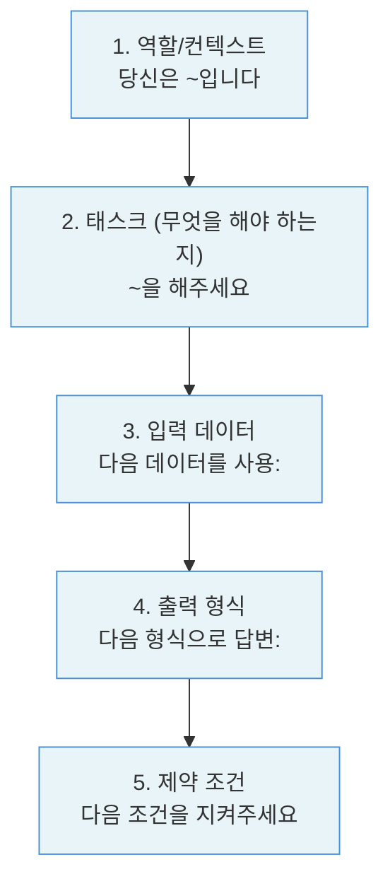

# 3.1 프롬프트 기초

> **학습 목표**: 프롬프트 엔지니어링의 기본 원칙을 이해하고, 효과적인 프롬프트를 작성할 수 있다.
>
> **참고**: [Anthropic Prompt Engineering Guide](https://docs.anthropic.com/en/docs/build-with-claude/prompt-engineering/overview) 기반

## 프롬프트란?

프롬프트는 AI에게 주는 **지시문**입니다. 같은 AI라도 프롬프트에 따라 결과가 크게 달라집니다.

```
나쁜 프롬프트:                    좋은 프롬프트:
"코드 짜줘"                      "Python으로 CSV 파일을 읽어서
                                  각 열의 평균값을 계산하는
                                  함수를 작성해줘.
                                  pandas를 사용하고,
                                  빈 값은 무시해줘."

→ 무엇을? 어떤 언어로?           → 명확한 목표, 조건, 제약
```

## 좋은 프롬프트의 원칙

### 1. 명확하고 구체적으로

```
✗ "이 코드 고쳐줘"
✓ "이 Python 코드에서 리스트가 비어있을 때 IndexError가 발생합니다.
   빈 리스트일 경우 빈 딕셔너리를 반환하도록 수정해주세요."
```

### 2. 역할 부여 (System Prompt)

```
"당신은 10년 경력의 시니어 백엔드 개발자입니다.
 코드 리뷰를 할 때 보안과 성능에 특히 주의를 기울입니다."
```

역할을 부여하면 AI의 답변 스타일과 관점이 달라집니다.

### 3. 출력 형식 지정

```
"다음 형식으로 답변해주세요:

## 요약
(한 줄 요약)

## 원인
(버그의 원인)

## 수정 코드
(수정된 코드)

## 설명
(수정 내용 설명)"
```

### 4. 컨텍스트 제공

AI는 여러분의 상황을 모릅니다. 필요한 배경 정보를 충분히 제공하세요:

```
"우리 팀은 React + TypeScript로 프론트엔드를 개발하고 있습니다.
 현재 사용자 인증 시스템을 구현 중이며,
 JWT 토큰을 사용합니다.
 
 다음 코드에서 토큰 갱신 로직에 문제가 있습니다:
 [코드]"
```

### 5. 제약 조건 명시

```
"다음 조건을 지켜주세요:
- 외부 라이브러리 사용 금지
- Python 3.9 이상 문법 사용
- 함수 하나당 20줄 이내
- 타입 힌트 포함"
```

## 프롬프트의 구조

효과적인 프롬프트의 일반적인 구조:



## 실습: 프롬프트 개선하기

### Before

```
"이메일 분류해줘"
```

### After

```
"고객 지원 이메일을 다음 카테고리 중 하나로 분류해주세요:
- 결제 문제
- 기술 지원
- 계정 관련
- 일반 문의

입력 이메일:
"{이메일 내용}"

다음 JSON 형식으로 응답해주세요:
{
  "category": "카테고리명",
  "confidence": "높음/보통/낮음",
  "reason": "분류 이유 한 줄"
}"
```

---

## 도메인별 실전 예시

### 코딩 도메인

::: details Before/After: 함수 작성 요청

**Before (모호한 프롬프트)**
```
"파일 읽는 함수 만들어줘"
```

**After (명확한 프롬프트)**
```
"Python으로 JSON 설정 파일을 읽는 함수를 작성해주세요.

조건:
- 파일이 없을 경우 FileNotFoundError 대신 None을 반환
- 파싱 오류 시 ValueError를 발생시키되 원인을 메시지에 포함
- 타입 힌트 사용 (반환 타입: dict | None)
- 함수 독스트링 포함

예시 사용법:
config = load_config('settings.json')
if config is None:
    print('설정 파일 없음, 기본값 사용')
"
```

**결과 품질 차이**: 모호한 요청은 에러 처리도 없고 타입 힌트도 없는 코드를 생성. 명확한 요청은 즉시 프로덕션 수준의 코드를 생성.
:::

### 글쓰기 도메인

::: details Before/After: 기술 블로그 작성

**Before (모호한 프롬프트)**
```
"API에 대한 글 써줘"
```

**After (명확한 프롬프트)**
```
"주니어 백엔드 개발자를 대상으로 REST API 설계 원칙에 관한 블로그 포스트를 작성해주세요.

- 분량: 1,500자 내외
- 톤: 친근하지만 전문적
- 포함할 내용: HTTP 메서드 구분, 상태 코드 올바른 사용, URL 설계 원칙
- 각 원칙마다 좋은 예/나쁜 예 코드 포함
- 마지막에 핵심 요약 3줄

독자는 Express나 FastAPI를 처음 쓰는 사람입니다."
```
:::

### 데이터 분석 도메인

::: details Before/After: 데이터 분석 요청

**Before (모호한 프롬프트)**
```
"이 데이터 분석해줘"
```

**After (명확한 프롬프트)**
```
"다음 판매 데이터(CSV)를 분석해주세요.

분석 목표:
1. 월별 매출 추이 (2024년 1월~12월)
2. 지역별 매출 비중 (파이 차트용 수치)
3. 매출 상위 10개 제품 (금액 기준)
4. 이상치 탐지 (전월 대비 50% 이상 변동)

출력 형식:
- 각 분석은 Python pandas/matplotlib 코드로
- 코드 아래에 해석 한 문단
- 발견된 인사이트를 마지막에 bullet point로 요약

데이터:
[CSV 데이터]"
```
:::

---

## Before/After 비교: 실제 Claude API 사용

같은 태스크를 두 가지 프롬프트로 호출한 예시입니다.

```python
import anthropic

client = anthropic.Anthropic()

# --- 나쁜 프롬프트 ---
bad_response = client.messages.create(
    model="claude-opus-4-5",
    max_tokens=1024,
    messages=[{"role": "user", "content": "코드 리뷰해줘"}]
)
# 결과: "어떤 코드를 리뷰해드릴까요?" — 즉시 재질문 필요

# --- 좋은 프롬프트 ---
good_response = client.messages.create(
    model="claude-opus-4-5",
    max_tokens=2048,
    system="""당신은 Python 시니어 개발자입니다.
코드 리뷰 시 다음 순서로 검토합니다:
1. 보안 취약점 (최우선)
2. 성능 이슈
3. 가독성 / 유지보수성
각 이슈에 심각도(높음/보통/낮음)와 수정 코드를 함께 제시합니다.""",
    messages=[{
        "role": "user",
        "content": """다음 Flask 엔드포인트를 리뷰해주세요:

```python
@app.route('/user')
def get_user():
    user_id = request.args.get('id')
    result = db.execute(f"SELECT * FROM users WHERE id={user_id}")
    return jsonify(result)
```"""
    }]
)
# 결과: SQL 인젝션 취약점 즉시 지적 + 파라미터화된 쿼리 수정 코드 제공
```

---

## 🧪 실습

다음 프롬프트를 위에서 배운 5가지 원칙을 적용하여 개선해보세요.

**개선 대상 1 — 코딩**
```
"로그인 기능 만들어줘"
```

**개선 대상 2 — 글쓰기**
```
"이 회의록 요약해줘"
```

**개선 대상 3 — 데이터 분석**
```
"왜 매출이 떨어졌는지 알아봐줘"
```

::: tip 체크리스트
개선한 프롬프트를 아래 항목으로 평가해보세요:
- [ ] 역할/컨텍스트가 명확한가?
- [ ] 원하는 결과물이 구체적으로 정의되어 있는가?
- [ ] 출력 형식이 지정되어 있는가?
- [ ] 필요한 배경 정보가 포함되어 있는가?
- [ ] 지켜야 할 제약 조건이 있다면 명시되어 있는가?
:::

---

## 흔한 실수와 해결법

| 실수 유형 | 문제가 되는 이유 | 해결 방법 |
|-----------|-----------------|-----------|
| 너무 짧은 프롬프트 | AI가 추측으로 채워야 함 | 목적, 대상, 형식을 명시 |
| 여러 요청을 한 번에 | 우선순위 불명확, 일부 누락 | 번호를 붙여 순서대로 요청 |
| 부정문으로만 지시 | "~하지 마"는 AI가 무엇을 해야 할지 모름 | "대신 ~해주세요"로 긍정형 전환 |
| 전문 용어 과다 | 모델이 잘못 해석할 수 있음 | 약어와 용어를 풀어서 설명 |
| 예시 없이 추상적 지시 | "좋은 글"의 기준이 주관적 | 기대하는 스타일 예시 한 단락 제공 |

::: warning 부정문 함정
"마케팅 용어를 쓰지 마세요"처럼 금지만 나열하면 AI가 무엇을 써야 할지 모릅니다.

"기술적 사실에 집중하고, 과장 표현 없이 명확한 수치로 설명해주세요"처럼 원하는 방향을 긍정형으로 서술하세요.
:::

---

## 핵심 정리

- **구체적으로**: 모호한 지시는 모호한 결과를 낳음
- **역할 부여**: 전문가 역할을 주면 전문적 답변을 얻음
- **형식 지정**: 원하는 출력 형식을 미리 정의
- **컨텍스트**: AI가 모르는 배경 정보를 제공
- **제약 조건**: 지켜야 할 규칙을 명확히

---

::: info 핵심 용어 정리

**프롬프트 (Prompt)**: AI에게 주는 지시문. 질문, 명령, 맥락 정보를 포함한다.

**시스템 프롬프트 (System Prompt)**: 사용자 메시지보다 먼저 AI에게 주어지는 지시. AI의 역할, 성격, 행동 규칙을 설정한다.

**컨텍스트 (Context)**: AI가 태스크를 수행하는 데 필요한 배경 정보. 프로젝트 정보, 이전 대화, 관련 데이터 등이 포함된다.

**제약 조건 (Constraints)**: 출력이 반드시 지켜야 할 규칙. 형식, 분량, 사용 기술, 금지 항목 등.

**출력 형식 (Output Format)**: AI의 응답이 어떤 구조여야 하는지 정의. JSON, 마크다운, 표, 목록 등.

**프롬프트 엔지니어링 (Prompt Engineering)**: 원하는 결과를 얻기 위해 프롬프트를 체계적으로 설계하고 개선하는 기술.
:::

## 더 알아보기

- [Anthropic - Prompt Engineering Guide](https://docs.anthropic.com/en/docs/build-with-claude/prompt-engineering/overview)
- [Anthropic Courses - Prompt Engineering Interactive Tutorial](https://github.com/anthropics/courses)

---

**다음 챕터**: [3.2 고급 프롬프트 기법](/chapters/03-prompt-engineering/advanced-techniques) →
