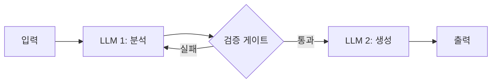
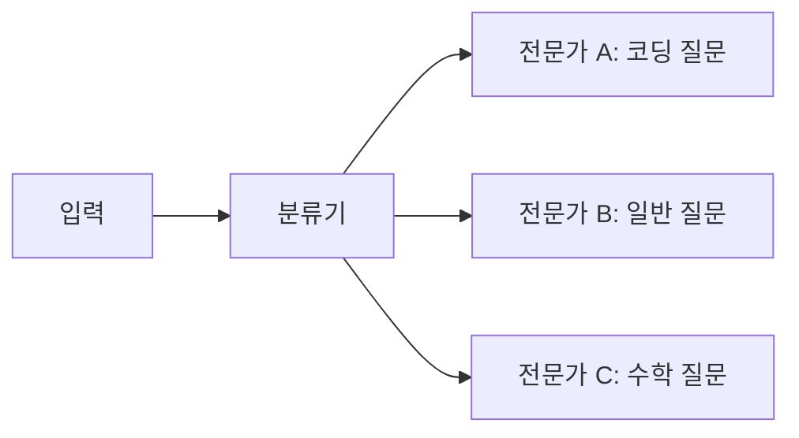
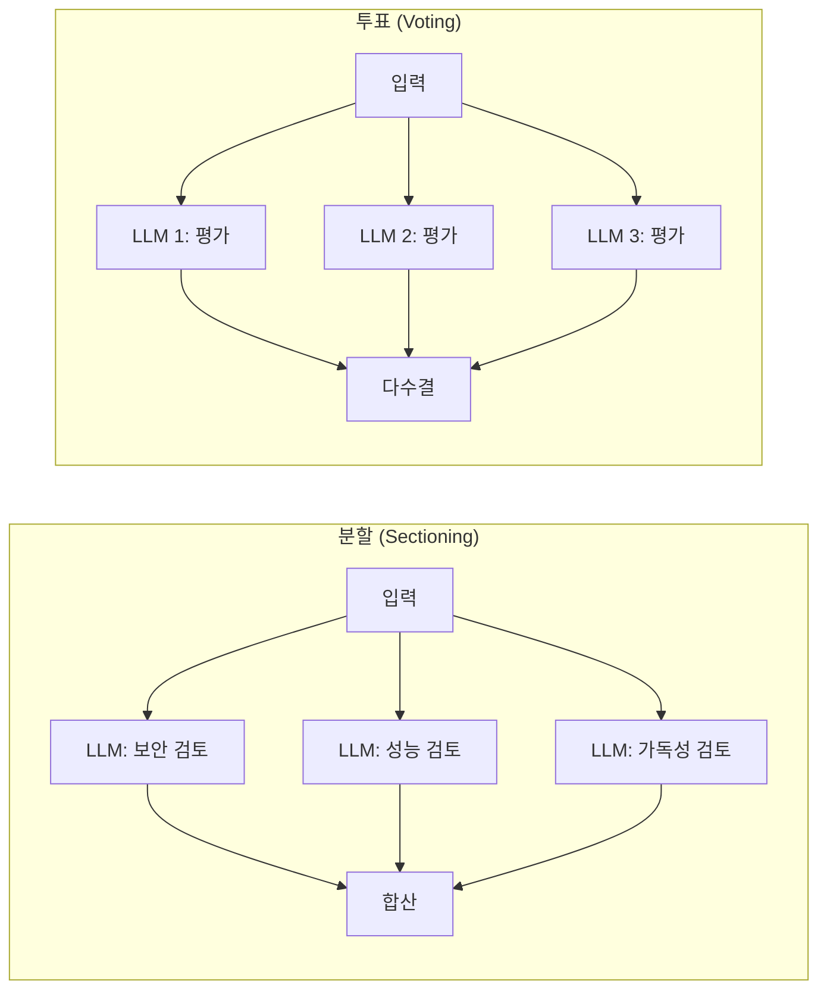
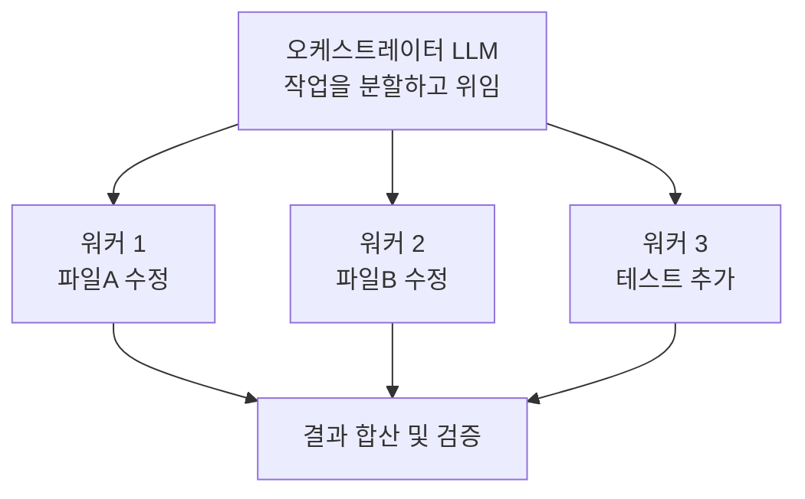
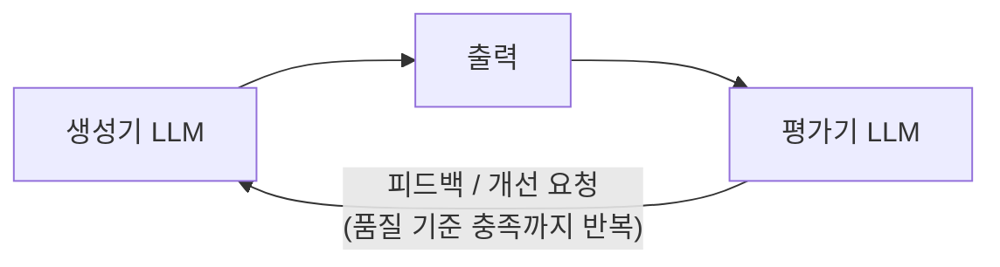
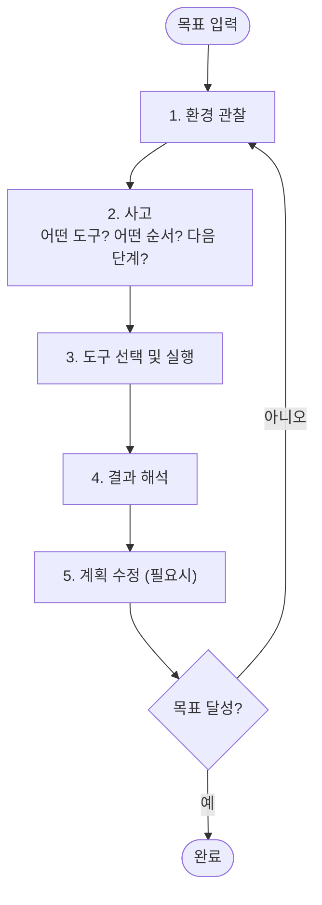

# 4.2 에이전트 아키텍처

> **학습 목표**: 다양한 에이전트 아키텍처 패턴을 이해하고, 상황에 맞는 패턴을 선택할 수 있다.
>
> **참고**: [Anthropic - Building Effective Agents](https://www.anthropic.com/engineering/building-effective-agents)

## 워크플로우 vs 에이전트

Anthropic은 에이전틱 시스템을 두 가지로 구분합니다:

```
워크플로우 (Workflows):              에이전트 (Agents):
사전 정의된 코드 경로               모델이 자율적으로 경로 결정

if 조건A:                          while not done:
    LLM.do(작업1)                      action = LLM.decide()
elif 조건B:                            result = execute(action)
    LLM.do(작업2)                      done = LLM.evaluate(result)

예측 가능, 일관성 높음               유연하지만 예측 어려움
```

::: tip Anthropic의 핵심 권고
"Building Effective Agents" 블로그에서 Anthropic은 명확히 밝힙니다: **대부분의 실제 사용 사례는 완전 자율 에이전트보다 잘 설계된 워크플로우로 더 잘 해결됩니다.** 에이전트의 자율성은 예측 불가능성과 비용을 함께 증가시키기 때문입니다.
:::

## 워크플로우 패턴들

### 1. 프롬프트 체이닝 (Prompt Chaining)



**사용 사례**: 코드 생성 후 리뷰, 문서 작성 후 검수

```
예시: 블로그 포스트 작성

[1단계: 개요 작성]
  → "AI 에이전트 소개 글의 개요를 작성해주세요"
  → 개요 생성

[게이트: 개요 품질 확인]
  → 통과

[2단계: 본문 작성]
  → "이 개요를 바탕으로 본문을 작성해주세요"
  → 본문 생성
```

### 2. 라우팅 (Routing)



**사용 사례**: 고객 문의 분류, 멀티 도메인 처리

### 3. 병렬화 (Parallelization)



**사용 사례**: 코드 리뷰(여러 관점), 콘텐츠 검수

### 4. 오케스트레이터-워커 (Orchestrator-Workers)



**사용 사례**: 대규모 리팩토링, 멀티파일 작업

### 5. 평가자-최적화 루프 (Evaluator-Optimizer)



**사용 사례**: 코드 품질 향상, 번역 정교화

---

## 각 패턴의 실전 코드

### 라우팅 패턴 구현

```python
import anthropic

client = anthropic.Anthropic()

def classify_query(query: str) -> str:
    """사용자 질문을 카테고리로 분류합니다."""
    response = client.messages.create(
        model="claude-opus-4-5",
        max_tokens=64,
        system="""질문을 다음 중 하나로만 분류하세요: coding, math, general
        JSON 형식으로만 응답: {"category": "분류명"}""",
        messages=[{"role": "user", "content": query}]
    )
    import json
    return json.loads(response.content[0].text)["category"]

SPECIALISTS = {
    "coding": """당신은 시니어 소프트웨어 엔지니어입니다. 
                 코드 예시를 항상 포함합니다.""",
    "math": """당신은 수학 교수입니다. 
               단계별 풀이를 항상 보여줍니다.""",
    "general": """당신은 지식이 풍부한 어시스턴트입니다."""
}

def route_and_answer(query: str) -> str:
    """질문을 분류하고 전문가에게 라우팅합니다."""
    category = classify_query(query)
    system_prompt = SPECIALISTS.get(category, SPECIALISTS["general"])
    
    response = client.messages.create(
        model="claude-opus-4-5",
        max_tokens=1024,
        system=system_prompt,
        messages=[{"role": "user", "content": query}]
    )
    return response.content[0].text

# 사용
answer = route_and_answer("파이썬에서 제너레이터란?")
```

### 평가자-최적화 루프 구현

```python
import anthropic

client = anthropic.Anthropic()

def evaluator_optimizer(task: str, quality_threshold: float = 0.8, max_iterations: int = 3) -> str:
    """생성-평가-개선 루프로 고품질 결과를 생성합니다."""
    
    current_output = ""
    feedback = ""
    
    for i in range(max_iterations):
        # 1. 생성 (또는 개선)
        generate_prompt = task if i == 0 else f"""{task}

이전 답변:
{current_output}

개선 필요 사항:
{feedback}

위 피드백을 반영하여 개선된 답변을 작성하세요."""
        
        gen_response = client.messages.create(
            model="claude-opus-4-5",
            max_tokens=1024,
            messages=[{"role": "user", "content": generate_prompt}]
        )
        current_output = gen_response.content[0].text
        
        # 2. 평가
        eval_response = client.messages.create(
            model="claude-opus-4-5",
            max_tokens=256,
            system="코드/글의 품질을 0.0~1.0으로 평가합니다. JSON: {\"score\": 0.0, \"feedback\": \"개선점\"}",
            messages=[{"role": "user", "content": f"평가할 내용:\n{current_output}"}]
        )
        
        import json
        eval_result = json.loads(eval_response.content[0].text)
        score = eval_result["score"]
        feedback = eval_result["feedback"]
        
        print(f"Iteration {i+1}: score={score:.2f}")
        
        if score >= quality_threshold:
            print(f"품질 기준 달성 ({score:.2f} >= {quality_threshold})")
            break
    
    return current_output
```

---

## 자율 에이전트 패턴

워크플로우보다 자유도가 높은 패턴:



---

## 어떤 패턴을 선택할 것인가?

Anthropic의 권고:

> **가장 단순한 솔루션부터 시작하고, 필요할 때만 복잡성을 추가하라.**

```
복잡도 낮음 ──────────────────────────────── 복잡도 높음

단일 LLM  →  프롬프트   →  라우팅/  →  오케스트레이터  →  자율
  호출       체이닝      병렬화      -워커           에이전트

"대부분의 문제는 왼쪽 패턴으로 충분하다"
```

| 상황 | 권장 패턴 |
|------|----------|
| 작업이 명확하고 단순 | 단일 LLM 호출 |
| 단계별 처리 필요 | 프롬프트 체이닝 |
| 여러 전문 영역 | 라우팅 |
| 독립적 하위 작업 | 병렬화 |
| 복잡한 동적 작업 | 오케스트레이터-워커 |
| 열린 문제 해결 | 자율 에이전트 |

---

## 에이전트 안전 설계

Anthropic이 에이전트 설계에서 강조하는 안전 원칙:

### 인간 확인 지점 (Human-in-the-Loop)

```python
def agent_with_confirmation(task: str):
    """되돌리기 어려운 작업 전에 사용자 확인을 요청합니다."""
    
    # 에이전트가 계획을 수립
    plan = generate_plan(task)
    
    # 위험한 작업이 포함되어 있는지 평가
    risky_actions = [action for action in plan if is_risky(action)]
    
    if risky_actions:
        print("다음 작업들은 되돌리기 어렵습니다:")
        for action in risky_actions:
            print(f"  - {action}")
        
        confirm = input("계속 진행하시겠습니까? (y/n): ")
        if confirm.lower() != 'y':
            return "작업 취소됨"
    
    # 승인된 경우에만 실행
    return execute_plan(plan)

def is_risky(action: str) -> bool:
    """삭제, 배포, 외부 API 호출 등 위험한 작업 판별."""
    risky_keywords = ["delete", "drop", "deploy", "send_email", "charge"]
    return any(keyword in action.lower() for keyword in risky_keywords)
```

### 체크포인트와 롤백

```
안전한 에이전트 패턴:

작업 시작 → [체크포인트 저장] → 작업 실행
                                    ↓
                             오류 발생 시
                                    ↓
                          [체크포인트로 복원] → 다시 시도

예시: 코드베이스 대규모 리팩토링 시
- git commit 후 시작
- 중간 단계마다 git stash
- 실패 시 git reset
```

---

## 실전 사례: 코드 리뷰 자동화 파이프라인

병렬화 패턴을 활용한 실제 코드 리뷰 시스템:

```python
import anthropic
import asyncio
from typing import NamedTuple

client = anthropic.Anthropic()

class ReviewResult(NamedTuple):
    aspect: str
    issues: list[str]
    score: float

def review_security(code: str) -> ReviewResult:
    response = client.messages.create(
        model="claude-opus-4-5",
        max_tokens=512,
        system="보안 전문가로서 코드의 보안 취약점만 검토합니다. SQL 인젝션, XSS, 인증 우회 등.",
        messages=[{"role": "user", "content": f"보안 검토:\n```\n{code}\n```\n\nJSON: {{\"issues\": [...], \"score\": 0.0~1.0}}"}]
    )
    import json
    result = json.loads(response.content[0].text)
    return ReviewResult("security", result["issues"], result["score"])

def review_performance(code: str) -> ReviewResult:
    response = client.messages.create(
        model="claude-opus-4-5",
        max_tokens=512,
        system="성능 전문가로서 코드의 성능 이슈만 검토합니다. N+1 쿼리, 불필요한 루프, 메모리 누수 등.",
        messages=[{"role": "user", "content": f"성능 검토:\n```\n{code}\n```\n\nJSON: {{\"issues\": [...], \"score\": 0.0~1.0}}"}]
    )
    import json
    result = json.loads(response.content[0].text)
    return ReviewResult("performance", result["issues"], result["score"])

def review_readability(code: str) -> ReviewResult:
    response = client.messages.create(
        model="claude-opus-4-5",
        max_tokens=512,
        system="코드 품질 전문가로서 가독성과 유지보수성만 검토합니다. 네이밍, 복잡도, 주석 등.",
        messages=[{"role": "user", "content": f"가독성 검토:\n```\n{code}\n```\n\nJSON: {{\"issues\": [...], \"score\": 0.0~1.0}}"}]
    )
    import json
    result = json.loads(response.content[0].text)
    return ReviewResult("readability", result["issues"], result["score"])

def parallel_code_review(code: str) -> dict:
    """세 가지 관점을 병렬로 검토합니다."""
    # 실제로는 ThreadPoolExecutor나 asyncio로 병렬 실행
    security = review_security(code)
    performance = review_performance(code)
    readability = review_readability(code)
    
    all_issues = []
    for result in [security, performance, readability]:
        for issue in result.issues:
            all_issues.append(f"[{result.aspect.upper()}] {issue}")
    
    overall_score = (security.score + performance.score + readability.score) / 3
    
    return {
        "overall_score": overall_score,
        "issues": all_issues,
        "breakdown": {
            "security": security.score,
            "performance": performance.score,
            "readability": readability.score
        }
    }
```

---

## 🧪 실습

**실습 1: 패턴 선택 연습**

다음 시나리오에 가장 적합한 아키텍처 패턴을 선택하고 이유를 설명해보세요:

1. 고객 리뷰 텍스트에서 감정(긍정/부정/중립)을 분류하는 시스템
2. 여러 언어(영어, 한국어, 일본어)로 고객을 지원하는 챗봇
3. 코드를 작성하고, 테스트하고, 문서화까지 자동으로 처리하는 시스템
4. 장문의 법률 계약서에서 리스크 조항을 찾아내는 시스템

::: details 정답 예시
1. 단일 LLM 호출 (명확하고 단순한 분류 태스크)
2. 라우팅 (입력 언어에 따라 전문화된 모델로 분기)
3. 프롬프트 체이닝 또는 오케스트레이터-워커 (명확한 순서가 있는 복잡한 작업)
4. 병렬화 (독립적인 여러 관점에서 동시에 분석 가능)
:::

**실습 2: 평가자-최적화 루프 실험**

위의 `evaluator_optimizer` 함수를 사용하여 다음 태스크의 결과를 개선해보세요:

```
task = """Python으로 이진 검색 함수를 작성해주세요.
           타입 힌트, 독스트링, 에러 처리를 포함해야 합니다."""
```

- 최대 반복 횟수를 3으로 설정하고 각 iteration의 점수를 관찰하세요
- 어떤 부분이 개선되었나요?

---

## 핵심 정리

- **워크플로우**: 사전 정의된 경로, 예측 가능하고 일관적
- **자율 에이전트**: 모델이 경로를 결정, 유연하지만 예측 어려움
- **단순함 우선**: 가장 간단한 패턴부터 시작
- **체이닝, 라우팅, 병렬화**: 가장 흔하게 사용되는 기본 패턴
- **오케스트레이터-워커**: 대규모 작업에 적합
- **안전 설계**: 되돌리기 어려운 작업 전에 반드시 확인 단계 포함

---

::: info 핵심 용어 정리

**워크플로우 (Workflow)**: LLM 호출의 순서와 조건이 코드로 미리 정의된 시스템. 예측 가능하고 디버깅이 쉬움.

**프롬프트 체이닝 (Prompt Chaining)**: 이전 LLM 호출의 출력을 다음 LLM 호출의 입력으로 사용하는 패턴. 복잡한 작업을 단계별로 분해.

**라우팅 (Routing)**: 입력의 특성에 따라 다른 전문화된 모델이나 프롬프트로 분기하는 패턴.

**병렬화 (Parallelization)**: 동일한 입력을 여러 LLM이 동시에 처리하거나, 독립적인 하위 작업을 병렬로 실행하는 패턴.

**오케스트레이터-워커 (Orchestrator-Workers)**: 오케스트레이터 LLM이 작업을 분석하고 여러 워커 LLM에게 하위 작업을 동적으로 위임하는 패턴.

**평가자-최적화 (Evaluator-Optimizer)**: 생성기 LLM과 평가기 LLM이 순환하며 출력을 반복적으로 개선하는 패턴.

**Human-in-the-Loop**: 에이전트의 자율 실행 과정에 인간의 확인/승인 단계를 포함시키는 안전 설계 패턴.
:::

## 더 알아보기

- [Anthropic - Building Effective Agents](https://www.anthropic.com/engineering/building-effective-agents)
- [Anthropic Academy - Introduction to Subagents](https://anthropic.skilljar.com/)

---

← [4.1 에이전트란 무엇인가](/chapters/04-ai-agents/) | **다음 챕터**: [4.3 멀티 에이전트 시스템](/chapters/04-ai-agents/multi-agent) →
