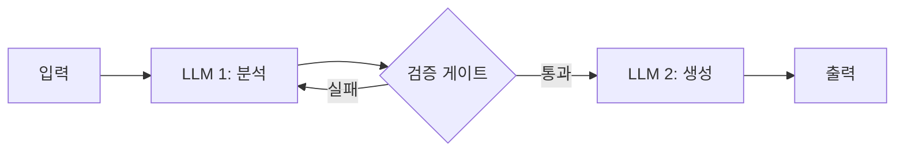
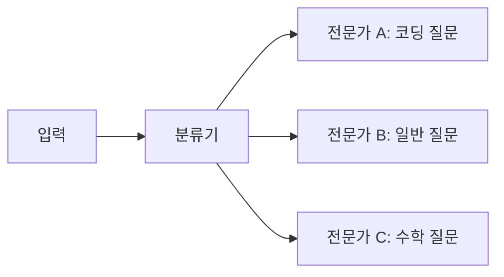
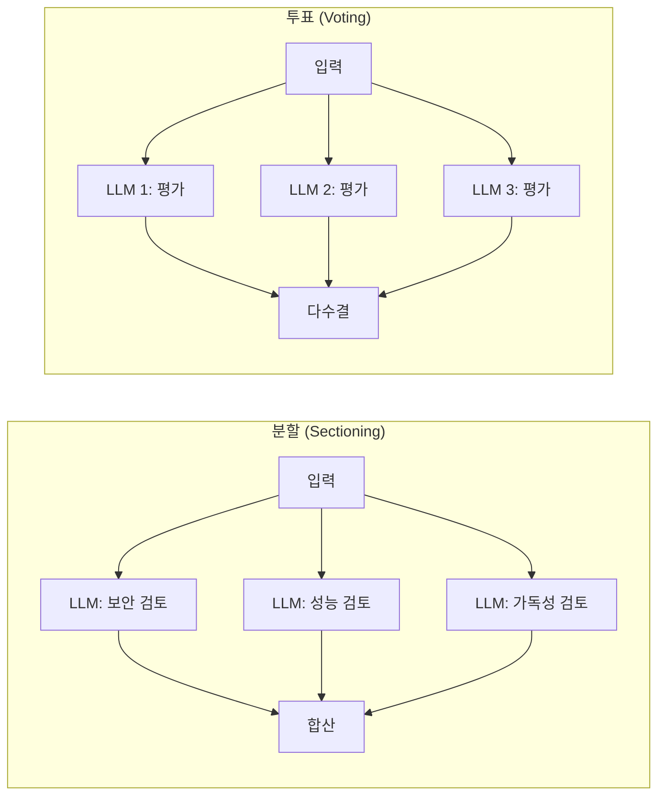
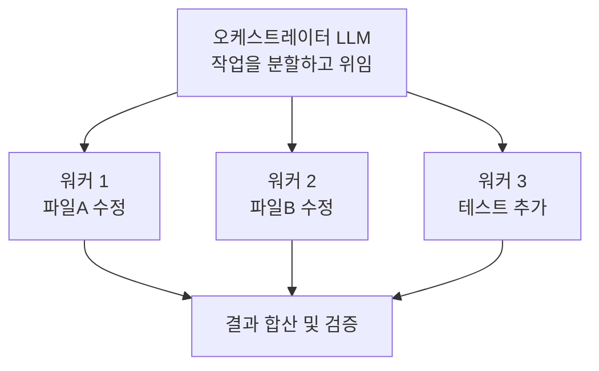
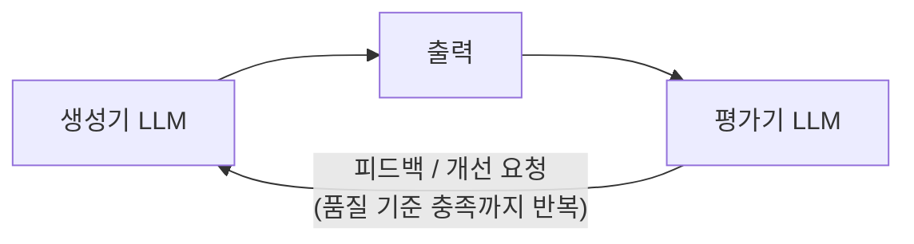

# 4.2 에이전트 아키텍처

> **학습 목표**: 다양한 에이전트 아키텍처 패턴을 이해하고, 상황에 맞는 패턴을 선택할 수 있다.
>
> **참고**: [Anthropic - Building Effective Agents](https://www.anthropic.com/engineering/building-effective-agents)

## 워크플로우 vs 에이전트

Anthropic은 에이전틱 시스템을 두 가지로 구분합니다:

```
워크플로우 (Workflows):              에이전트 (Agents):
사전 정의된 코드 경로               모델이 자율적으로 경로 결정

if 조건A:                          while not done:
    LLM.do(작업1)                      action = LLM.decide()
elif 조건B:                            result = execute(action)
    LLM.do(작업2)                      done = LLM.evaluate(result)

예측 가능, 일관성 높음               유연하지만 예측 어려움
```

## 워크플로우 패턴들

### 1. 프롬프트 체이닝 (Prompt Chaining)



**사용 사례**: 코드 생성 후 리뷰, 문서 작성 후 검수

```
예시: 블로그 포스트 작성

[1단계: 개요 작성]
  → "AI 에이전트 소개 글의 개요를 작성해주세요"
  → 개요 생성

[게이트: 개요 품질 확인]
  → 통과

[2단계: 본문 작성]
  → "이 개요를 바탕으로 본문을 작성해주세요"
  → 본문 생성
```

### 2. 라우팅 (Routing)



**사용 사례**: 고객 문의 분류, 멀티 도메인 처리

### 3. 병렬화 (Parallelization)



**사용 사례**: 코드 리뷰(여러 관점), 콘텐츠 검수

### 4. 오케스트레이터-워커 (Orchestrator-Workers)



**사용 사례**: 대규모 리팩토링, 멀티파일 작업

### 5. 평가자-최적화 루프 (Evaluator-Optimizer)



**사용 사례**: 코드 품질 향상, 번역 정교화

## 자율 에이전트 패턴

워크플로우보다 자유도가 높은 패턴:


## 어떤 패턴을 선택할 것인가?

Anthropic의 권고:

> **가장 단순한 솔루션부터 시작하고, 필요할 때만 복잡성을 추가하라.**

```
복잡도 낮음 ──────────────────────────────── 복잡도 높음

단일 LLM  →  프롬프트   →  라우팅/  →  오케스트레이터  →  자율
  호출       체이닝      병렬화      -워커           에이전트

"대부분의 문제는 왼쪽 패턴으로 충분하다"
```

| 상황 | 권장 패턴 |
|------|----------|
| 작업이 명확하고 단순 | 단일 LLM 호출 |
| 단계별 처리 필요 | 프롬프트 체이닝 |
| 여러 전문 영역 | 라우팅 |
| 독립적 하위 작업 | 병렬화 |
| 복잡한 동적 작업 | 오케스트레이터-워커 |
| 열린 문제 해결 | 자율 에이전트 |

## 핵심 정리

- **워크플로우**: 사전 정의된 경로, 예측 가능하고 일관적
- **자율 에이전트**: 모델이 경로를 결정, 유연하지만 예측 어려움
- **단순함 우선**: 가장 간단한 패턴부터 시작
- **체이닝, 라우팅, 병렬화**: 가장 흔하게 사용되는 기본 패턴
- **오케스트레이터-워커**: 대규모 작업에 적합

## 더 알아보기

- [Anthropic - Building Effective Agents](https://www.anthropic.com/engineering/building-effective-agents)
- [Anthropic Academy - Introduction to Subagents](https://anthropic.skilljar.com/)

---

← [4.1 에이전트란 무엇인가](/chapters/04-ai-agents/) | **다음 챕터**: [4.3 멀티 에이전트 시스템](/chapters/04-ai-agents/multi-agent) →
