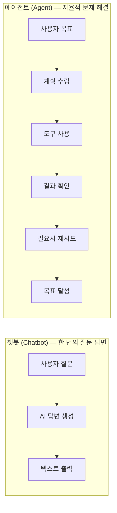
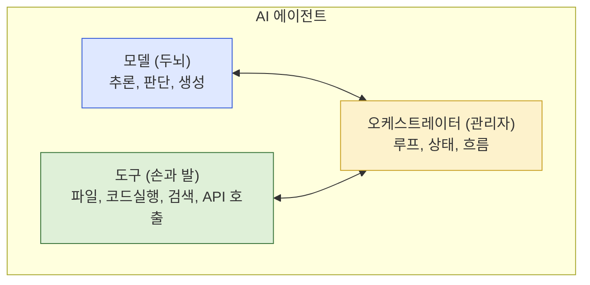
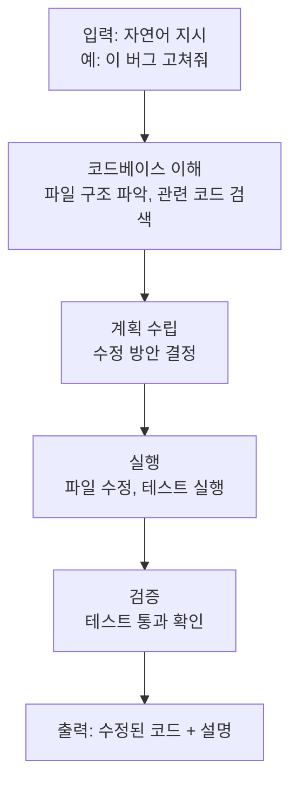

# 4.1 에이전트란 무엇인가

> **학습 목표**: AI 에이전트의 정의와 핵심 특성을 이해하고, 챗봇과 에이전트의 차이를 설명할 수 있다.
>
> **참고**: [Anthropic - Building Effective Agents](https://www.anthropic.com/engineering/building-effective-agents)

## 챗봇 vs 에이전트



| 특성 | 챗봇 | 에이전트 |
|------|------|---------|
| 상호작용 | 질문 → 답변 | 목표 → 자율 실행 |
| 도구 사용 | 없음 | 파일 읽기/쓰기, 명령 실행 등 |
| 계획 수립 | 없음 | 스스로 단계를 계획 |
| 오류 처리 | 사용자가 재시도 | 스스로 오류 감지 및 수정 |
| 예시 | 단순 Q&A | Claude Code, Cursor |

## 에이전트의 핵심 구성요소



### 1. 모델 (Model) — 두뇌

LLM이 에이전트의 추론 엔진 역할을 합니다:
- 사용자의 목표를 이해
- 어떤 도구를 사용할지 결정
- 결과를 해석하고 다음 단계를 계획

### 2. 도구 (Tools) — 손과 발

에이전트가 외부 세계와 상호작용하는 수단:

```
Claude Code가 사용하는 도구들:

- Read: 파일 읽기
- Write: 파일 쓰기
- Edit: 파일 수정
- Bash: 명령어 실행
- Grep: 코드 검색
- WebSearch: 웹 검색
```

### 3. 오케스트레이션 — 관리자

모델과 도구를 연결하고, 전체 작업 흐름을 관리:

```
반복 루프 (Agentic Loop):

while 목표 미달성:
    1. 현재 상태 확인
    2. 다음 행동 결정 (모델)
    3. 도구 실행
    4. 결과 확인
    5. 목표 달성 여부 판단
```

## Agentic Loop — 에이전트의 심장

에이전트의 핵심은 **반복 루프**입니다:

```
사용자: "이 프로젝트의 테스트를 모두 통과시켜줘"

Loop 1:
  [사고] "먼저 테스트를 실행해서 현재 상태를 파악하자"
  [도구] bash: npm test
  [결과] 5개 중 2개 실패

Loop 2:
  [사고] "첫 번째 실패 테스트를 분석하자"
  [도구] read: test/auth.test.js
  [결과] 인증 토큰 만료 처리 누락

Loop 3:
  [사고] "auth.js에서 토큰 만료 처리를 추가하자"
  [도구] edit: src/auth.js
  [결과] 코드 수정 완료

Loop 4:
  [사고] "테스트를 다시 실행해서 확인하자"
  [도구] bash: npm test
  [결과] 4개 통과, 1개 실패

Loop 5-7:
  ... (나머지 실패 수정)

Loop 8:
  [사고] "모든 테스트 통과 확인"
  [도구] bash: npm test
  [결과] 5개 모두 통과 ✓
  → 목표 달성, 루프 종료
```

## Claude Code는 어떤 에이전트인가?

Claude Code는 **코딩 특화 AI 에이전트**입니다:



---

## Claude Code 실제 사용 시나리오

### 시나리오 1: 신규 기능 구현

```
사용자: "사용자 프로필 이미지 업로드 기능을 구현해줘.
         S3에 저장하고, DB에 URL을 저장해야 해."

--- Claude Code의 실제 동작 ---

Step 1: 코드베이스 탐색
  [Glob] src/**/*.ts → 프로젝트 구조 파악
  [Read] src/models/user.ts → User 모델 확인
  [Read] src/routes/user.ts → 기존 라우터 패턴 확인
  [Read] package.json → 사용 가능한 패키지 확인

Step 2: 계획 수립 (내부 사고)
  "multer로 파일 업로드, @aws-sdk/client-s3으로 S3 업로드,
   User 모델에 profileImageUrl 필드 추가가 필요하다."

Step 3: 구현
  [Write] src/middleware/upload.ts → multer 설정
  [Write] src/services/s3.service.ts → S3 업로드 서비스
  [Edit]  src/models/user.ts → profileImageUrl 필드 추가
  [Edit]  src/routes/user.ts → 업로드 엔드포인트 추가
  [Write] src/migrations/add_profile_image.ts → DB 마이그레이션

Step 4: 테스트
  [Bash] npx ts-node src/migrations/add_profile_image.ts
  [Bash] npm test src/routes/user.test.ts
  → 테스트 통과 확인

Step 5: 결과 보고
  "프로필 이미지 업로드 기능 구현 완료.
   POST /api/users/:id/profile-image 엔드포인트 추가.
   최대 5MB, JPEG/PNG만 허용. ..."
```

### 시나리오 2: 레거시 코드 리팩토링

```
사용자: "콜백 지옥으로 된 auth.js를 async/await으로 바꿔줘.
         기존 테스트는 모두 통과해야 해."

--- Claude Code의 실제 동작 ---

Step 1: 현재 상태 파악
  [Read] src/auth.js → 콜백 패턴 분석
  [Bash] npm test src/auth.test.js → 현재 테스트 22개 모두 통과 확인

Step 2: 리팩토링 계획
  "콜백을 Promise로, 그 다음 async/await으로 전환.
   에러 처리는 try/catch로 변환.
   함수 시그니처는 유지."

Step 3: 리팩토링 실행
  [Edit] src/auth.js → 전체 async/await 변환

Step 4: 검증
  [Bash] npm test src/auth.test.js
  → 22개 중 20개 통과, 2개 실패

Step 5: 실패 분석 및 수정
  [Read] 실패 테스트 케이스 확인
  [Edit] src/auth.js → 타이밍 이슈 수정

Step 6: 최종 확인
  [Bash] npm test src/auth.test.js
  → 22개 모두 통과
```

---

## AI 코딩 도구 비교

에이전트 기반 코딩 도구들의 특성을 비교합니다.

| 도구 | 접근 방식 | 강점 | 약점 |
|------|-----------|------|------|
| **Claude Code** | 터미널 기반 에이전트 | 전체 코드베이스 이해, 실제 명령 실행 | GUI 없음 |
| **Cursor** | IDE 내장 | 코드 편집 UX 최적화, 빠른 인라인 제안 | 에이전트 자율성 낮음 |
| **GitHub Copilot** | IDE 확장 | 광범위한 IDE 지원, 코드 자동 완성 | 에이전트 기능 제한적 |
| **Windsurf** | IDE 내장 | Cascade 에이전트로 멀티파일 작업 | 상대적으로 신규 |

::: tip Claude Code가 적합한 상황
- 여러 파일에 걸친 복잡한 리팩토링
- 버그 재현 → 분석 → 수정 → 테스트의 전 과정 자동화
- 코드베이스 전체를 이해해야 하는 작업
- 터미널 명령과 코드 수정을 함께 수행해야 할 때
:::

::: tip Cursor/Copilot이 적합한 상황
- 빠른 코드 자동 완성
- 특정 함수나 블록 단위의 즉각적인 제안
- GUI 환경에서 시각적 코드 탐색
:::

---

## 에이전트의 도전 과제

| 과제 | 설명 |
|------|------|
| **환각 (Hallucination)** | 존재하지 않는 파일/함수를 참조 |
| **무한 루프** | 같은 실수를 반복 |
| **컨텍스트 한계** | 대규모 코드베이스 전체를 한 번에 이해 불가 |
| **안전성** | 위험한 명령어 실행 가능성 |
| **비용** | 많은 도구 호출 = 많은 토큰 소비 |

---

## Anthropic의 에이전트 설계 원칙

Anthropic의 "Building Effective Agents" 블로그에서 강조하는 핵심 원칙:

> **"가능한 한 단순하게. 필요할 때만 복잡성을 추가하라."**

에이전트가 강력할수록 실수의 파급력도 커집니다. Anthropic은 다음을 권고합니다:

1. **최소 권한**: 에이전트에게 태스크에 필요한 최소한의 도구만 부여
2. **인간 확인 지점**: 되돌리기 어려운 작업 전에 사용자 확인 요청
3. **명확한 종료 조건**: 에이전트가 언제 멈춰야 하는지 명확히 정의
4. **오류 복구 전략**: 실패 시 어떻게 복구할지 사전 설계

::: warning 에이전트 안전성
에이전트는 실제 파일을 삭제하고, 실제 API를 호출하고, 실제 코드를 배포할 수 있습니다. 테스트 환경에서 먼저 검증하고, 중요한 작업에는 항상 확인 단계를 두세요.
:::

---

## 🧪 실습

**실습 1: 에이전트 루프 직접 추적하기**

Claude Code에서 다음 명령을 실행하고, 에이전트가 몇 번의 루프를 거치는지, 어떤 도구를 사용하는지 관찰해보세요:

```
"이 프로젝트의 README.md를 읽고, 설치 방법 섹션에 
 'Prerequisites' 항목을 추가해줘. Node.js 18+와 
 npm 9+가 필요하다고 명시해줘."
```

- 에이전트가 몇 개의 도구를 호출했나요?
- 어떤 순서로 도구를 사용했나요?
- 중간에 계획을 수정하는 순간이 있었나요?

**실습 2: 에이전트 vs 챗봇 비교**

같은 질문을 챗봇(claude.ai)과 에이전트(Claude Code)에 각각 해보고 차이를 비교하세요:

```
"이 프로젝트에서 사용하지 않는 npm 패키지를 찾아줘"
```

- 챗봇은 어떻게 답변하나요?
- Claude Code는 어떻게 처리하나요?

---

## 핵심 정리

- **에이전트**: 모델 + 도구 + 오케스트레이션으로 자율적 문제 해결
- **Agentic Loop**: 관찰 → 사고 → 행동 → 확인의 반복
- **도구**: 에이전트가 외부 세계와 상호작용하는 수단
- **Claude Code**: 코딩 특화 에이전트의 대표적 예시
- **단순함 우선**: 에이전트는 강력하지만, 단순한 해결책이 가능하면 먼저 시도

---

::: info 핵심 용어 정리

**AI 에이전트 (AI Agent)**: 주어진 목표를 달성하기 위해 도구를 사용하고, 환경을 관찰하며, 자율적으로 다음 행동을 결정하는 AI 시스템.

**Agentic Loop**: 에이전트의 핵심 동작 사이클. "관찰 → 사고 → 행동 → 결과 확인"을 목표 달성까지 반복.

**오케스트레이터 (Orchestrator)**: 에이전트의 전체 흐름을 관리하는 구성요소. 모델의 결정을 받아 실제 도구를 실행하고 결과를 다시 모델에 전달.

**환각 (Hallucination)**: LLM이 실제로 존재하지 않는 정보를 사실인 것처럼 생성하는 현상. 에이전트 환경에서는 없는 파일을 읽으려 하거나 없는 함수를 호출하는 형태로 나타남.

**도구 호출 (Tool Call)**: 에이전트가 외부 도구(파일 시스템, API, 데이터베이스 등)를 사용하기 위해 보내는 요청. LLM이 도구 이름과 파라미터를 생성하면 호스트 시스템이 실제로 실행.

**컨텍스트 윈도우 (Context Window)**: LLM이 한 번에 처리할 수 있는 최대 텍스트 길이. 에이전트 루프가 길어질수록 이전 단계의 정보가 컨텍스트를 채워 한계에 도달할 수 있음.
:::

## 더 알아보기

- [Anthropic - Building Effective Agents](https://www.anthropic.com/engineering/building-effective-agents)
- [Anthropic Academy - Introduction to Agent Skills](https://anthropic.skilljar.com/)

---

**다음 챕터**: [4.2 에이전트 아키텍처](/chapters/04-ai-agents/architecture) →
