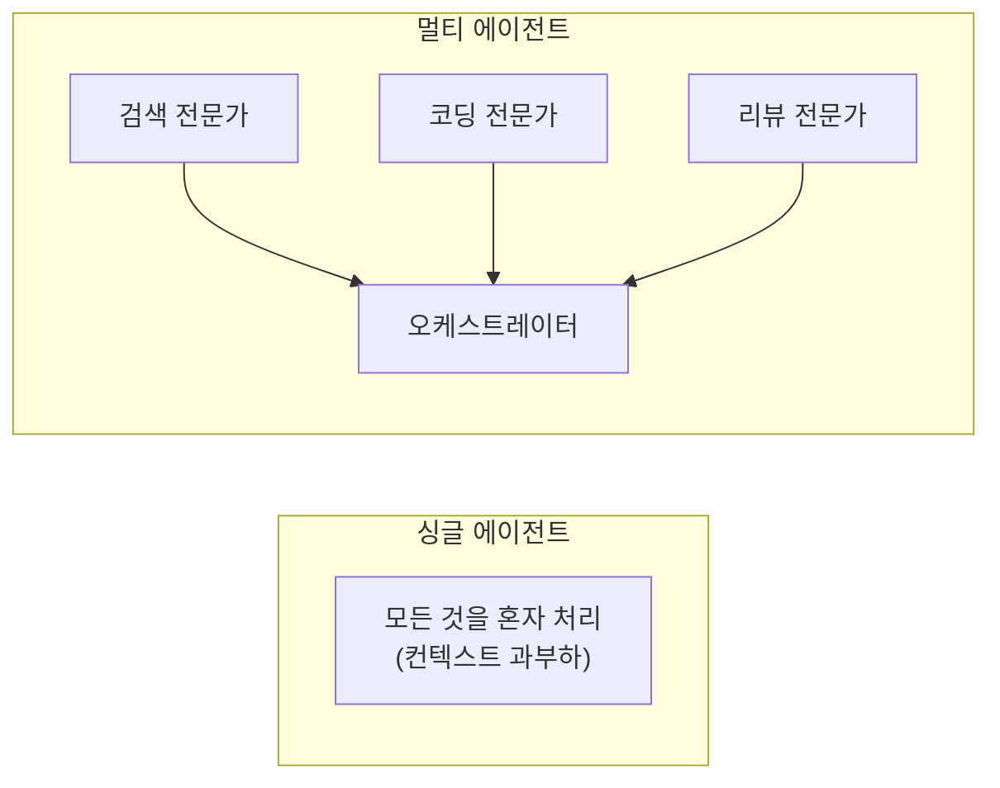
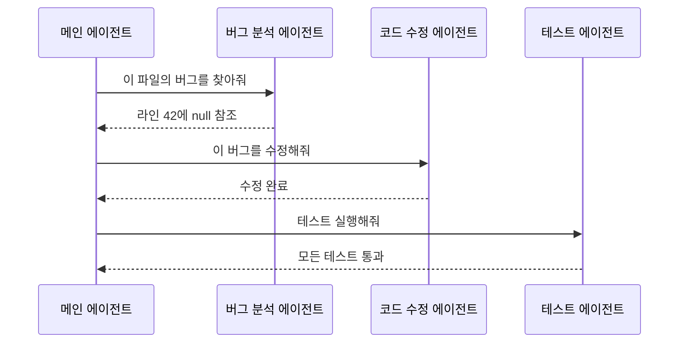
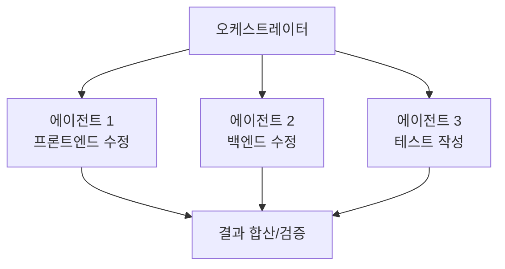
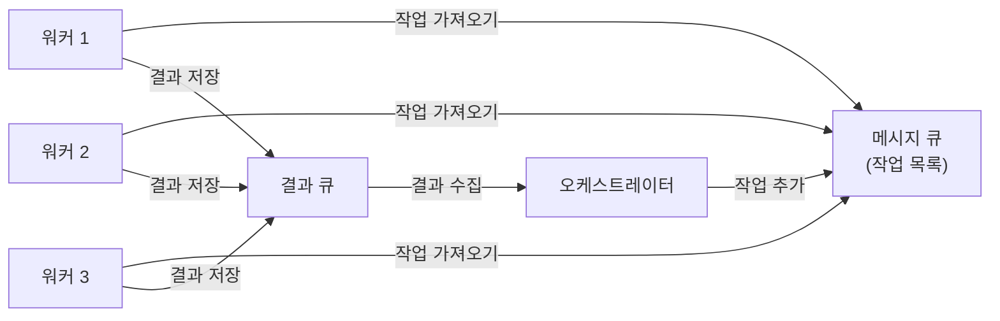

# 4.3 멀티 에이전트 시스템

> **학습 목표**: 여러 에이전트가 협력하는 멀티 에이전트 시스템의 개념과 패턴을 이해한다.

## 왜 멀티 에이전트인가?

하나의 에이전트로 모든 것을 처리하면:
- 컨텍스트 윈도우가 빠르게 소모됨
- 서로 다른 전문성이 필요한 작업에 비효율적
- 실패 시 전체 작업이 중단됨



## 멀티 에이전트 패턴

### 1. 위임 패턴 (Delegation)

메인 에이전트가 서브 에이전트에게 작업을 위임:



Claude Code의 **Agent Teams**가 이 패턴을 사용합니다.

### 2. 병렬 실행 패턴

독립적인 작업을 여러 에이전트가 동시에 처리:



### 3. 토론 패턴 (Debate)

여러 에이전트가 다른 관점에서 토론하여 최적해를 찾음:

```
질문: "이 시스템의 최적 아키텍처는?"

[에이전트 A: 마이크로서비스 옹호]
  "확장성과 독립 배포가 중요합니다..."

[에이전트 B: 모놀리스 옹호]
  "팀 규모를 고려하면 단순함이 우선..."

[판정 에이전트]
  "현재 상황에서는 모놀리스로 시작하되,
   서비스 경계를 명확히 하여 추후 분리 준비..."
```

## Claude Code의 서브에이전트

Claude Code에서는 Agent tool로 서브에이전트를 생성할 수 있습니다:

```
사용자: "프론트엔드와 백엔드 모두 수정해줘"

[메인 Claude Code]
  │
  ├──→ [서브에이전트 1: Explore]
  │     "프론트엔드 코드 구조 파악"
  │
  ├──→ [서브에이전트 2: build-integrator]
  │     "백엔드 API 수정"
  │
  └──→ [메인이 결과를 합산하여 최종 처리]
```

### 서브에이전트의 장점

| 장점 | 설명 |
|------|------|
| 컨텍스트 분리 | 각 에이전트가 독립된 컨텍스트 유지 |
| 병렬 처리 | 독립 작업을 동시에 수행 |
| 전문화 | 각 에이전트가 특정 역할에 집중 |
| 격리 | 하나의 실패가 전체에 영향 안 미침 |

---

## 실전 멀티 에이전트 구현

### Python으로 구현하는 오케스트레이터-워커 패턴

```python
import anthropic
from typing import Callable

client = anthropic.Anthropic()

def orchestrator(task: str, workers: dict[str, Callable]) -> str:
    """
    오케스트레이터가 태스크를 분석하고 적절한 워커에게 위임합니다.
    """
    # 1. 태스크 분해
    decompose_response = client.messages.create(
        model="claude-opus-4-5",
        max_tokens=512,
        system=f"""사용 가능한 워커: {list(workers.keys())}
        
주어진 태스크를 워커들에게 분배하세요. 각 서브태스크를 어떤 워커에게 줄지 결정하세요.
JSON 배열로만 응답: [{{"worker": "워커명", "subtask": "할 일"}}]""",
        messages=[{"role": "user", "content": f"태스크: {task}"}]
    )
    
    import json
    subtasks = json.loads(decompose_response.content[0].text)
    
    # 2. 각 워커에게 서브태스크 위임
    results = []
    for item in subtasks:
        worker_name = item["worker"]
        subtask = item["subtask"]
        
        if worker_name in workers:
            print(f"[{worker_name}] 실행 중: {subtask}")
            result = workers[worker_name](subtask)
            results.append(f"[{worker_name}] 결과:\n{result}")
    
    # 3. 결과 합산
    synthesis_response = client.messages.create(
        model="claude-opus-4-5",
        max_tokens=1024,
        messages=[{
            "role": "user",
            "content": f"""원래 태스크: {task}

각 워커의 결과:
{chr(10).join(results)}

위 결과들을 종합하여 최종 답변을 작성하세요."""
        }]
    )
    
    return synthesis_response.content[0].text


# 워커 정의
def code_worker(task: str) -> str:
    response = client.messages.create(
        model="claude-opus-4-5",
        max_tokens=512,
        system="코딩 전문가입니다. 코드 구현에 집중합니다.",
        messages=[{"role": "user", "content": task}]
    )
    return response.content[0].text

def test_worker(task: str) -> str:
    response = client.messages.create(
        model="claude-opus-4-5",
        max_tokens=512,
        system="테스트 전문가입니다. pytest 테스트 코드 작성에 집중합니다.",
        messages=[{"role": "user", "content": task}]
    )
    return response.content[0].text

def doc_worker(task: str) -> str:
    response = client.messages.create(
        model="claude-opus-4-5",
        max_tokens=512,
        system="기술 문서 작성 전문가입니다. 명확한 문서화에 집중합니다.",
        messages=[{"role": "user", "content": task}]
    )
    return response.content[0].text

# 실행
workers = {
    "code_worker": code_worker,
    "test_worker": test_worker,
    "doc_worker": doc_worker
}

result = orchestrator(
    "Python으로 이진 탐색 함수를 만들고, 테스트 코드와 문서도 작성해줘",
    workers
)
print(result)
```

---

## 에이전트 간 통신 설계

멀티 에이전트 시스템에서 에이전트들이 어떻게 정보를 주고받는지가 중요합니다.

### 메시지 큐 패턴



### 효율적인 에이전트 메시지 구조

```python
from dataclasses import dataclass
from typing import Any

@dataclass
class AgentMessage:
    """에이전트 간 전달되는 표준 메시지 구조."""
    task_id: str           # 추적을 위한 고유 ID
    sender: str            # 발신 에이전트
    recipient: str         # 수신 에이전트
    task_type: str         # 태스크 유형 (분류 목적)
    payload: str           # 실제 태스크 내용 (간결하게!)
    context: dict[str, Any] = None  # 필요한 최소 컨텍스트만

# 메시지를 간결하게 유지하는 것이 핵심
# 에이전트 간 컨텍스트 전달 시 필요한 정보만 포함
good_message = AgentMessage(
    task_id="task-001",
    sender="orchestrator",
    recipient="code_worker",
    task_type="implement",
    payload="이진 탐색 함수 구현. 입력: 정렬된 리스트 + 타겟값. 출력: 인덱스 또는 -1.",
    context={"language": "python", "style_guide": "pep8"}
)

# 나쁜 예: 전체 대화 이력을 그대로 전달 (토큰 낭비)
bad_message = AgentMessage(
    task_id="task-001",
    sender="orchestrator",
    recipient="code_worker",
    task_type="implement",
    payload="[이전 대화 5000 토큰]... 아무튼 이진 탐색 함수 만들어줘",
    context={}
)
```

::: warning 멀티 에이전트의 비용
에이전트를 추가할 때마다 비용이 곱해집니다. 워커 3개 × 평균 1000토큰 = 3000토큰. 오케스트레이션 오버헤드까지 합치면 싱글 에이전트보다 5~10배 비쌀 수 있습니다. 멀티 에이전트는 진짜 필요할 때만 사용하세요.
:::

---

## 실패 처리와 복구

멀티 에이전트 시스템의 핵심 과제 중 하나는 부분 실패 처리입니다.

```python
import anthropic
from enum import Enum

class TaskStatus(Enum):
    PENDING = "pending"
    RUNNING = "running"
    COMPLETED = "completed"
    FAILED = "failed"

class ResilientOrchestrator:
    """실패 복구 기능을 갖춘 오케스트레이터."""
    
    def __init__(self, max_retries: int = 2):
        self.client = anthropic.Anthropic()
        self.max_retries = max_retries
        self.task_results = {}
    
    def run_with_retry(self, task_id: str, task: str, worker_fn) -> str:
        """실패 시 재시도합니다."""
        for attempt in range(self.max_retries + 1):
            try:
                result = worker_fn(task)
                self.task_results[task_id] = {
                    "status": TaskStatus.COMPLETED,
                    "result": result
                }
                return result
            except Exception as e:
                if attempt == self.max_retries:
                    # 마지막 시도도 실패
                    self.task_results[task_id] = {
                        "status": TaskStatus.FAILED,
                        "error": str(e)
                    }
                    # 실패해도 전체 시스템은 계속
                    return f"[태스크 {task_id} 실패: {e}]"
                print(f"태스크 {task_id} 실패 (시도 {attempt+1}/{self.max_retries+1}): {e}")
    
    def get_summary(self) -> str:
        """실행 결과 요약을 생성합니다."""
        total = len(self.task_results)
        completed = sum(1 for r in self.task_results.values() 
                       if r["status"] == TaskStatus.COMPLETED)
        failed = total - completed
        
        return f"완료: {completed}/{total}, 실패: {failed}/{total}"
```

---

## 멀티 에이전트의 도전 과제

```
1. 조율 (Coordination)
   에이전트 A가 수정한 파일을 에이전트 B도 수정하면?
   → 충돌 해결 메커니즘 필요

2. 통신 비용
   에이전트 간 정보 교환 = 토큰 소비
   → 효율적 메시지 설계

3. 일관성
   각 에이전트의 결과가 서로 모순되면?
   → 최종 검증 단계 필요

4. 비용
   에이전트 수 × 토큰 비용
   → 꼭 필요한 경우에만 멀티 에이전트 사용
```

---

## 🧪 실습

**실습 1: 토론 패턴 직접 구현**

두 에이전트가 다른 관점을 취하도록 시스템 프롬프트를 설정하고, 다음 주제로 토론을 시뮬레이션해보세요:

주제: "소규모 스타트업에서 TypeScript vs JavaScript 중 무엇을 선택해야 하는가?"

```python
# 시작 코드 힌트
pro_ts_system = "당신은 TypeScript의 강력한 지지자입니다..."
pro_js_system = "당신은 JavaScript의 실용성을 중시합니다..."
judge_system = "당신은 공정한 기술 결정권자입니다..."
```

**실습 2: 병렬 처리 성능 측정**

다음 두 가지 방식으로 같은 작업을 실행하고 소요 시간을 비교해보세요:

1. 순차 실행: A → B → C 순서로 3개 LLM 호출
2. 병렬 실행: `concurrent.futures.ThreadPoolExecutor`로 동시 실행

태스크: 짧은 텍스트 3개를 각각 한국어, 영어, 일본어로 번역

---

## 핵심 정리

- **멀티 에이전트**: 복잡한 작업을 여러 전문 에이전트가 협력 처리
- **위임 패턴**: 메인 에이전트가 서브에이전트에 작업 배분
- **병렬 패턴**: 독립 작업을 동시에 처리하여 속도 향상
- **Claude Code**: 서브에이전트를 통한 멀티 에이전트 지원
- **트레이드오프**: 유연성과 비용/복잡성 사이의 균형
- **실패 처리**: 부분 실패가 전체 시스템을 멈추지 않도록 설계

---

::: info 핵심 용어 정리

**멀티 에이전트 시스템 (Multi-Agent System)**: 여러 AI 에이전트가 각자의 역할을 가지고 협력하여 목표를 달성하는 시스템.

**오케스트레이터 (Orchestrator)**: 멀티 에이전트 시스템에서 전체 흐름을 관리하고 워커에게 작업을 분배하는 중앙 에이전트.

**워커 에이전트 (Worker Agent)**: 오케스트레이터로부터 구체적인 서브태스크를 받아 실행하는 전문화된 에이전트.

**서브에이전트 (Subagent)**: Claude Code에서 메인 에이전트가 생성하는 독립된 컨텍스트의 하위 에이전트. Agent 도구를 통해 호출.

**컨텍스트 격리 (Context Isolation)**: 각 에이전트가 독립된 대화 컨텍스트를 유지하여 서로의 맥락이 뒤섞이지 않도록 하는 설계.

**토론 패턴 (Debate Pattern)**: 동일한 문제에 대해 서로 다른 관점을 가진 에이전트들이 논증을 교환하고 판정 에이전트가 최적해를 선택하는 패턴.
:::

## 더 알아보기

- [Anthropic Academy - Introduction to Subagents](https://anthropic.skilljar.com/)
- [Anthropic - Claude Code Subagents](https://docs.anthropic.com/en/docs/claude-code/sub-agents)

---

← [4.2 에이전트 아키텍처](/chapters/04-ai-agents/architecture) | **다음 챕터**: [5.1 Tool Use 개념](/chapters/05-tool-use-mcp/) →
