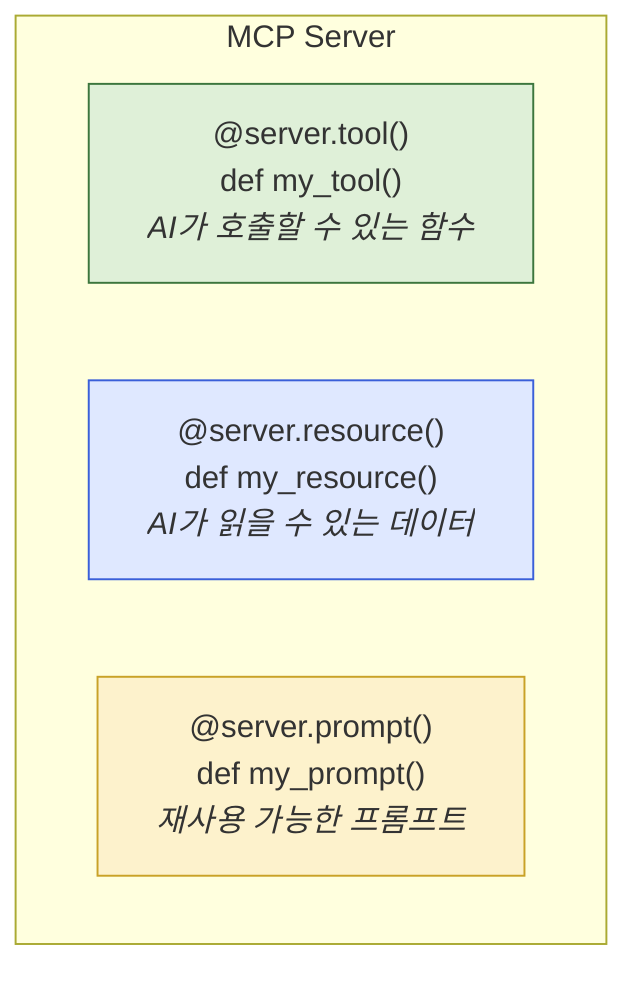

# 5.3 MCP 서버 만들기

> **학습 목표**: Python으로 간단한 MCP 서버를 직접 구축하여, MCP의 작동 원리를 체험한다.
>
> **참고**: [Anthropic Academy - Introduction to MCP](https://anthropic.skilljar.com/)

::: warning 준비물
- Python 3.10 이상
- `uv` 또는 `pip` 패키지 매니저
:::

## MCP 서버의 구조

MCP 서버 = 도구(Tools) + 리소스(Resources) + 프롬프트(Prompts) 제공자



## 실습 1: 메모 관리 MCP 서버

간단한 메모 저장/조회 서버를 만들어봅시다.

### 1단계: 프로젝트 설정

```bash
# 프로젝트 디렉토리 생성
mkdir mcp-notes-server && cd mcp-notes-server

# Python MCP SDK 설치
pip install mcp
```

### 2단계: 서버 코드 작성

```python
# server.py
from mcp.server.fastmcp import FastMCP

# 서버 인스턴스 생성
mcp = FastMCP("notes")

# 메모 저장소 (메모리)
notes: dict[str, str] = {}

@mcp.tool()
def add_note(title: str, content: str) -> str:
    """새로운 메모를 추가합니다."""
    notes[title] = content
    return f"메모 '{title}'가 저장되었습니다."

@mcp.tool()
def get_note(title: str) -> str:
    """제목으로 메모를 조회합니다."""
    if title in notes:
        return notes[title]
    return f"'{title}' 메모를 찾을 수 없습니다."

@mcp.tool()
def list_notes() -> str:
    """모든 메모의 제목 목록을 반환합니다."""
    if not notes:
        return "저장된 메모가 없습니다."
    return "\n".join(f"- {title}" for title in notes)

@mcp.resource("notes://list")
def notes_resource() -> str:
    """모든 메모를 리소스로 제공합니다."""
    if not notes:
        return "저장된 메모가 없습니다."
    return "\n\n".join(
        f"## {title}\n{content}" 
        for title, content in notes.items()
    )

if __name__ == "__main__":
    mcp.run()
```

### 3단계: Claude Code에 연결

```bash
claude mcp add notes-server -s user -- python /path/to/server.py
```

### 4단계: 사용해보기

Claude Code에서:
```
> "오늘 배운 내용을 메모로 저장해줘. 제목은 'MCP 학습'으로."
→ add_note 도구 호출

> "저장된 메모 목록을 보여줘"
→ list_notes 도구 호출
```

---

## 도구 설계 가이드

좋은 MCP 도구를 만들기 위한 원칙:

```
1. 명확한 이름과 설명
   ✗ def do_stuff()
   ✓ def search_documents(query: str)
       """키워드로 문서를 검색합니다. 제목과 본문에서 검색합니다."""

2. 적절한 타입 힌트
   ✗ def search(q, limit)
   ✓ def search(query: str, limit: int = 10) -> list[dict]

3. 에러 처리
   try/except로 실패 시 명확한 에러 메시지 반환

4. 원자적 작업
   하나의 도구 = 하나의 명확한 작업
```

---

## 실습 2: 날씨 API MCP 서버

외부 API를 연동하는 실용적인 서버를 만들어봅시다. Open-Meteo API를 사용합니다 (무료, 키 불필요).

### 프로젝트 설정

```bash
mkdir mcp-weather-server && cd mcp-weather-server
pip install mcp httpx
```

### 서버 코드

```python
# weather_server.py
import httpx
from mcp.server.fastmcp import FastMCP

mcp = FastMCP("weather")

# 주요 도시 좌표 (실제 앱에서는 지오코딩 API 사용)
CITY_COORDINATES = {
    "서울": {"lat": 37.5665, "lon": 126.9780},
    "부산": {"lat": 35.1796, "lon": 129.0756},
    "제주": {"lat": 33.4996, "lon": 126.5312},
    "도쿄": {"lat": 35.6762, "lon": 139.6503},
    "뉴욕": {"lat": 40.7128, "lon": -74.0060},
    "런던": {"lat": 51.5074, "lon": -0.1278},
}

WMO_CODES = {
    0: "맑음", 1: "대체로 맑음", 2: "부분적 흐림", 3: "흐림",
    45: "안개", 48: "결빙 안개",
    51: "약한 이슬비", 53: "보통 이슬비", 55: "강한 이슬비",
    61: "약한 비", 63: "보통 비", 65: "강한 비",
    71: "약한 눈", 73: "보통 눈", 75: "강한 눈",
    80: "약한 소나기", 81: "보통 소나기", 82: "강한 소나기",
    95: "뇌우", 96: "우박 동반 뇌우", 99: "강한 우박 동반 뇌우",
}


@mcp.tool()
def get_current_weather(city: str) -> str:
    """
    지정된 도시의 현재 날씨를 조회합니다.
    한국 주요 도시(서울, 부산, 제주)와 해외 도시(도쿄, 뉴욕, 런던)를 지원합니다.
    """
    city_lower = city.strip()
    
    if city_lower not in CITY_COORDINATES:
        available = ", ".join(CITY_COORDINATES.keys())
        return f"'{city}' 도시를 찾을 수 없습니다. 지원 도시: {available}"
    
    coords = CITY_COORDINATES[city_lower]
    
    try:
        url = "https://api.open-meteo.com/v1/forecast"
        params = {
            "latitude": coords["lat"],
            "longitude": coords["lon"],
            "current": ["temperature_2m", "relative_humidity_2m", 
                        "wind_speed_10m", "weathercode"],
            "timezone": "auto",
        }
        
        response = httpx.get(url, params=params, timeout=10)
        response.raise_for_status()
        data = response.json()
        
        current = data["current"]
        temp = current["temperature_2m"]
        humidity = current["relative_humidity_2m"]
        wind = current["wind_speed_10m"]
        code = current["weathercode"]
        condition = WMO_CODES.get(code, f"알 수 없음(코드:{code})")
        
        return (
            f"{city_lower} 현재 날씨:\n"
            f"- 상태: {condition}\n"
            f"- 기온: {temp}°C\n"
            f"- 습도: {humidity}%\n"
            f"- 풍속: {wind} km/h"
        )
    
    except httpx.TimeoutException:
        return "날씨 API 응답 시간이 초과되었습니다. 잠시 후 다시 시도해주세요."
    except httpx.HTTPStatusError as e:
        return f"날씨 API 오류: HTTP {e.response.status_code}"
    except Exception as e:
        return f"날씨 조회 중 오류 발생: {str(e)}"


@mcp.tool()
def get_weather_forecast(city: str, days: int = 3) -> str:
    """
    지정된 도시의 날씨 예보를 조회합니다.
    
    Args:
        city: 도시 이름 (서울, 부산, 제주, 도쿄, 뉴욕, 런던)
        days: 예보 일수 (1~7일, 기본값 3일)
    """
    if not 1 <= days <= 7:
        return "예보 일수는 1~7일 사이여야 합니다."
    
    city_lower = city.strip()
    if city_lower not in CITY_COORDINATES:
        available = ", ".join(CITY_COORDINATES.keys())
        return f"'{city}' 도시를 찾을 수 없습니다. 지원 도시: {available}"
    
    coords = CITY_COORDINATES[city_lower]
    
    try:
        url = "https://api.open-meteo.com/v1/forecast"
        params = {
            "latitude": coords["lat"],
            "longitude": coords["lon"],
            "daily": ["temperature_2m_max", "temperature_2m_min", 
                      "weathercode", "precipitation_probability_max"],
            "timezone": "auto",
            "forecast_days": days,
        }
        
        response = httpx.get(url, params=params, timeout=10)
        response.raise_for_status()
        data = response.json()
        
        daily = data["daily"]
        lines = [f"{city_lower} {days}일 예보:"]
        
        for i in range(days):
            date = daily["time"][i]
            max_temp = daily["temperature_2m_max"][i]
            min_temp = daily["temperature_2m_min"][i]
            code = daily["weathercode"][i]
            rain_prob = daily["precipitation_probability_max"][i]
            condition = WMO_CODES.get(code, "알 수 없음")
            
            lines.append(
                f"\n{date} ({condition})\n"
                f"  최고 {max_temp}°C / 최저 {min_temp}°C\n"
                f"  강수 확률: {rain_prob}%"
            )
        
        return "\n".join(lines)
    
    except Exception as e:
        return f"예보 조회 중 오류 발생: {str(e)}"


@mcp.tool()
def compare_weather(city1: str, city2: str) -> str:
    """
    두 도시의 현재 날씨를 비교합니다.
    어느 도시가 더 따뜻하거나 맑은지 비교할 때 유용합니다.
    """
    result1 = get_current_weather(city1)
    result2 = get_current_weather(city2)
    
    return f"=== 날씨 비교 ===\n\n{result1}\n\n{result2}"


@mcp.resource("weather://supported-cities")
def supported_cities() -> str:
    """지원하는 도시 목록을 리소스로 제공합니다."""
    lines = ["# 지원 도시 목록\n"]
    for city, coords in CITY_COORDINATES.items():
        lines.append(f"- {city} (위도: {coords['lat']}, 경도: {coords['lon']})")
    return "\n".join(lines)


@mcp.prompt()
def weather_based_recommendation(city: str) -> str:
    """날씨 기반 활동 추천을 위한 프롬프트 템플릿."""
    return f"""{city}의 현재 날씨를 get_current_weather 도구로 조회한 후,
날씨에 맞는 활동 3가지를 추천해주세요.
추천 시 날씨 데이터의 구체적인 수치를 근거로 설명해주세요."""


if __name__ == "__main__":
    mcp.run()
```

### Claude Code에 연결

```bash
claude mcp add weather-server -s user -- python /path/to/weather_server.py
```

### 사용 예시

```
> "서울 날씨 알려줘"
→ get_current_weather("서울") 호출
→ "서울 현재 날씨: 맑음, 기온 18°C, 습도 55%, 풍속 12 km/h"

> "서울이랑 제주 날씨 비교해줘"
→ compare_weather("서울", "제주") 호출
→ 두 도시 날씨 나란히 비교

> "도쿄 5일 예보 보여줘"
→ get_weather_forecast("도쿄", days=5) 호출
→ 5일간 최고/최저 기온, 강수 확률
```

::: tip 날씨 서버 확장 아이디어
- 지오코딩 API 연동으로 임의 도시 지원
- 시간대별 예보 추가
- 날씨 경보(폭풍, 폭설 등) 감지
- UV 지수, 대기질(AQI) 추가
:::

---

## 실습 3: 파일 기반 메모 서버 (영구 저장)

앞의 메모 서버를 개선하여 서버 재시작 후에도 데이터가 유지되도록 합니다.

```python
# persistent_notes_server.py
import json
from pathlib import Path
from mcp.server.fastmcp import FastMCP

mcp = FastMCP("persistent-notes")

NOTES_FILE = Path.home() / ".mcp_notes.json"


def load_notes() -> dict[str, str]:
    """파일에서 메모를 불러옵니다."""
    if NOTES_FILE.exists():
        try:
            return json.loads(NOTES_FILE.read_text(encoding="utf-8"))
        except json.JSONDecodeError:
            return {}
    return {}


def save_notes(notes: dict[str, str]) -> None:
    """메모를 파일에 저장합니다."""
    NOTES_FILE.write_text(
        json.dumps(notes, ensure_ascii=False, indent=2),
        encoding="utf-8"
    )


@mcp.tool()
def add_note(title: str, content: str, tags: str = "") -> str:
    """
    새로운 메모를 추가합니다. 파일에 영구 저장됩니다.
    
    Args:
        title: 메모 제목 (고유해야 함)
        content: 메모 내용
        tags: 쉼표로 구분된 태그 (예: "python,학습,중요")
    """
    notes = load_notes()
    
    if title in notes:
        return f"'{title}' 메모가 이미 존재합니다. update_note를 사용해주세요."
    
    note_data = {"content": content, "tags": tags, "created": _now()}
    notes[title] = json.dumps(note_data, ensure_ascii=False)
    save_notes(notes)
    
    return f"메모 '{title}'이 저장되었습니다."


@mcp.tool()
def search_notes(keyword: str) -> str:
    """
    키워드로 메모를 검색합니다. 제목, 내용, 태그를 모두 검색합니다.
    
    Args:
        keyword: 검색 키워드
    """
    notes = load_notes()
    results = []
    
    for title, raw in notes.items():
        try:
            note = json.loads(raw)
            content = note.get("content", raw)
            tags = note.get("tags", "")
        except (json.JSONDecodeError, TypeError):
            content = raw
            tags = ""
        
        if (keyword.lower() in title.lower() or 
            keyword.lower() in content.lower() or
            keyword.lower() in tags.lower()):
            results.append(f"제목: {title}\n내용: {content[:100]}...")
    
    if not results:
        return f"'{keyword}'에 대한 검색 결과가 없습니다."
    
    return f"{len(results)}개 검색 결과:\n\n" + "\n\n---\n\n".join(results)


@mcp.tool()
def delete_note(title: str) -> str:
    """메모를 삭제합니다."""
    notes = load_notes()
    
    if title not in notes:
        return f"'{title}' 메모를 찾을 수 없습니다."
    
    del notes[title]
    save_notes(notes)
    return f"메모 '{title}'이 삭제되었습니다."


def _now() -> str:
    from datetime import datetime
    return datetime.now().strftime("%Y-%m-%d %H:%M")


if __name__ == "__main__":
    mcp.run()
```

---

## 전체 흐름 복습

```
1. MCP 서버 코드 작성 (Python, TypeScript 등)
2. Claude Code에 서버 등록 (claude mcp add)
3. Claude Code가 서버의 도구 목록을 자동 인식
4. 사용자 요청 → Claude가 적절한 도구 선택 → 서버에서 실행 → 결과 반환
```

---

## 흔한 실수와 해결법

| 실수 | 증상 | 해결 |
|------|------|------|
| 독스트링 부실 | Claude가 잘못된 상황에 도구 호출 | 언제 사용해야 하는지 독스트링에 명시 |
| 타입 힌트 누락 | 파라미터 타입 오류 | 모든 파라미터에 타입 힌트 추가 |
| 에러 미처리 | 예외 발생 시 서버 크래시 | try/except로 에러 메시지 반환 |
| 서버 경로 오류 | `claude mcp add` 실패 | 절대 경로 사용, python 실행 권한 확인 |
| 의존성 미설치 | ImportError | requirements.txt 관리, venv 사용 |

::: warning 보안 주의사항
MCP 서버는 Claude Code와 동일한 권한으로 실행됩니다. 외부 API 키는 환경변수로 관리하고, 코드에 하드코딩하지 마세요. 특히 데이터베이스 서버는 읽기 전용 계정을 사용하는 것을 권장합니다.
:::

---

## 🧪 실습

**실습 1: 날씨 서버 확장**

날씨 서버에 다음 기능을 추가해보세요:

```python
@mcp.tool()
def get_outfit_recommendation(city: str) -> str:
    """
    현재 날씨를 기반으로 적절한 옷차림을 추천합니다.
    기온, 강수 확률, 풍속을 모두 고려합니다.
    """
    # 힌트: get_current_weather 함수의 결과를 파싱하거나
    # 직접 API를 호출하여 날씨 데이터를 가져오세요
    pass
```

**실습 2: 나만의 MCP 서버**

다음 중 하나를 선택하여 MCP 서버를 만들어보세요:

**옵션 A: 할 일 관리 서버**
- 할 일 추가 (제목, 기한, 우선순위)
- 완료 처리
- 오늘의 할 일 목록 조회
- 기한 초과 항목 조회

**옵션 B: 환율 변환 서버**
- 특정 통화쌍 환율 조회 (exchangerate.host API — 무료)
- 금액 변환 (100 USD → KRW)
- 여러 통화 동시 비교

**옵션 C: URL 단축 + 기록 서버**
- URL 저장 (이름, URL, 설명, 태그)
- 태그로 검색
- 자주 사용하는 URL 리소스로 제공

::: tip 서버 개발 팁
FastMCP의 개발 모드로 로컬에서 빠르게 테스트할 수 있습니다:
```bash
# 개발 서버 실행 (MCP Inspector 포함)
mcp dev server.py
```
브라우저에서 도구 목록 확인 및 직접 호출 테스트가 가능합니다.
:::

---

## 핵심 정리

- **FastMCP**: Python에서 MCP 서버를 쉽게 만드는 프레임워크
- **@server.tool()**: AI가 호출할 수 있는 도구 정의
- **@server.resource()**: AI가 읽을 수 있는 데이터 정의
- **타입 힌트**: LLM이 파라미터를 올바르게 생성하는 데 필수적
- **독스트링**: LLM이 도구의 용도를 판단하는 핵심 정보
- **에러 처리**: 예외를 잡아 명확한 메시지로 반환해야 서버가 안정적으로 동작

---

::: info 핵심 용어 정리

**FastMCP**: MCP 서버 개발을 위한 Python 고수준 프레임워크. 데코레이터 기반으로 도구, 리소스, 프롬프트를 빠르게 정의할 수 있음.

**@mcp.tool()**: FastMCP에서 MCP 도구를 정의하는 데코레이터. 함수의 타입 힌트와 독스트링이 자동으로 도구 스키마와 설명으로 변환됨.

**@mcp.resource()**: MCP 리소스를 정의하는 데코레이터. URI 패턴과 함께 사용되며, AI가 데이터를 읽기 전용으로 접근할 때 사용.

**@mcp.prompt()**: 재사용 가능한 프롬프트 템플릿을 정의하는 데코레이터. 인자를 받아 동적으로 프롬프트를 생성할 수 있음.

**stdio 전송 방식**: MCP 서버가 표준 입출력으로 통신하는 방식. `mcp.run()`을 호출하면 기본적으로 stdio 모드로 시작됨.

**MCP Inspector**: MCP 서버의 도구 목록을 확인하고 직접 호출하여 테스트할 수 있는 개발 도구. `mcp dev server.py`로 실행.
:::

## 더 알아보기

- [MCP Python SDK](https://github.com/modelcontextprotocol/python-sdk)
- [MCP TypeScript SDK](https://github.com/modelcontextprotocol/typescript-sdk)
- [Anthropic Academy - MCP Advanced Topics](https://anthropic.skilljar.com/)

---

← [5.2 MCP 기초](/chapters/05-tool-use-mcp/mcp-basics) | **다음 챕터**: [6.1 Anthropic API 시작하기](/chapters/06-api-development/) →
