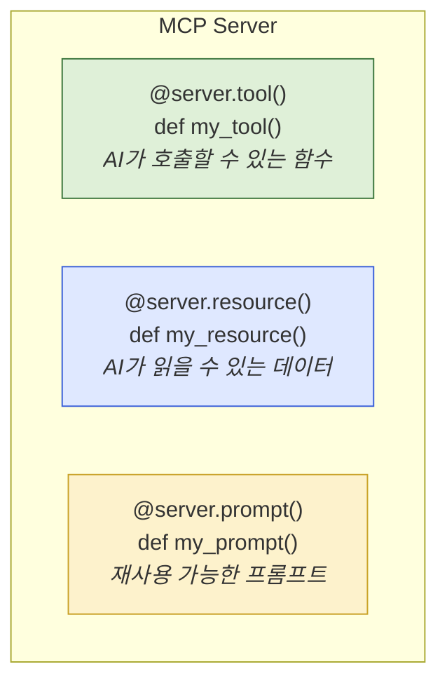

# 5.3 MCP 서버 만들기

> **학습 목표**: Python으로 간단한 MCP 서버를 직접 구축하여, MCP의 작동 원리를 체험한다.
>
> **참고**: [Anthropic Academy - Introduction to MCP](https://anthropic.skilljar.com/)

::: warning 준비물
- Python 3.10 이상
- `uv` 또는 `pip` 패키지 매니저
:::

## MCP 서버의 구조

MCP 서버 = 도구(Tools) + 리소스(Resources) + 프롬프트(Prompts) 제공자



## 실습: 메모 관리 MCP 서버

간단한 메모 저장/조회 서버를 만들어봅시다.

### 1단계: 프로젝트 설정

```bash
# 프로젝트 디렉토리 생성
mkdir mcp-notes-server && cd mcp-notes-server

# Python MCP SDK 설치
pip install mcp
```

### 2단계: 서버 코드 작성

```python
# server.py
from mcp.server.fastmcp import FastMCP

# 서버 인스턴스 생성
mcp = FastMCP("notes")

# 메모 저장소 (메모리)
notes: dict[str, str] = {}

@mcp.tool()
def add_note(title: str, content: str) -> str:
    """새로운 메모를 추가합니다."""
    notes[title] = content
    return f"메모 '{title}'가 저장되었습니다."

@mcp.tool()
def get_note(title: str) -> str:
    """제목으로 메모를 조회합니다."""
    if title in notes:
        return notes[title]
    return f"'{title}' 메모를 찾을 수 없습니다."

@mcp.tool()
def list_notes() -> str:
    """모든 메모의 제목 목록을 반환합니다."""
    if not notes:
        return "저장된 메모가 없습니다."
    return "\n".join(f"- {title}" for title in notes)

@mcp.resource("notes://list")
def notes_resource() -> str:
    """모든 메모를 리소스로 제공합니다."""
    if not notes:
        return "저장된 메모가 없습니다."
    return "\n\n".join(
        f"## {title}\n{content}" 
        for title, content in notes.items()
    )

if __name__ == "__main__":
    mcp.run()
```

### 3단계: Claude Code에 연결

```bash
claude mcp add notes-server -s user -- python /path/to/server.py
```

### 4단계: 사용해보기

Claude Code에서:
```
> "오늘 배운 내용을 메모로 저장해줘. 제목은 'MCP 학습'으로."
→ add_note 도구 호출

> "저장된 메모 목록을 보여줘"
→ list_notes 도구 호출
```

## 도구 설계 가이드

좋은 MCP 도구를 만들기 위한 원칙:

```
1. 명확한 이름과 설명
   ✗ def do_stuff()
   ✓ def search_documents(query: str)
       """키워드로 문서를 검색합니다. 제목과 본문에서 검색합니다."""

2. 적절한 타입 힌트
   ✗ def search(q, limit)
   ✓ def search(query: str, limit: int = 10) -> list[dict]

3. 에러 처리
   try/except로 실패 시 명확한 에러 메시지 반환

4. 원자적 작업
   하나의 도구 = 하나의 명확한 작업
```

## 전체 흐름 복습

```
1. MCP 서버 코드 작성 (Python, TypeScript 등)
2. Claude Code에 서버 등록 (claude mcp add)
3. Claude Code가 서버의 도구 목록을 자동 인식
4. 사용자 요청 → Claude가 적절한 도구 선택 → 서버에서 실행 → 결과 반환
```

## 핵심 정리

- **FastMCP**: Python에서 MCP 서버를 쉽게 만드는 프레임워크
- **@server.tool()**: AI가 호출할 수 있는 도구 정의
- **@server.resource()**: AI가 읽을 수 있는 데이터 정의
- **타입 힌트**: LLM이 파라미터를 올바르게 생성하는 데 필수적
- **독스트링**: LLM이 도구의 용도를 판단하는 핵심 정보

## 더 알아보기

- [MCP Python SDK](https://github.com/modelcontextprotocol/python-sdk)
- [MCP TypeScript SDK](https://github.com/modelcontextprotocol/typescript-sdk)
- [Anthropic Academy - MCP Advanced Topics](https://anthropic.skilljar.com/)

---

← [5.2 MCP 기초](/chapters/05-tool-use-mcp/mcp-basics) | **다음 챕터**: [6.1 Anthropic API 시작하기](/chapters/06-api-development/) →
