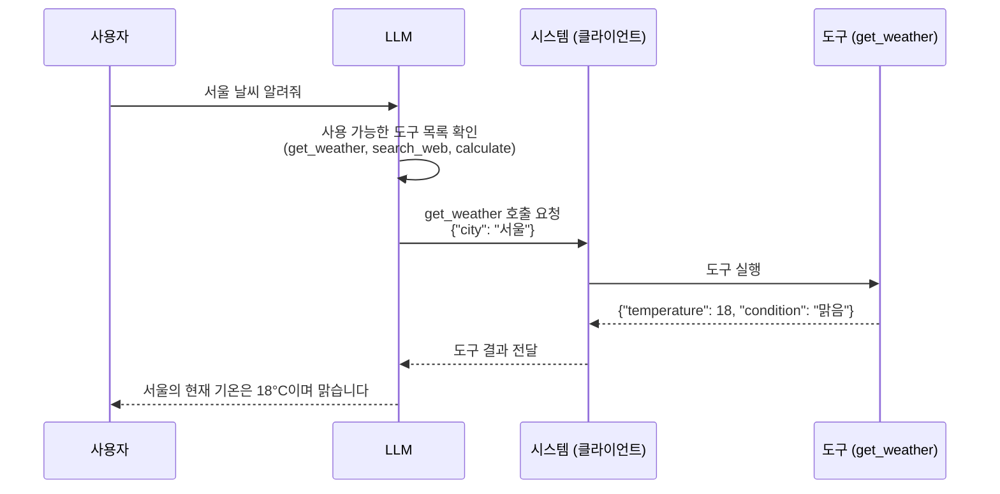

# 5.1 Tool Use 개념

> **학습 목표**: AI의 Tool Use(도구 사용)가 무엇인지 이해하고, 작동 원리를 설명할 수 있다.
>
> **참고**: [Anthropic - Tool Use Guide](https://docs.anthropic.com/en/docs/build-with-claude/tool-use/overview)

## Tool Use란?

LLM 자체는 텍스트를 생성할 수만 있습니다. 파일을 읽거나, 계산을 하거나, API를 호출하는 것은 불가능합니다. **Tool Use**는 LLM에게 외부 도구를 사용할 수 있는 능력을 부여합니다.

```
Tool Use 없이:                    Tool Use와 함께:
"오늘 날씨 알려줘"               "오늘 날씨 알려줘"
   ↓                               ↓
"제가 실시간 정보에              [날씨 API 도구 호출]
 접근할 수 없어서                   ↓
 알려드리기 어렵습니다"           "서울 현재 기온 18°C,
                                  맑음입니다"
```

## Tool Use 작동 방식



### 핵심 포인트

LLM은 도구를 **직접 실행하지 않습니다**. LLM은:
1. 어떤 도구를 사용할지 **결정**
2. 도구에 전달할 **파라미터를 생성**
3. 시스템이 실행한 **결과를 해석**

실제 도구 실행은 호스트 시스템(클라이언트)이 담당합니다.

## 도구 정의하기

도구는 JSON Schema로 정의됩니다:

```json
{
  "name": "get_weather",
  "description": "지정된 도시의 현재 날씨를 조회합니다",
  "input_schema": {
    "type": "object",
    "properties": {
      "city": {
        "type": "string",
        "description": "날씨를 조회할 도시 이름"
      },
      "unit": {
        "type": "string",
        "enum": ["celsius", "fahrenheit"],
        "description": "온도 단위"
      }
    },
    "required": ["city"]
  }
}
```

좋은 도구 정의의 요소:
- **명확한 이름**: 도구의 기능을 나타내는 이름
- **상세한 설명**: LLM이 언제 이 도구를 사용해야 하는지 판단할 근거
- **스키마**: 입력 파라미터의 타입과 제약 조건

## Tool Use의 실전 예시

### 계산기 도구

```
사용자: "2의 32승은?"

LLM 사고: "계산이 필요하므로 calculator 도구를 사용하자"
도구 호출: calculator(expression="2**32")
도구 결과: 4294967296
LLM 응답: "2의 32승은 4,294,967,296입니다."
```

### 데이터베이스 조회 도구

```
사용자: "지난달 매출 상위 5개 제품은?"

LLM 사고: "DB 조회가 필요하다"
도구 호출: query_db(sql="SELECT product, SUM(amount) 
           FROM sales WHERE month='2026-03' 
           GROUP BY product ORDER BY SUM(amount) DESC LIMIT 5")
도구 결과: [{product: "A", total: 5000}, ...]
LLM 응답: "지난달 매출 상위 5개 제품은: 1. 제품A..."
```

### 도구 연쇄 사용

하나의 질문에 여러 도구를 순차적으로 사용하기도 합니다:

```
사용자: "서울 날씨에 맞는 옷차림 추천해줘"

1단계: get_weather(city="서울")
       → 기온 8°C, 바람 강함

2단계: search_fashion(temperature=8, wind="strong")
       → 패딩, 목도리 추천

LLM: "서울은 현재 8°C에 바람이 강합니다. 
      따뜻한 패딩과 목도리를 추천드립니다."
```

---

## 완전한 Tool Use 구현 예시

실제 Claude API를 사용하는 전체 코드입니다.

```python
import anthropic
import json

client = anthropic.Anthropic()

# 도구 정의
tools = [
    {
        "name": "get_stock_price",
        "description": "주식 종목의 현재 가격과 기본 정보를 조회합니다. 실시간 주가가 필요할 때 사용하세요.",
        "input_schema": {
            "type": "object",
            "properties": {
                "ticker": {
                    "type": "string",
                    "description": "주식 티커 심볼 (예: AAPL, TSLA, 005930.KS)"
                }
            },
            "required": ["ticker"]
        }
    },
    {
        "name": "calculate",
        "description": "수식을 계산합니다. Python 수식을 지원합니다.",
        "input_schema": {
            "type": "object",
            "properties": {
                "expression": {
                    "type": "string",
                    "description": "계산할 수식 (예: '100 * 1.05 ** 3')"
                }
            },
            "required": ["expression"]
        }
    }
]

# 도구 실행 함수 (실제 구현)
def execute_tool(tool_name: str, tool_input: dict) -> str:
    if tool_name == "get_stock_price":
        # 실제로는 증권 API 호출
        # 여기서는 시뮬레이션
        mock_prices = {
            "AAPL": {"price": 185.50, "change": "+1.2%", "market_cap": "2.87T"},
            "TSLA": {"price": 248.30, "change": "-0.8%", "market_cap": "792B"},
            "005930.KS": {"price": 75000, "change": "+0.5%", "market_cap": "447T KRW"}
        }
        ticker = tool_input["ticker"]
        if ticker in mock_prices:
            data = mock_prices[ticker]
            return json.dumps(data, ensure_ascii=False)
        return json.dumps({"error": f"티커 {ticker}를 찾을 수 없습니다"})
    
    elif tool_name == "calculate":
        try:
            # 안전한 계산을 위해 eval 대신 실제로는 numexpr 등 사용
            result = eval(tool_input["expression"])
            return str(result)
        except Exception as e:
            return f"계산 오류: {e}"
    
    return "알 수 없는 도구"

def chat_with_tools(user_message: str) -> str:
    """도구를 사용하여 사용자 질문에 답합니다."""
    messages = [{"role": "user", "content": user_message}]
    
    while True:
        response = client.messages.create(
            model="claude-opus-4-5",
            max_tokens=1024,
            tools=tools,
            messages=messages
        )
        
        # 도구 호출이 없으면 최종 답변
        if response.stop_reason == "end_turn":
            return response.content[0].text
        
        # 도구 호출 처리
        if response.stop_reason == "tool_use":
            # Assistant 응답을 메시지에 추가
            messages.append({"role": "assistant", "content": response.content})
            
            # 각 도구 호출 실행
            tool_results = []
            for block in response.content:
                if block.type == "tool_use":
                    print(f"도구 호출: {block.name}({block.input})")
                    result = execute_tool(block.name, block.input)
                    tool_results.append({
                        "type": "tool_result",
                        "tool_use_id": block.id,
                        "content": result
                    })
            
            # 도구 결과를 메시지에 추가
            messages.append({"role": "user", "content": tool_results})

# 사용 예시
answer = chat_with_tools("애플 주식 가격을 기준으로, 100만원어치 사면 몇 주나 살 수 있어? 1 USD = 1350 KRW로 계산해줘.")
print(answer)
```

---

## 도구 설계 Best Practices

### 도구 설명이 곧 프롬프트다

LLM은 도구 설명만 보고 언제, 어떻게 사용할지 결정합니다. 나쁜 설명은 잘못된 도구 호출로 이어집니다.

```json
// 나쁜 도구 정의
{
  "name": "search",
  "description": "검색합니다",
  "input_schema": {
    "type": "object",
    "properties": {
      "q": {"type": "string"}
    }
  }
}

// 좋은 도구 정의
{
  "name": "search_documents",
  "description": "사내 문서 데이터베이스에서 키워드로 관련 문서를 검색합니다. 제목, 본문, 태그를 모두 검색합니다. 최신 정책, 프로세스, 기술 문서를 찾을 때 사용하세요.",
  "input_schema": {
    "type": "object",
    "properties": {
      "query": {
        "type": "string",
        "description": "검색 키워드 또는 자연어 질문"
      },
      "limit": {
        "type": "integer",
        "description": "반환할 최대 결과 수 (기본값: 5, 최대: 20)",
        "default": 5
      },
      "date_from": {
        "type": "string",
        "description": "검색 시작 날짜 (YYYY-MM-DD 형식). 최근 문서만 필요할 때 사용."
      }
    },
    "required": ["query"]
  }
}
```

### 도구 수는 적을수록 좋다

| 도구 수 | 효과 |
|---------|------|
| 1~5개 | LLM이 올바른 도구를 거의 항상 선택 |
| 6~15개 | 간혹 잘못된 도구 선택 발생 |
| 15개 이상 | 혼란 증가, 정확도 저하, 비용 증가 |

::: tip 도구 수 관리
도구가 많아지면 관련 도구만 선택적으로 제공하는 라우팅을 먼저 적용하세요. 예: 코딩 관련 질문이면 코딩 도구만, 검색 관련이면 검색 도구만 활성화.
:::

---

## Claude Code에서의 Tool Use

Claude Code는 다양한 내장 도구를 갖춘 에이전트입니다:

| 도구 | 기능 | 예시 |
|------|------|------|
| Read | 파일 읽기 | 소스 코드 분석 |
| Write | 파일 생성 | 새 파일 작성 |
| Edit | 파일 수정 | 코드 수정 |
| Bash | 명령 실행 | npm test, git status |
| Grep | 텍스트 검색 | 코드 내 패턴 검색 |
| Glob | 파일 검색 | 파일명 패턴 매칭 |
| WebSearch | 웹 검색 | 문서, 라이브러리 검색 |

---

## 🧪 실습

**실습 1: 도구 정의 작성**

다음 기능을 가진 도구의 JSON Schema를 직접 작성해보세요:

도구 목적: "회사 직원 디렉토리에서 직원 정보를 검색"
- 이름으로 검색 가능
- 부서명으로 필터링 가능
- 직급으로 필터링 가능
- 연락처(이메일/전화) 포함 여부 선택 가능

**실습 2: 도구 연쇄 설계**

"이번 달 가장 많이 팔린 제품의 재고가 부족하면 자동으로 발주서를 작성해줘"라는 요청을 처리하기 위해 필요한 도구 목록을 설계해보세요. 각 도구의 이름, 설명, 필수 파라미터를 정의하세요.

::: details 힌트
필요한 도구들:
1. 이번 달 판매 데이터 조회
2. 특정 제품의 재고 수준 확인
3. 발주서 생성/저장

각 도구 간 데이터 흐름을 먼저 설계하면 파라미터가 자연스럽게 나옵니다.
:::

---

## 핵심 정리

- **Tool Use**: LLM에게 외부 도구를 사용하는 능력 부여
- **LLM의 역할**: 도구 선택과 파라미터 생성 (실행은 시스템이 담당)
- **JSON Schema**: 도구의 이름, 설명, 입력 스키마를 정의
- **도구 연쇄**: 여러 도구를 순차/병렬로 조합하여 복잡한 작업 수행
- **Claude Code**: 다양한 내장 도구를 활용하는 코딩 에이전트
- **도구 설명이 핵심**: 명확한 설명이 정확한 도구 선택을 결정

---

::: info 핵심 용어 정리

**Tool Use (도구 사용)**: LLM이 외부 함수, API, 서비스를 호출할 수 있도록 하는 기능. "Function Calling"이라고도 불림.

**도구 정의 (Tool Definition)**: JSON Schema 형식으로 도구의 이름, 설명, 입력 파라미터를 정의한 명세서.

**도구 호출 (Tool Call)**: LLM이 특정 도구를 사용하겠다고 결정하고 파라미터를 포함하여 보내는 요청. 실제 실행은 클라이언트가 담당.

**stop_reason: "tool_use"**: Claude API의 응답 중지 이유. LLM이 도구 호출을 원할 때 반환됨. 클라이언트는 이를 받으면 도구를 실행하고 결과를 다시 전달해야 함.

**도구 결과 (Tool Result)**: 도구 실행 후 LLM에게 돌려주는 응답. `tool_result` 타입의 메시지로 전달.

**JSON Schema**: 도구 입력 파라미터의 구조, 타입, 필수 여부를 정의하는 표준 형식. LLM이 올바른 파라미터를 생성하는 데 사용.
:::

## 더 알아보기

- [Anthropic - Tool Use Guide](https://docs.anthropic.com/en/docs/build-with-claude/tool-use/overview)
- [Anthropic Courses - Tool Use](https://github.com/anthropics/courses)

---

**다음 챕터**: [5.2 MCP 기초](/chapters/05-tool-use-mcp/mcp-basics) →
