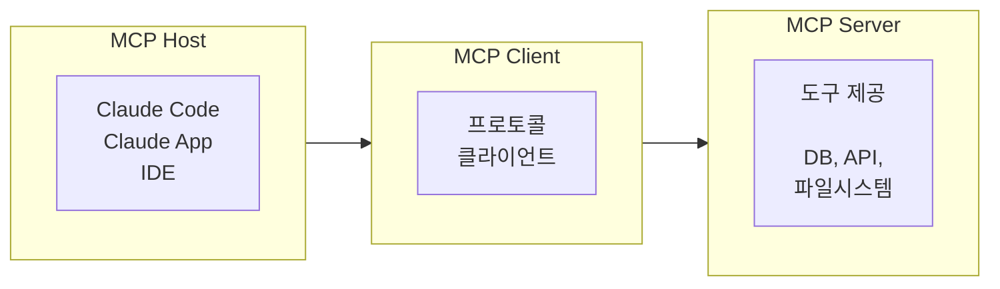

# 5.2 MCP 기초

> **학습 목표**: Model Context Protocol(MCP)이 무엇인지, 왜 필요한지, 어떻게 작동하는지 이해한다.
>
> **참고**: [Model Context Protocol 공식 사이트](https://modelcontextprotocol.io/)

## MCP란?

**Model Context Protocol (MCP)** 은 Anthropic이 만든 오픈 표준으로, AI 모델이 외부 데이터 소스 및 도구와 연결되는 방식을 표준화합니다.

### USB-C 비유

```
MCP 이전:                          MCP 이후:
각 AI × 각 도구마다               하나의 표준 프로토콜로
별도 연동 필요                     모든 연결 통일

AI_A ─── 도구1 전용 코드          AI_A ─┐
AI_A ─── 도구2 전용 코드          AI_B ─┼── MCP ──┬── 도구1
AI_B ─── 도구1 전용 코드          AI_C ─┘         ├── 도구2
AI_B ─── 도구2 전용 코드                          └── 도구3
...
  N × M 개의 연동                   N + M 개의 연동
```

USB-C가 다양한 기기의 충전/데이터 포트를 통일한 것처럼, MCP는 AI와 도구 간의 연결을 통일합니다.

## MCP 아키텍처



| 구성요소 | 역할 | 예시 |
|---------|------|------|
| **Host** | MCP를 실행하는 애플리케이션 | Claude Code, Claude Desktop |
| **Client** | 서버와 1:1 연결 관리 | Host 내부에서 자동 관리 |
| **Server** | 도구, 리소스, 프롬프트 제공 | DB 서버, GitHub 서버 등 |

## MCP의 3가지 핵심 요소

### 1. Tools (도구)

AI가 호출할 수 있는 함수:

```json
{
  "name": "query_database",
  "description": "SQL 쿼리를 실행합니다",
  "inputSchema": {
    "type": "object",
    "properties": {
      "sql": { "type": "string" }
    }
  }
}
```

### 2. Resources (리소스)

AI가 읽을 수 있는 데이터:

```
리소스 URI 예시:
- file:///path/to/document.md
- db://mydb/users
- api://github/repos
```

### 3. Prompts (프롬프트)

재사용 가능한 프롬프트 템플릿:

```json
{
  "name": "code_review",
  "description": "코드 리뷰용 프롬프트",
  "arguments": [
    { "name": "code", "required": true }
  ]
}
```

## MCP 서버 연결하기

Claude Code에서 MCP 서버를 설정하는 방법:

```bash
# MCP 서버 추가
claude mcp add my-server -s user -- npx -y @example/mcp-server

# 등록된 서버 확인
claude mcp list

# 서버 제거
claude mcp remove my-server
```

### 설정 파일 (`~/.claude/settings.json`)

```json
{
  "mcpServers": {
    "filesystem": {
      "command": "npx",
      "args": ["-y", "@modelcontextprotocol/server-filesystem", "/path"]
    },
    "github": {
      "command": "npx",
      "args": ["-y", "@modelcontextprotocol/server-github"],
      "env": {
        "GITHUB_TOKEN": "ghp_xxx"
      }
    }
  }
}
```

## 인기 MCP 서버들

| 서버 | 기능 |
|------|------|
| **filesystem** | 파일 시스템 접근 |
| **github** | GitHub 리포지토리, 이슈, PR 관리 |
| **postgres** | PostgreSQL 데이터베이스 쿼리 |
| **slack** | Slack 메시지 읽기/쓰기 |
| **brave-search** | Brave 검색 엔진 |
| **memory** | 영구 메모리 저장소 |

## 핵심 정리

- **MCP**: AI와 외부 도구를 연결하는 오픈 표준 프로토콜
- **Host-Client-Server**: 3계층 아키텍처
- **Tools, Resources, Prompts**: MCP의 3가지 핵심 요소
- **표준화**: 한 번 만든 MCP 서버는 모든 MCP 호환 AI에서 사용 가능

## 더 알아보기

- [Model Context Protocol 공식](https://modelcontextprotocol.io/)
- [Anthropic Academy - Introduction to MCP](https://anthropic.skilljar.com/)
- [MCP Servers 목록](https://github.com/modelcontextprotocol/servers)

---

← [5.1 Tool Use 개념](/chapters/05-tool-use-mcp/) | **다음 챕터**: [5.3 MCP 서버 만들기](/chapters/05-tool-use-mcp/building-mcp-server) →
