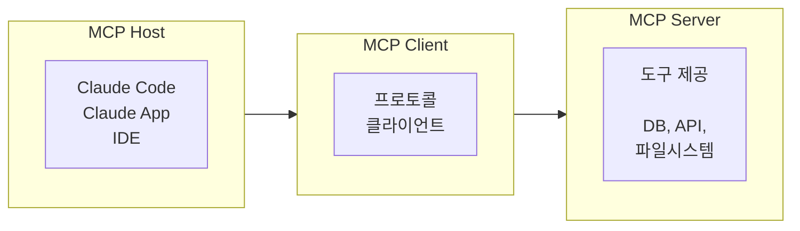
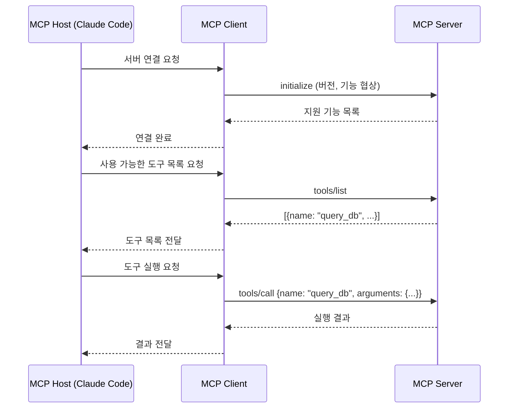

# 5.2 MCP 기초

> **학습 목표**: Model Context Protocol(MCP)이 무엇인지, 왜 필요한지, 어떻게 작동하는지 이해한다.
>
> **참고**: [Model Context Protocol 공식 사이트](https://modelcontextprotocol.io/)

## MCP란?

**Model Context Protocol (MCP)** 은 Anthropic이 만든 오픈 표준으로, AI 모델이 외부 데이터 소스 및 도구와 연결되는 방식을 표준화합니다.

### USB-C 비유

```
MCP 이전:                          MCP 이후:
각 AI × 각 도구마다               하나의 표준 프로토콜로
별도 연동 필요                     모든 연결 통일

AI_A ─── 도구1 전용 코드          AI_A ─┐
AI_A ─── 도구2 전용 코드          AI_B ─┼── MCP ──┬── 도구1
AI_B ─── 도구1 전용 코드          AI_C ─┘         ├── 도구2
AI_B ─── 도구2 전용 코드                          └── 도구3
...
  N × M 개의 연동                   N + M 개의 연동
```

USB-C가 다양한 기기의 충전/데이터 포트를 통일한 것처럼, MCP는 AI와 도구 간의 연결을 통일합니다.

## MCP 아키텍처



| 구성요소 | 역할 | 예시 |
|---------|------|------|
| **Host** | MCP를 실행하는 애플리케이션 | Claude Code, Claude Desktop |
| **Client** | 서버와 1:1 연결 관리 | Host 내부에서 자동 관리 |
| **Server** | 도구, 리소스, 프롬프트 제공 | DB 서버, GitHub 서버 등 |

## MCP의 3가지 핵심 요소

### 1. Tools (도구)

AI가 호출할 수 있는 함수:

```json
{
  "name": "query_database",
  "description": "SQL 쿼리를 실행합니다",
  "inputSchema": {
    "type": "object",
    "properties": {
      "sql": { "type": "string" }
    }
  }
}
```

### 2. Resources (리소스)

AI가 읽을 수 있는 데이터:

```
리소스 URI 예시:
- file:///path/to/document.md
- db://mydb/users
- api://github/repos
```

### 3. Prompts (프롬프트)

재사용 가능한 프롬프트 템플릿:

```json
{
  "name": "code_review",
  "description": "코드 리뷰용 프롬프트",
  "arguments": [
    { "name": "code", "required": true }
  ]
}
```

## MCP 서버 연결하기

Claude Code에서 MCP 서버를 설정하는 방법:

```bash
# MCP 서버 추가
claude mcp add my-server -s user -- npx -y @example/mcp-server

# 등록된 서버 확인
claude mcp list

# 서버 제거
claude mcp remove my-server
```

### 설정 파일 (`~/.claude/settings.json`)

```json
{
  "mcpServers": {
    "filesystem": {
      "command": "npx",
      "args": ["-y", "@modelcontextprotocol/server-filesystem", "/path"]
    },
    "github": {
      "command": "npx",
      "args": ["-y", "@modelcontextprotocol/server-github"],
      "env": {
        "GITHUB_TOKEN": "ghp_xxx"
      }
    }
  }
}
```

## 인기 MCP 서버들

| 서버 | 기능 |
|------|------|
| **filesystem** | 파일 시스템 접근 |
| **github** | GitHub 리포지토리, 이슈, PR 관리 |
| **postgres** | PostgreSQL 데이터베이스 쿼리 |
| **slack** | Slack 메시지 읽기/쓰기 |
| **brave-search** | Brave 검색 엔진 |
| **memory** | 영구 메모리 저장소 |

---

## Tool Use vs MCP: 무엇이 다른가?

초보자가 가장 많이 혼동하는 개념입니다.

| 구분 | Tool Use | MCP |
|------|----------|-----|
| 정의 | LLM이 도구를 호출하는 능력 자체 | 도구를 표준화하여 공유하는 프로토콜 |
| 관점 | LLM ↔ 도구 통신 방식 | 도구를 패키징·배포하는 생태계 표준 |
| 비유 | 함수 호출 | npm 패키지 |
| 누가 만드나 | 개발자가 앱마다 직접 정의 | 표준화된 서버로 누구나 재사용 |
| 재사용성 | 낮음 (앱에 종속) | 높음 (MCP 호환 앱 어디서나) |

::: tip 핵심 관계
Tool Use는 **기능**이고, MCP는 그 기능을 **표준화하고 공유하는 생태계**입니다.
MCP 서버를 만들면 Claude Code, Claude Desktop, Cursor 등 MCP를 지원하는 모든 앱에서 동일하게 쓸 수 있습니다.
:::

---

## MCP 통신 프로토콜 상세

MCP는 내부적으로 JSON-RPC 2.0을 사용합니다.



### stdio vs HTTP 전송 방식

MCP 서버는 두 가지 방식으로 통신합니다:

```
stdio (표준 입출력):          HTTP/SSE (원격):
─────────────────────         ─────────────────────
Host ←─stdin/stdout─→ Server  Host ←─HTTP request─→ Server
                              Host ←─SSE events───→ Server

장점: 간단, 로컬에서만 사용    장점: 원격 서버, 여러 클라이언트
단점: 로컬 전용                단점: 네트워크 설정 필요

대부분의 로컬 개발에는 stdio 사용
```

---

## MCP 서버 생태계

공식 MCP 서버 외에도 커뮤니티가 다양한 서버를 만들고 있습니다.

### 공식 서버 (Anthropic / 파트너)

```json
// Claude Desktop 설정 예시
{
  "mcpServers": {
    "filesystem": {
      "command": "npx",
      "args": ["-y", "@modelcontextprotocol/server-filesystem", 
               "/Users/me/Documents", "/Users/me/Projects"]
    },
    "github": {
      "command": "npx", 
      "args": ["-y", "@modelcontextprotocol/server-github"],
      "env": { "GITHUB_PERSONAL_ACCESS_TOKEN": "ghp_xxx" }
    },
    "postgres": {
      "command": "npx",
      "args": ["-y", "@modelcontextprotocol/server-postgres",
               "postgresql://localhost/mydb"]
    }
  }
}
```

### 커뮤니티 활용 사례

| 카테고리 | 서버 예시 | 활용 |
|---------|----------|------|
| 개발 도구 | git, Docker, Kubernetes | CI/CD 자동화 |
| 데이터베이스 | MySQL, MongoDB, Redis | 데이터 조회/분석 |
| 생산성 | Notion, Linear, Jira | 이슈 관리 |
| 모니터링 | Grafana, Datadog | 메트릭 조회 |
| 커뮤니케이션 | Slack, Discord | 메시지 전송 |

---

## 실전: GitHub MCP 서버 활용

GitHub MCP 서버를 설정하면 Claude Code가 직접 GitHub를 조작할 수 있습니다.

```bash
# 설치
claude mcp add github -s user -- npx -y @modelcontextprotocol/server-github
# GITHUB_PERSONAL_ACCESS_TOKEN 환경변수 필요
```

Claude Code에서 사용 가능한 작업:

```
"develop 브랜치의 최근 커밋 5개를 요약해줘"
→ [MCP] github: list_commits(owner, repo, branch, per_page=5)

"이슈 #123의 내용을 읽고 관련 코드를 찾아줘"
→ [MCP] github: get_issue(owner, repo, issue_number=123)
→ [Grep] 관련 코드 검색

"새 이슈를 만들어줘. 제목: '로그인 버튼 깨짐', 라벨: bug"
→ [MCP] github: create_issue(owner, repo, title, labels=["bug"])
```

---

## 🧪 실습

**실습 1: MCP 서버 설정**

GitHub Personal Access Token을 발급하고 GitHub MCP 서버를 Claude Code에 연결해보세요.

연결 후 다음을 시도해보세요:
```
"내 GitHub 프로필 정보를 알려줘"
"내 최근 repository 목록을 보여줘"
```

**실습 2: Tool Use vs MCP 비교 분석**

동일한 기능(파일 시스템 접근)을 두 가지 방식으로 구현하고 비교해보세요:

1. Anthropic API의 Tool Use로 직접 파일 읽기 도구 정의
2. `@modelcontextprotocol/server-filesystem` MCP 서버 사용

어떤 차이가 있나요? 각각 언제 사용하는 것이 적절한가요?

---

## 핵심 정리

- **MCP**: AI와 외부 도구를 연결하는 오픈 표준 프로토콜
- **Host-Client-Server**: 3계층 아키텍처
- **Tools, Resources, Prompts**: MCP의 3가지 핵심 요소
- **표준화**: 한 번 만든 MCP 서버는 모든 MCP 호환 AI에서 사용 가능
- **Tool Use vs MCP**: Tool Use는 기능, MCP는 그것을 표준화하는 생태계

---

::: info 핵심 용어 정리

**MCP (Model Context Protocol)**: Anthropic이 설계한 AI-도구 연결 오픈 표준. 한 번 구현한 MCP 서버를 여러 AI 애플리케이션에서 재사용할 수 있게 함.

**MCP Host**: MCP 클라이언트를 포함하는 최상위 애플리케이션. Claude Code, Claude Desktop, Cursor 등.

**MCP Client**: Host 내부에서 MCP Server와 1:1로 연결을 관리하는 컴포넌트.

**MCP Server**: Tools, Resources, Prompts를 외부 애플리케이션에 노출하는 경량 프로세스. Python SDK나 TypeScript SDK로 구현.

**JSON-RPC 2.0**: MCP가 사용하는 원격 프로시저 호출 프로토콜. 요청-응답 패턴의 표준 형식.

**stdio 전송**: MCP 서버가 표준 입출력(stdin/stdout)을 통해 통신하는 방식. 로컬 개발에 가장 일반적.

**Resources (MCP)**: MCP 서버가 AI에게 제공하는 읽기 전용 데이터. URI로 식별되며 파일, DB 레코드, API 응답 등이 될 수 있음.
:::

## 더 알아보기

- [Model Context Protocol 공식](https://modelcontextprotocol.io/)
- [Anthropic Academy - Introduction to MCP](https://anthropic.skilljar.com/)
- [MCP Servers 목록](https://github.com/modelcontextprotocol/servers)

---

← [5.1 Tool Use 개념](/chapters/05-tool-use-mcp/) | **다음 챕터**: [5.3 MCP 서버 만들기](/chapters/05-tool-use-mcp/building-mcp-server) →
